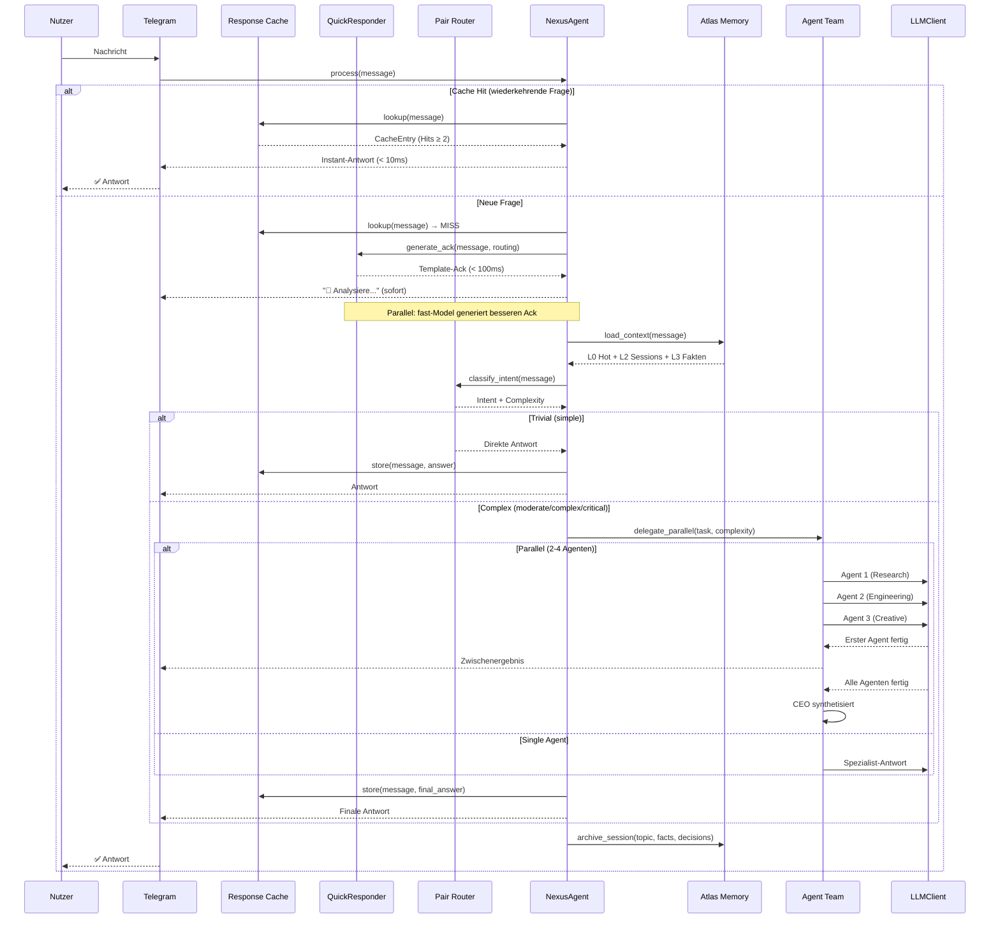
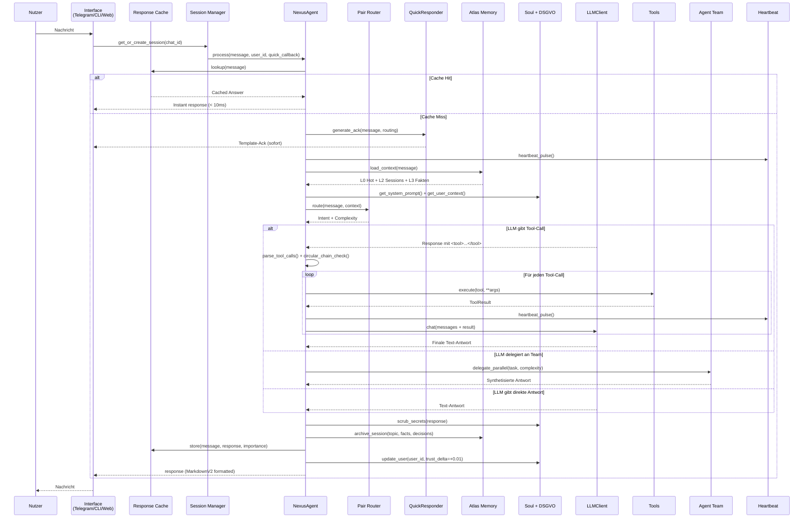
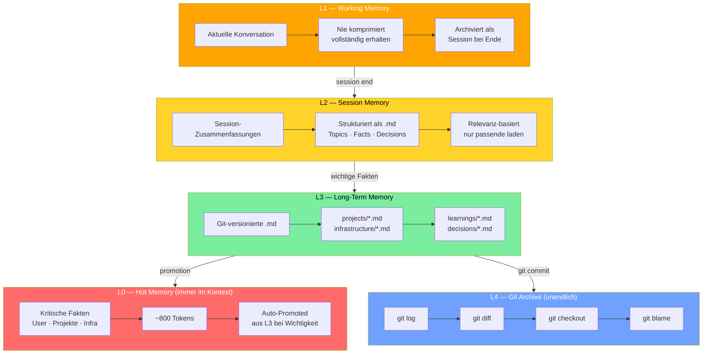
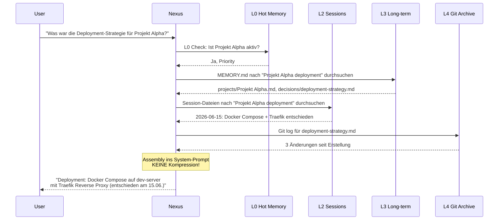
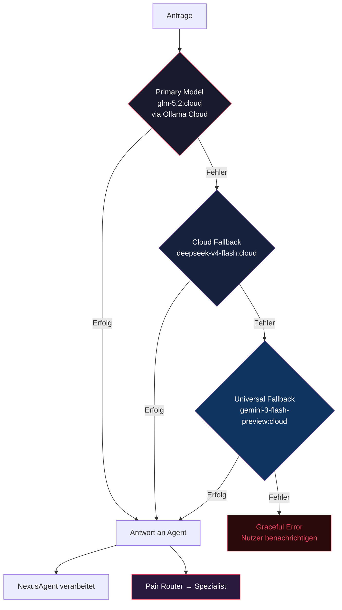
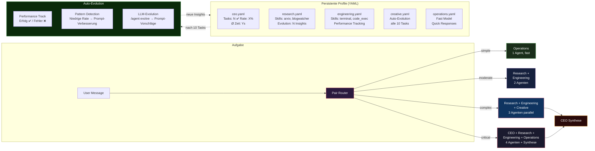
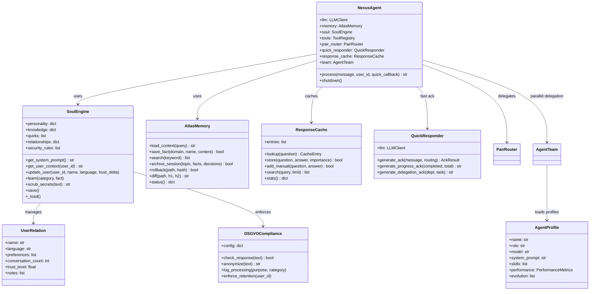

<p align="center">
  
  
  
  
</p>

<h1 align="center">NEXUS v10.0</h1>

<p align="center">
  <strong>Autonomer KI-Agent mit Atlas Git Memory, 5-Layer Memory-System und Multi-Agent-Delegation.</strong><br>
  GLM-5.2 · Atlas Memory · Git-Versioniert · 156 Skills
</p>

---

## 🆕 Was ist neu in v10.0

| Feature | Beschreibung |
|---|---|
| **Atlas Git Memory (5 Layer)** | Komplett neues Memory-System: L0 Hot Memory → L1 Working → L2 Sessions → L3 Long-term → L4 Git Archive. **Nie komprimieren — immer versionieren.** |
| **L0 Hot Memory** | ~800 Tokens immer im Kontext — kritische Fakten, aktive Projekte, Infrastruktur. Auto-promoted aus L3. |
| **L4 Git Archive** | Unendliches, versioniertes Memory. Jeder Fakt ist ein Git-Commit. `git log`, `git diff`, `git blame`, `git checkout` — vollständige Versionsgeschichte. |
| **Context Loader** | Relevanz-basiertes Laden statt Kompression. Nur das wird geladen, was für die aktuelle Frage relevant ist. |
| **Migration Engine** | Importiert Memories aus Hermes, Mercury v1/v2, Nova und Claude — dedupliziert mit Provenance-Tagging. |
| **Skill Consolidator** | 617 Skills aus 5 Agenten-Quellen gescannt, dedupliziert und in 25 Kategorien konsolidiert. |
| **GLM-5.2:cloud** | Hauptmodell mit 1M Token-Kontext. |
| **Memory Tool erweitert** | `search` durchsucht das gesamte Git-Archiv. `log` zeigt Versionsgeschichte. `diff` zeigt Änderungen zwischen Versionen. `rollback` stellt frühere Versionen wieder her. |

### v9.3 Features (bleiben erhalten)

| Feature | Beschreibung |
|---|---|
| **Fast Response Layer** | Template-Ack < 100ms + Hybrid fast-Model-Upgrade < 2s. |
| **Response Cache** | Wiederkehrende Fragen < 10ms, kein LLM-Call. |
| **Parallele Agenten** | Komplexe Aufgaben auf N Agenten verteilt (ThreadPoolExecutor). |
| **Agent Profile** | Persistente YAML-Profile mit Performance-Tracking und Auto-Evolution. |
| **Complexity Routing** | Intent → simple/moderate/complex/critical. |

---

## Diagramme

### System-Architektur (v10.0)

```mermaid
graph TB
    subgraph Interfaces
        TG[Telegram Bot<br/>MarkdownV2 · Streaming · Rate-Limit]
        CLI[CLI Interface]
        WEB[Web UI<br/>FastAPI · Invite-Gate]
    end

    subgraph FastResponse["⚡ Fast Response Layer"]
        RC[Response Cache<br/>Q&A Pairs · Fuzzy Match · <10ms]
        QR[QuickResponder<br/>Template-Ack · Hybrid fast-Model]
    end

    subgraph NexusAgent["NEXUS v10.0 — Agent Core"]
        AG[Agent Core<br/>Think-Act Loop · Circular-Chain Detection]
        PR[Pair Router<br/>6-Agent Delegation · Complexity Routing]
        SOUL[SoulEngine<br/>Persönlichkeit · Beziehungen · DSGVO]
        AM[Atlas Memory<br/>5 Layer · Git-basiert · Keine Kompression]
        TOOLS[ToolRegistry<br/>11 Werkzeuge]
        LLM[LLMClient<br/>Ollama Cloud · glm-5.2:cloud]
        HB[Heartbeat<br/>Process Health · Auto-Restart]
        PT[Project Tracker<br/>Context · Status]
        SM[Session Manager<br/>Per-Chat Isolation · Timeout]
    end

    subgraph AtlasMemory["🧠 Atlas Memory System"]
        L0["L0 Hot Memory<br/>immer im Context"]
        L1["L1 Working Memory<br/>nie komprimiert"]
        L2["L2 Session Memory<br/>archiviert"]
        L3["L3 Long-term Memory<br/>git-versioniert"]
        L4["L4 Git Archive<br/>unendlich"]
    end

    subgraph AgentTeam["5-Department Team + Parallel"]
        CEO["CEO<br/>glm-5.2:cloud<br/>Priorisierung · Synthese"]
        SC["Research<br/>glm-5.2:cloud<br/>Recherche · Analyse"]
        FG["Engineering<br/>qwen3-coder-next:cloud<br/>Code · Build · Deploy"]
        HD["Creative<br/>gemma4:cloud<br/>Design · Text · UI"]
        OPS["Operations<br/>deepseek-v4-flash:cloud<br/>Schnell · Effizient"]
    end

    subgraph AgentProfiles["📊 Persistente Profile"]
        Y1[ceo.yaml]
        Y2[research.yaml]
        Y3[engineering.yaml]
        Y4[creative.yaml]
        Y5[operations.yaml]
    end

    subgraph Tools
        T1[terminal]
        T2[file_read · file_write<br/>file_search]
        T3[web_search · web_fetch]
        T4[code_exec · calculator]
        T5[time · memory<br/>delegation]
    end

    subgraph Persistence["Persistenz"]
        SY[soul.yaml]
        RJ[relations.json]
        GIT[.git — vollständige History]
        CACHE[response_cache.json]
        DSGVO[dsgvo_config.yaml]
    end

    TG --> SM
    CLI --> SM
    WEB --> SM
    SM --> AG

    AG --> RC
    AG --> QR
    AG --> PR
    AG --> SOUL
    AG --> AM
    AG --> TOOLS
    AG --> LLM
    AG --> HB
    AG --> PT

    AM --> L0
    AM --> L1
    AM --> L2
    AM --> L3
    AM --> L4

    PR --> CEO
    PR --> SC
    PR --> FG
    PR --> HD
    PR --> OPS

    CEO --> Y1
    SC --> Y2
    FG --> Y3
    HD --> Y4
    OPS --> Y5

    TOOLS --> T1
    TOOLS --> T2
    TOOLS --> T3
    TOOLS --> T4
    TOOLS --> T5

    SOUL --> SY
    SOUL --> RJ
    SOUL --> DSGVO
    L4 --> GIT
    AG --> CACHE

    style AG fill:#1a1a2e,stroke:#e94560,color:#fff
    style PR fill:#2a1a3e,stroke:#e94560,color:#fff
    style QR fill:#0a2a0a,stroke:#4CAF50,color:#fff
    style RC fill:#0a2a0a,stroke:#4CAF50,color:#fff
    style SOUL fill:#16213e,stroke:#0f3460,color:#fff
    style AM fill:#16213e,stroke:#0f3460,color:#fff
    style TOOLS fill:#16213e,stroke:#0f3460,color:#fff
    style LLM fill:#16213e,stroke:#e94560,color:#fff
    style HB fill:#1a2e1a,stroke:#4CAF50,color:#fff
    style PT fill:#1a2e1a,stroke:#4CAF50,color:#fff
    style SM fill:#2e1a1a,stroke:#FF9800,color:#fff
    style L0 fill:#ff6b6b,color:#fff
    style L1 fill:#ffa502,color:#fff
    style L2 fill:#ffd32a,color:#000
    style L3 fill:#7bed9f,color:#000
    style L4 fill:#70a1ff,color:#fff
    style CEO fill:#1a1a2e,stroke:#e94560,color:#fff
    style SC fill:#16213e,stroke:#533483,color:#fff
    style FG fill:#0f3460,stroke:#533483,color:#fff
    style HD fill:#2a1a3e,stroke:#e94560,color:#fff
    style OPS fill:#1a2e1a,stroke:#4CAF50,color:#fff
    style CACHE fill:#0a2a0a,stroke:#4CAF50,color:#4CAF50
```



### Request-Flow (v10.0) — Erste Antwort < 4s



### Think-Act Loop (v10.0)



### Atlas Memory-Hierarchie (v10.0)



### Context Loading (statt Kompression)



### LLM-Fallback-Chain (Cloud-Only)



### Agent Profile & Evolution



### Soul-Komponenten



## Architektur

```
nexus.py                    Entry Point ─ CLI · Telegram · Self-Test
config.yaml                 Zentrale Konfiguration (LLM · Memory · Tools · Telegram)
requirements.txt            Python-Dependencies

nexus/
  core/
    agent.py                NexusAgent ─ Orchestrator, Think-Act Loop, Cache, QuickResponder
    agent_team.py            5-Department Team ─ Parallel Delegation, Complexity Classification
    agent_profiles.py        Persistente Profile ─ YAML, Performance, Auto-Evolution
    llm_client.py           Ollama Cloud Client ─ Streaming · Fallback-Chain
    pair_router.py           Pair Router ─ Intent + Complexity Classification
    memory_engine.py         Atlas Memory Wrapper ─ 5 Layer, Git-basiert
    memory.py               L0→L1→L2→L3→L4 Memory (erweitert um Atlas)
    config.py               ConfigManager ─ Hot-Reload · mtime-Watcher · SIGHUP
    config_validation.py    Config-Validierung ─ Schema · Defaults · Migration
    session_manager.py      Per-Chat Sessions ─ Isolation · Timeout · Eviction
    heartbeat.py            Process Health ─ Watchdog · Auto-Restart
    project_tracker.py      Project Context ─ Status · Milestones · Progress
    conversations.py        Session Persistence ─ Speichern · Laden · Resumieren
    vector_store.py         Vector Search ─ sentence-transformers · Hybrid-Scoring
    rate_limiter.py         Token-Bucket ─ Per-User · Burst · Auto-Cleanup
    feedback.py              Feedback Loop ─ Self-Improvement · Response Quality
    personalization.py       Adaptive Personalisierung ─ Mood · Style · Preferences
    skill_autocreator.py     Skill-Auto-Erstellung ─ Pattern Detection · Template
    fast_response.py          ⚡ QuickResponder ─ Template-Ack · Hybrid fast-Model (< 4s)
    response_cache.py         ⚡ Response Cache ─ Q&A Pairs · Fuzzy Match · < 10ms
    dsgvo.py                DSGVO Compliance ─ Data Handling · Privacy · Anonymization
  interfaces/
    telegram_bot.py         Telegram Interface ─ MarkdownV2 · Streaming · /agent Command
    markdown_utils.py       MarkdownV2 Formatter ─ Escaping · Splitting · Conversion
    cli.py                  CLI Interface ─ interaktiver Test-Modus
    web_ui.py               Web UI ─ FastAPI · Chat · Invite-Gate · Rate-Limit
  soul/
    __init__.py             SoulEngine ─ persistente Identität, Beziehungen, Eigenheiten, DSGVO
    soul.yaml               Persönlichkeits-Definition (Werte, Regeln, Stil, Security)
  memory/                   Runtime-Daten (gitignored · persistent via Docker Volume)

atlas/                      Atlas Memory System (5 Layer, Git-basiert)
  git_memory.py             Git Memory Engine ─ save, load, search, log, diff, rollback
  hot_memory.py             L0 Hot Memory ─ immer im Kontext, auto-promoted
  session_manager.py        L2 Session Memory ─ archivieren, finden, laden
  context_loader.py         Context Loader ─ relevanz-basiertes Laden, keine Kompression
  memory_orchestrator.py    Memory Orchestrator ─ alle 5 Layer steuern
  migrate.py                Migration Engine ─ Agenten-Memories importieren
  consolidate_skills.py     Skill Consolidator ─ Skills aus 5 Quellen mergen

data/
  agents/                   ⚡ Persistente Agent-Profile (YAML)
    ceo.yaml                CEO ─ Orchestrierung, Synthese
    research.yaml           Research ─ Recherche, Analyse
    engineering.yaml        Engineering ─ Code, Build, Deploy
    creative.yaml           Creative ─ Design, Text, UI
    operations.yaml         Operations ─ Schnell, Effizient
  skills/                   156 Skills in 22 Kategorien
  memory/git/               Git-basiertes Memory (versioniert)
    MEMORY.md               Master-Index
    user/                   User-Profil, Kommunikation
    projects/               Projekt-Memory
    infrastructure/          Docker, Ollama, Tailscale
    learnings/              Fehler, Lösungen, Patterns
    decisions/              Architekturentscheidungen
    sessions/               Archivierte Sessions
    agents/                 Importierte Agenten-Memories
```

## Quick Start

### Einzeilen-Installation (empfohlen)

```bash
curl -fsSL https://raw.githubusercontent.com/***REMOVED***/nexus-toti/main/install.sh | bash
```

Oder nicht-interaktiv mit Telegram-Token:

```bash
curl -fsSL https://raw.githubusercontent.com/***REMOVED***/nexus-toti/main/install.sh | bash -s -- --token ***REMOVED*** --chat-id ***REMOVED***
```

Deinstallation:

```bash
curl -fsSL https://raw.githubusercontent.com/***REMOVED***/nexus-toti/main/install.sh | bash -s -- --uninstall
```

### Docker (manuell)

```bash
git clone https://github.com/***REMOVED***/nexus-toti.git && cd nexus-toti
cp .env.example .env         # Api-Keys eintragen
mkdir -p ~/.nexus/memory/git
docker compose up -d
```

### Management Script

```bash
chmod +x nexus.sh
./nexus.sh start              # Nexus starten (Port 8690)
./nexus.sh status              # Status anzeigen
./nexus.sh chat                # Interaktiver Chat
./nexus.sh memory status       # Atlas Memory Status
./nexus.sh memory search <s>   # Im Git-Archiv suchen
./nexus.sh memory log          # Versionsgeschichte anzeigen
./nexus.sh doctor              # Diagnose
```

### Lokale Installation (ohne Docker)

```bash
pip install -r requirements.txt
cp .env.example .env         # Api-Keys eintragen
python nexus.py --test       # Self-Test
python nexus.py --telegram   # Telegram-Bot starten
```

## Atlas Memory System

Das Herzstück von NEXUS v10.0 ist das **Atlas Git Memory System** — 5 Layer, keine Kompression, alles versioniert.

```
L0 ─ Hot Memory         Immer im Kontext (~800 Tokens), auto-promoted aus L3
 │                       User-Profil, aktive Projekte, Infrastruktur, Regeln
L1 ─ Working Memory     Aktuelle Konversation, NIE komprimiert
 │                       Vollständig erhalten, bei Session-Ende archiviert
L2 ─ Session Memory     Archivierte Sessions als .md-Dateien
 │                       Topics · Key Facts · Decisions · Relevanz-basiertes Laden
L3 ─ Long-term Memory   Git-versionierte .md-Dateien nach Domain
 │                       projects/ · infrastructure/ · learnings/ · decisions/
L4 ─ Git Archive        Unendlich, versioniert, durchsuchbar
                        git log · git diff · git blame · git checkout · git push/pull
```

**Die Kerninnovation:** Statt Context-Window zu komprimieren (und damit Persönlichkeit zu verlieren), wird **relevanz-basiert geladen**. Nur das kommt in den Context, was für die aktuelle Frage relevant ist. Alles andere bleibt versioniert im Git-Repo — jederzeit durchsuchbar, rückholbar, diffbar.

### Memory-Operationen

| Operation | Beschreibung | Git-Analogie |
|---|---|---|
| `save_fact(domain, name, content)` | Fakt speichern | `git add + git commit` |
| `search(keyword)` | Volltext-Suche | `git grep` |
| `log(path)` | Versionsgeschichte | `git log` |
| `diff(path, hash1, hash2)` | Änderungen vergleichen | `git diff` |
| `rollback(path, hash)` | Frühere Version wiederherstellen | `git checkout` |
| `archive_session(topic, facts, decisions)` | Session archivieren | `git commit -m "session: ..."` |
| `promote_project(name, tech, priority)` | Ins Hot Memory befördern | L0-Update |

## Soul-Driven Architecture

Nexus besitzt eine **Seele** — persistent, adaptiv, einzigartig:

| Schicht | Funktion | Persistenz |
|---|---|---|
| **Persönlichkeit** | Werte, Regeln, Kommunikationsstil | soul.yaml — manuell & auto |
| **Beziehungen** | Nutzer-Erkennung, Vertrauens-Modell, Präferenzen | relations.json — pro Nutzer |
| **Kernwissen** | Fakten, die über Sessions hinweg bleiben | Git-Memory — L3 |
| **Eigenheiten** | Humor, Effizienz-Fokus, Deutsch-first | soul.yaml — wächst mit |

Die Seele ist kein Gimmick — sie definiert **wer Nexus ist**, nicht was er tut. Session-State wird gelöscht; die Seele bleibt.

## 5-Department Team (v10.0)

| Department | Modell | Rolle | Parallel | Profile |
|---|---|---|---|---|
| **CEO** | `glm-5.2:cloud` | Priorisierung, Delegation, Synthese | ✅ Synthese | `data/agents/ceo.yaml` |
| **Research** | `glm-5.2:cloud` | Recherche, Analyse, Fakten | ✅ Parallel | `data/agents/research.yaml` |
| **Engineering** | `qwen3-coder-next:cloud` | Code, Build, Deploy | ✅ Parallel | `data/agents/engineering.yaml` |
| **Creative** | `gemma4:cloud` | Design, Text, UI/UX | ✅ Parallel | `data/agents/creative.yaml` |
| **Operations** | `deepseek-v4-flash:cloud` | Planung, Monitoring, Schnelles | ✅ Parallel | `data/agents/operations.yaml` |

| Fallback | Modell | Einsatzgebiet |
|---|---|---|
| **Cloud Fallback 1** | `deepseek-v4-flash:cloud` | Schneller Fallback bei Primärmodell-Ausfall |
| **Cloud Fallback 2** | `gemini-3-flash-preview:cloud` | Universeller Fallback |

### Complexity Routing

| Level | Agenten | Modelle | Synthese | Beispiel |
|---|---|---|---|---|
| **simple** | 1 | fast | Nein | "Wie spät ist es?" |
| **moderate** | 1-2 | default + specialist | Nein | "Erkläre mir Docker" |
| **complex** | 2-4 | research + engineering + creative | ✅ CEO | "Baue mir eine API mit Tests" |
| **critical** | 3-4 | CEO + research + engineering + ops | ✅ CEO | "Produktions-Deployment überprüfen" |

### `/agent` Telegram-Commands

| Command | Beschreibung |
|---|---|
| `/agent` | Alle Agenten auflisten (mit Stats) |
| `/agent create <name> <rolle>` | Neuen Agenten erstellen |
| `/agent assign <name> <skill>` | Skill einem Agenten zuweisen |
| `/agent stats <name>` | Performance-Statistiken |
| `/agent evolve <name>` | LLM-basierte Auto-Evolution triggern |

## Fast Response Layer

```
Nutzer-Nachricht
    │
    ├─ Response Cache Check (< 10ms, bei Hit: sofortige Antwort)
    ├─ Router klassifiziert Intent + Complexity
    ├─ QuickResponder: Template-Ack SOFORT (< 100ms)
    ├─ Parallel: fast-Model generiert besseren Ack → editiert Nachricht
    │
    ├─ Simple? → Einzelner Agent, Ergebnis senden
    │
    └─ Complex/Critical? → delegate_parallel()
           ├─ Agent 1 (Research)    ──┐
           ├─ Agent 2 (Engineering) ──┤ ThreadPoolExecutor
           └─ Agent 3 (Creative)    ──┘
           Erster fertig → Zwischenergebnis
           Alle fertig → CEO synthetisiert → Finale Antwort
```

## Tools

Alle **produktiv implementiert** — keine Platzhalter, keine Stubs:

| Tool | Beschreibung |
|---|---|
| `terminal` | Shell-Befehle ausführen (timeout, workdir) |
| `file_read` | Dateien lesen (offset, limit, Line-Numbers) |
| `file_write` | Dateien erstellen/überschreiben |
| `file_search` | Grep-artige Volltextsuche |
| `web_search` | DuckDuckGo-Suche mit Fallback-Scraper |
| `web_fetch` | URL-Inhalte abrufen und extrahieren |
| `code_exec` | Python-Code in Sandbox ausführen |
| `calculator` | Mathematische Ausdrücke berechnen |
| `time` | Aktuelle Datum/Zeit |
| `delegation` | Aufgabe an Team-Abteilung delegieren (single/parallel/full_team) |
| `memory` | Atlas Memory: search/log/diff/rollback/status |

Tool-Aufrufe erfolgen über XML-Tags im LLM-Output: `<tool>{"tool": "terminal", "command": "ls"}</tool>`

## Skills

Nexus verfügt über **156 Skills** in 22 Kategorien — von DevOps über Creative bis Red Teaming.

```mermaid
graph TB
    Nexus((NEXUS v10.0<br/>156 Skills))
    devops["🔧 DevOps<br/>33 Skills"]
    Nexus --> devops
    softdev["💻 Software Dev<br/>31 Skills"]
    Nexus --> softdev
    creative["🎨 Creative<br/>17 Skills"]
    Nexus --> creative
    prod["📄 Productivity<br/>14 Skills"]
    Nexus --> prod
    mlops["🧪 MLOps<br/>13 Skills"]
    Nexus --> mlops
    github["🐙 GitHub<br/>8 Skills"]
    Nexus --> github
    agents["🤖 Autonomous Agents<br/>7 Skills"]
    Nexus --> agents
    apple["🍎 Apple<br/>6 Skills"]
    Nexus --> apple
    research["🔬 Research<br/>5 Skills"]
    Nexus --> research
    media["🎬 Media<br/>4 Skills"]
    Nexus --> media
    mcp["🔌 MCP<br/>3 Skills"]
    Nexus --> mcp
    gaming["🎮 Gaming<br/>3 Skills"]
    Nexus --> gaming
    smarthome["🏠 Smart Home<br/>2 Skills"]
    Nexus --> smarthome
    redteam["🔒 Red Teaming<br/>2 Skills"]
    Nexus --> redteam
    workflow["🔍 Workflow<br/>1 Skill"]
    Nexus --> workflow
    other["📦 7 more<br/>7 Skills"]
    Nexus --> other

    style Nexus fill:#1a1a2e,stroke:#e94560,color:#fff
    style devops fill:#16213e,stroke:#533483,color:#fff
    style softdev fill:#16213e,stroke:#533483,color:#fff
    style creative fill:#2a1a3e,stroke:#e94560,color:#fff
    style mlops fill:#1a2e1a,stroke:#4CAF50,color:#fff
    style agents fill:#0f3460,stroke:#533483,color:#fff
```



👉 **Vollständige Skill-Dokumentation mit Workflow-Diagrammen:** [data/skills/SKILLS.md](data/skills/SKILLS.md)

## Konfiguration

Alle Einstellungen zentral in `config.yaml`:

```yaml
llm:
  mode: cloud                        # cloud ONLY — direkt über lokales Ollama
  default_model: glm-5.2:cloud       # 1M Token-Kontext
  stream: true                       # Streaming-Responses

  # 5-Department Delegation via Pair Router
  models:
    coding: "qwen3-coder-next:cloud"
    research: "glm-5.2:cloud"
    analysis: "glm-5.2:cloud"
    creative: "gemma4:cloud"
    fast: "deepseek-v4-flash:cloud"

  # Cloud-only Fallback
  fallback: ["deepseek-v4-flash:cloud", "gemini-3-flash-preview:cloud"]

soul:
  enabled: true                      # Persistente Persönlichkeit + DSGVO

memory:
  # Atlas 5-Layer Memory (v10.0)
  type: git                          # Git-basiert, versioniert
  repo_path: "/opt/data/memory/git"
  hot:
    enabled: true
    max_tokens: 800
  session:
    enabled: true
    max_context_sessions: 3
  git:
    enabled: true
    sync_interval: 300
    auto_push: true
    auto_pull: true

fast_response:
  enabled: true
  hybrid_ack_timeout: 2.0           # Sekunden für Hybrid-Ack-Upgrade

# ⚡ Response Cache (v9.2)
response_cache:
  max_cache_size: 500                # Max gecachte Q&A-Paare
  cache_ttl: 604800                  # 7 Tage
  similarity_threshold: 0.85         # Fuzzy-Match Schwelle

session_manager:
  timeout_seconds: 3600              # 1h Session-Timeout
  max_sessions: 50                    # Max parallele Sessions

telegram:
  streaming: true                    # Token-by-Token senden
  typing_indicator: true             # "Tippt..." anzeigen
  parse_mode: "MarkdownV2"          # Rich Formatting
  rate_limiter:
    rate: 0.33                       # 1 Nachricht / 3s
    burst: 5                          # Max Burst

heartbeat:
  enabled: true                      # Process Health Monitoring
  interval: 60                        # Check alle 60s
```

Umgebungsvariablen in `.env`: `TELEGRAM_BOT_TOKEN`, `TELEGRAM_ALLOWED_USERS`, `API_SERVER_KEY`.

## v9.3 → v10.0 Migration

| | v9.3 | v10.0 |
|---|---|---|
| **Memory** | L1-L4 + L3-Git Cold Memory | Atlas 5-Layer Git Memory (L0-L4) |
| **Kompression** | Ja, bei 90% Threshold | **Nie** — relevanz-basiertes Laden |
| **Versionierung** | Nur L3-Git | **Alle Layer** in Git versioniert |
| **Rollback** | Nein | `git checkout` zu jeder Version |
| **Diff** | Nein | `git diff` zwischen Versionen |
| **Migration** | Nein | Import von Hermes, Mercury, Nova, Claude |
| **Skills** | 156 in 22 Kategorien | 617 gescannt, 154 importiert, 25 Kategorien |
| **Modell** | glm-5.2:cloud | glm-5.2:cloud (unverändert) |

## Entwicklung

```
python nexus.py --test     # Self-Test (Imports · Tools · LLM · Soul · Memory)
python nexus.py            # CLI-Modus (interaktiv)
python nexus.py --telegram # Telegram-Bot (produktiv)
```

## Lizenz

GNU General Public License v3.0 (GPL-3.0)

Freie Nutzung, Modifikation und Verbreitung erlaubt — auch kommerziell.
**Aber:** Derivate müssen unter derselben Lizenz veröffentlicht werden (Copyleft).
Das verhindert Code-Klau: wer Nexus nutzt und verbessert, muss die Verbesserungen offenlegen.

Siehe [LICENSE](LICENSE) für den vollständigen Lizenztext.
