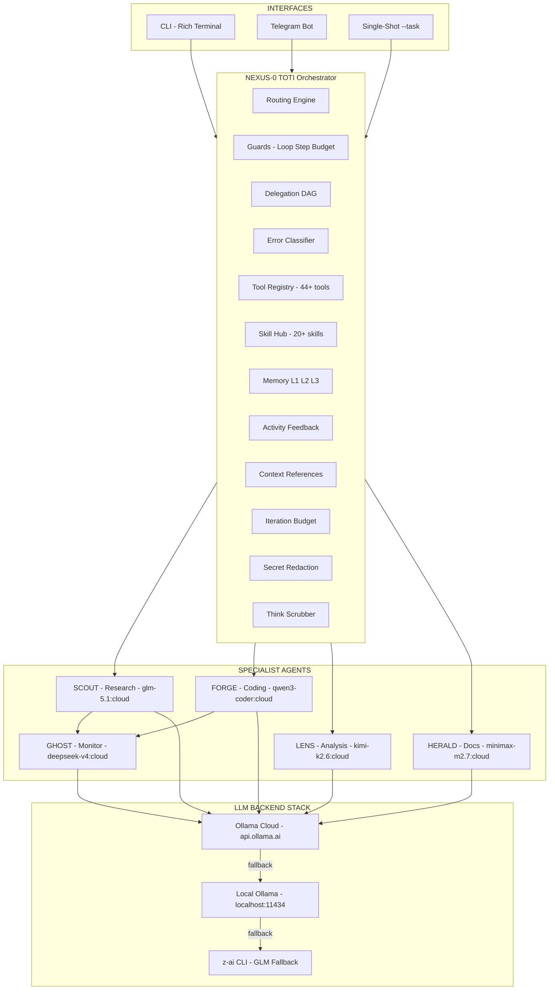
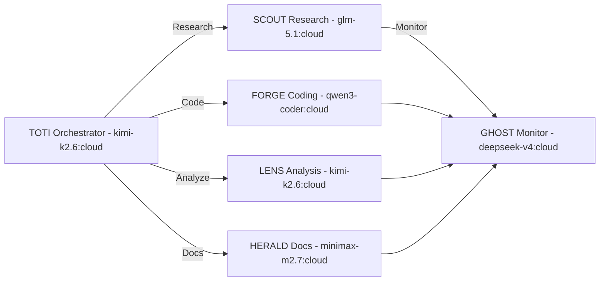
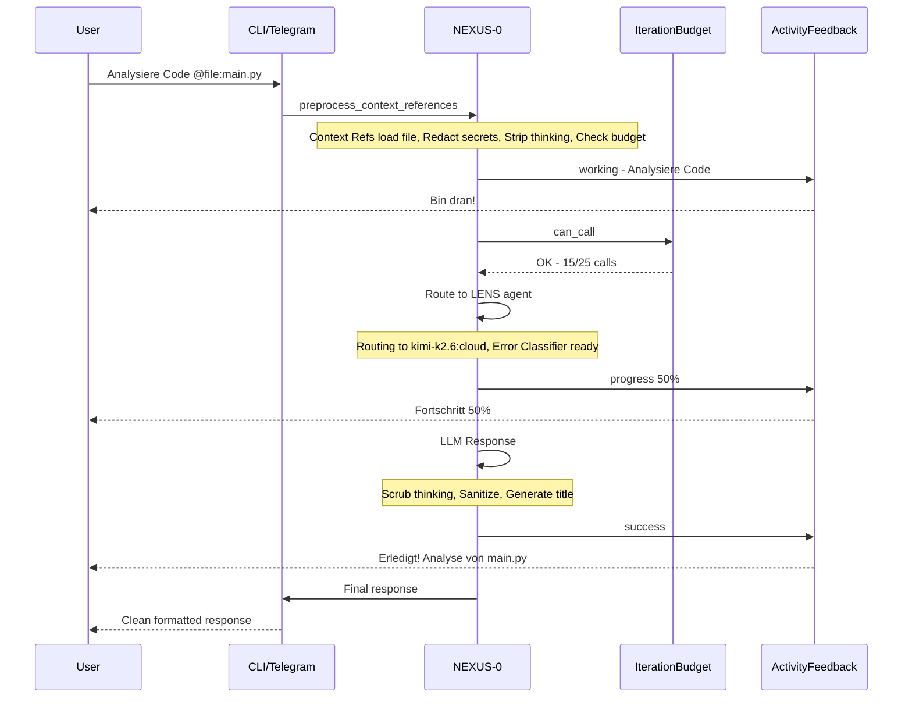
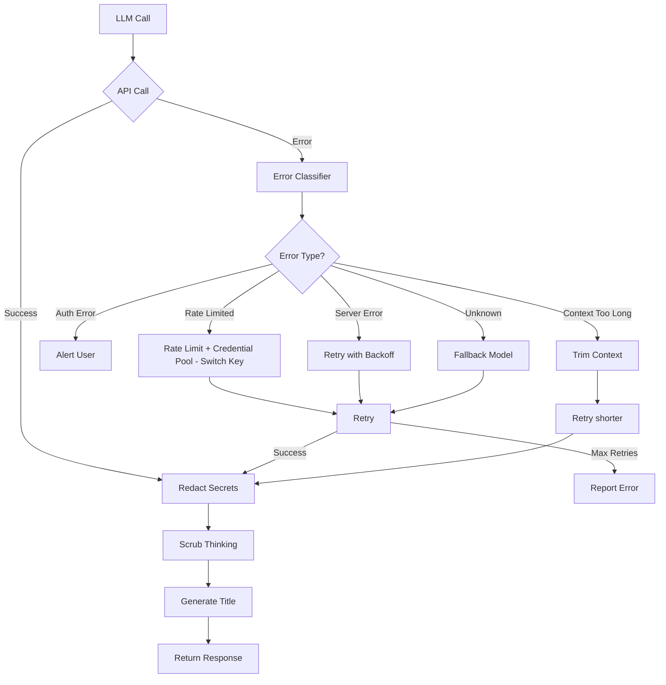
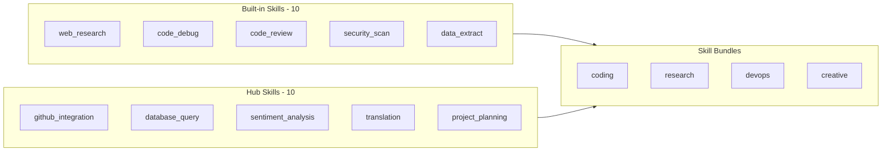

# NEXUS v6.0 — Autonomous Multi-Agent Framework

> **44+ Tools · 20+ Skills via Skill Hub · 6 Agents mit per-agent LLM-Routing · Fehlerklassifikation · Secret Redaction · Activity Feedback · Rate Limit Tracking · Iteration Budget**

[](LICENSE)

[](https://www.python.org/)
[](https://ollama.ai)
[](https://www.docker.com/)

---

**🇩🇪 NEXUS ist ein autonomes Multi-Agenten-Framework.** Es koordiniert ein Team spezialisierter KI-Agenten, die selbstständig denken, delegieren, Code ausführen und Probleme lösen — mit nur einem Ziel: komplexe Aufgaben vollständig autonom zu erledigen.

🇬🇧 **English:** NEXUS is an autonomous multi-agent framework that coordinates specialized AI agents thinking, delegating, executing code, and solving problems autonomously.

---

## System Architecture



### Detailed System Architecture

```
┌─────────────────────────────────────────────────────────────────────────────┐
│                              INTERFACES                                      │
│  ┌──────────────┐    ┌──────────────┐    ┌──────────────────────────────┐  │
│  │  CLI (Rich)   │    │  Telegram Bot │    │  --task Single-Shot Mode     │  │
│  └──────┬───────┘    └──────┬───────┘    └──────────────┬───────────────┘  │
└─────────┼────────────────────┼──────────────────────────┼───────────────────┘
          │                    │                          │
          ▼                    ▼                          ▼
┌─────────────────────────────────────────────────────────────────────────────┐
│                        NEXUS-0 / TOTI — Orchestrator                      │
│                        Model: kimi-k2.6:cloud · Temp: 0.7                    │
│                                                                              │
│  ┌────────────┐  ┌──────────────┐  ┌──────────────┐  ┌──────────────────┐  │
│  │  Routing    │  │  Guards      │  │  Delegation   │  │  Error           │  │
│  │   Engine   │  │  Loop · Step │  │  DAG Engine   │  │  Classifier       │  │
│  │  Per-Agent │  │  Budget·ReAct│  │  DAG·Parallel │  │  20+ FailoverTypes│  │
│  └────────────┘  └──────────────┘  └──────────────┘  └──────────────────┘  │
│  ┌────────────┐  ┌──────────────┐  ┌──────────────┐  ┌──────────────────┐  │
│  │  Tool       │  │  Skill Hub   │  │  Memory      │  │  Activity        │  │
│  │  Registry   │  │  20+ Skills  │  │  L1/L2/L3   │  │  Feedback         │  │
│  │  44+ tools  │  │  Built-in+Hub│  │  Sessions·RAG│  │  19 DE Messages   │  │
│  └────────────┘  └──────────────┘  └──────────────┘  └──────────────────┘  │
│  ┌────────────┐  ┌──────────────┐  ┌──────────────┐  ┌──────────────────┐  │
│  │  Context   │  │  Iteration   │  │  Redaction    │  │  Think            │  │
│  │  References│  │  Budget      │  │  15 Patterns │  │  Scrubber         │  │
│  │  @file @url│  │  Turn/Conv   │  │  Keys·Tokens  │  │  6 Block Types    │  │
│  └────────────┘  └──────────────┘  └──────────────┘  └──────────────────┘  │
└──────────────────────────────────────┬──────────────────────────────────────┘
                                       │
              ┌────────────────────────┼─────────────────────┐
              ▼                        ▼                     ▼
┌──────────────────┐  ┌──────────────────┐  ┌──────────────────┐  ┌──────────────────┐
│   SCOUT          │  │   FORGE          │  │   LENS            │  │   HERALD          │
│  glm-5.1:cloud   │  │ qwen3-coder:cloud│  │  kimi-k2.6:cloud │  │minimax-m2.7:cloud│
│  Research        │  │  Coding/Dev       │  │  Analysis         │  │  Output/Docs      │
└──────────────────┘  └──────────────────┘  └──────────────────┘  └──────────────────┘
              │                                    
              ▼                                    
    ┌──────────────────┐                           
    │   GHOST          │                           
    │ deepseek-v4:cloud│                           
    │  Background       │                           
    └──────────────────┘                           

┌─────────────────────────────────────────────────────────────────────────────┐
│                           LLM BACKEND STACK                                  │
│   ┌──────────────────┐    ┌──────────────────┐    ┌──────────────────┐     │
│   │  Ollama Cloud    │───▶│  Local Ollama    │───▶│  z-ai CLI        │     │
│   │  api.ollama.ai   │    │  localhost:11434   │    │  GLM Fallback    │     │
│   └──────────────────┘    └──────────────────┘    └──────────────────┘     │
│   Auto-detected · Auto-fallback · Per-agent routing · Credential Pool      │
└─────────────────────────────────────────────────────────────────────────────┘
```

---

## Agent Team



NEXUS v6.0 coordinates **6 specialized agents**, each running on the LLM best suited for its role.

| Agent | Model | Role | Specialization | Temperature | Max Tokens |
|-------|-------|------|----------------|-------------|------------|
| **NEXUS-0 / Toti** | `kimi-k2.6:cloud` | Orchestrator | Decision-making, routing, delegation | 0.7 | 4096 |
| **SCOUT** | `glm-5.1:cloud` | Researcher | Web search, fact-finding, triangulation | 0.5 | 8192 |
| **FORGE** | `qwen3-coder-next:cloud` | Developer | Code generation, debugging, deployment | 0.3 | 8192 |
| **LENS** | `kimi-k2.6:cloud` | Analyst | Code review, security analysis, profiling | 0.4 | 4096 |
| **HERALD** | `minimax-m2.7:cloud` | Writer | Documentation, formatting, translation | 0.6 | 4096 |
| **GHOST** | `deepseek-v4-flash:cloud` | Monitor | Background tasks, state persistence | 0.3 | 2048 |

---

## Data Flow

How a message flows through NEXUS from user input to final response:



---

## Error Handling



---

## Key Features v6.0

### Phase 1 — Security

#### Error Classifier (`error_classifier.py`)
**FailoverReason taxonomy** covering 20+ error types:

| Category | Error Types | Auto-Recovery |
|----------|------------|---------------|
| **Auth** | `AUTH_INVALID_KEY`, `AUTH_EXPIRED`, `AUTH_PERMISSION` | Alert user |
| **Billing** | `BILLING_RATE_LIMITED`, `BILLING_QUOTA_EXCEEDED` | Backoff + key rotation |
| **Server** | `SERVER_OVERLOADED`, `SERVER_INTERNAL_ERROR`, `SERVER_MAINTENANCE` | Retry with backoff |
| **Transport** | `TRANSPORT_TIMEOUT`, `TRANSPORT_CONNECTION`, `TRANSPORT_DNS` | Retry + fallback |
| **Context** | `CONTEXT_TOO_LONG`, `CONTEXT_CONTENT_FILTER` | Trim / rephrase |
| **Policy** | `POLICY_MODEL_UNAVAILABLE`, `POLICY_MODEL_REJECTED` | Failover model |
| **Tool** | `TOOL_EXECUTION_FAILED`, `TOOL_NOT_FOUND`, `TOOL_PERMISSION_DENIED` | Retry / alternate |

#### Secret Redaction (`redact.py`)
Regex-based secret detection for logs, tool output, and conversation history:

| Pattern Type | Examples | Coverage |
|-------------|----------|----------|
| API Keys | `sk-...`, `ghp_...`, `hf_...`, `ollama-...` | 10+ providers |
| Auth Tokens | `Bearer ...`, `api_key=...` | Query + JSON |
| Sensitive Params | `password=`, `secret=`, `token=` | URL + Body |
| Env Variables | `export OPENAI_API_KEY=...` | Shell + Config |

#### File Safety (`file_safety.py`)
Protected path validation preventing accidental agent overwrites:

- **Protected filenames**: `.env`, `config.yaml`, `credentials.json`, `*.key`, `*.pem`
- **Protected directories**: `/etc/`, `~/.ssh/`, `data/auth/`, `data/secrets/`
- **Path traversal prevention**: `../`, symlinks to sensitive locations

---

### Phase 2 — Performance

#### Context References (`context_references.py`)
Inject file contents and web pages: `@file:path` and `@url:url`

- `<context-ref>` tags wrap injected content
- Budget tracking (4MB max total injection)
- Blocked binary extensions (`.exe`, `.png`, `.sqlite`, etc.)

#### Rate Limit Tracker (`rate_limit_tracker.py`)
Per-model rate limit tracking from `x-ratelimit-*` API headers:

- Tracks requests-per-minute, tokens-per-minute, requests-per-day
- Auto-backoff when approaching limits (80% threshold)
- Persists state across sessions

#### Iteration Budget (`iteration_budget.py`)
Prevent runaway agent loops with per-turn and per-conversation budgets:

| Budget | Default | Scope |
|--------|---------|-------|
| Turn calls | 25 | Per user turn |
| Turn tokens | 100,000 | Per user turn |
| Total calls | 200 | Per conversation |
| Total tokens | 1,000,000 | Per conversation |

---

### Phase 3 — UX

#### Think Scrubber (`think_scrubber.py`)
Strips 6 thinking/reasoning block types from model output:

| Block Type | Pattern | Use Case |
|-----------|---------|----------|
| `<think>` | DeepSeek-R1, QwQ | Primary reasoning |
| `<thinking>` | Claude-style | Extended thinking |
| `<reasoning>` | o1-style | Step-by-step reasoning |
| `<reflection>` | Claude | Self-reflection |
| `<chain-of-thought>` | Experimental | Explicit CoT |
| `<scratchpad>` | Research | Internal scratchpad |

#### Title Generator (`title_generator.py`)
German/English pattern-based conversation title generation with category detection.

#### Message Sanitization (`message_sanitization.py`)
Three modes: `sanitize_for_telegram()` (aggressive, 3900 chars), `sanitize_for_conversation_history()` (preserves tool calls, 50K), `sanitize_for_logging()` (redacts secrets).

---

### Phase 4 — Advanced

#### Skill Bundles (`skill_bundles.py`)
6 pre-configured bundles: **coding** (5 skills, SCOUT/FORGE), **research** (3 skills, SCOUT/LENS), **devops** (3 skills, FORGE/GHOST), **creative** (3 skills, HERALD), **monitoring** (3 skills, GHOST), **full** (all 10, NEXUS-0).

#### Credential Pool (`credential_pool.py`)
Multi-key API key management with rotation and health tracking:

- Multiple keys per provider (Ollama Cloud, z-ai, etc.)
- Automatic rotation when rate limited
- Health scoring (0.0–1.0) based on error rate + usage
- Persisted state across sessions

#### Skill Hub (`skill_hub.py`)
Dynamic skill marketplace: 10 built-in + 10 hub-downloadable skills across 5 categories (coding, research, devops, creative, analysis).

---

### Phase 5 — Activity Feedback

#### Activity Feedback System (`activity_feedback.py`)
**Makes NEXUS feel alive.** Constant feedback so users never think the agent is offline:

| Situation | Example Messages (DE) | Count |
|-----------|----------------------|-------|
| **Thinking** | "Mmm, mal uberlegen...", "Analyziere das mal schnell..." | 12 |
| **Working** | "Bin dran!", "Wird gemacht!", "Auf geht's!" | 10 |
| **Progress** | "Fortschritt: 75% - halte durch!", "Noch ein Moment..." | 8 |
| **Success** | "Erledigt!", "Passt! Alles erledigt!" | 8 |
| **Error** | "Mist, Fehler! Aber ich hab noch Ideen..." | 5 |
| **Human-like** | "Endlich mal was Spannendes!", "Gute Frage btw!" | 10 |

**Streaming Feedback** provides periodic updates during long operations (10-second intervals).

---

## Skill Hub



---

## Quick Start

### One-Line Install (Docker)

```bash
curl -fsSL https://raw.githubusercontent.com/***REMOVED***/nexus-toti/main/install.sh | bash
```

### Manual Setup

```bash
git clone https://github.com/***REMOVED***/nexus-toti.git
cd nexus-toti
cp .env.example .env
# Edit .env with your keys
docker compose up nexus
```

### Auto-Start

```bash
NEXUS_AUTO_START=1 curl -fsSL https://raw.githubusercontent.com/***REMOVED***/nexus-toti/main/install.sh | bash
```

---

## Configuration

| Variable | Default | Description |
|----------|---------|-------------|
| `OLLAMA_HOST` | `http://host.docker.internal:11434` | Ollama API endpoint |
| `OLLAMA_API_KEY` | — | Ollama Cloud API key |
| `NEXUS_MODEL_FAST` | `glm-5.1:cloud` | Fast model (monitoring) |
| `NEXUS_MODEL_STANDARD` | `kimi-k2.6:cloud` | Standard model (coding) |
| `NEXUS_MODEL_THINK` | `kimi-k2.6:cloud` | Thinking model (reasoning) |
| `NEXUS_TG_TOKEN` | — | Telegram bot token |
| `NEXUS_MAX_CALLS` | `200` | Max LLM calls per conversation |
| `NEXUS_MAX_TOKENS` | `1000000` | Max tokens per conversation |

---

## Project Structure

```
nexus-toti/
├── nexus.py                    # Main entry point
├── config.yaml                 # Agent/model routing config
├── Dockerfile                  # Multi-stage Docker build
├── docker-compose.yml          # CLI + Telegram profiles
├── install.sh                  # One-line installer
├── .env.example                # Environment template
├── requirements.txt            # Python dependencies
│
├── agents/                     # Agent implementations
│   ├── toti.py                 # NEXUS-0: Primary orchestrator
│   ├── scout.py                # Research agent
│   ├── forge.py                # Coding agent
│   ├── lens.py                 # Analysis agent
│   ├── herald.py               # Output/docs agent
│   └── ghost.py                # Background/monitoring agent
│
├── core/                       # Core framework (v6.0)
│   ├── agent_base.py           # Agent base class
│   ├── llm_client.py          # Multi-backend LLM client
│   ├── memory.py               # L1/L2/L3 memory system
│   ├── tools.py                # Tool registry (44+ tools)
│   ├── delegation.py           # DAG task decomposition
│   ├── error_learning.py       # Base error learning
│   ├── guards.py               # Loop/step/budget guards
│   ├── scheduler.py            # Smart scheduler
│   ├── state.py                # Persistent state
│   │
│   ├── error_classifier.py     # v6.0: 20+ FailoverReason types
│   ├── redact.py               # v6.0: 15+ secret redaction patterns
│   ├── file_safety.py          # v6.0: Protected paths
│   ├── context_references.py   # v6.0: @file, @url references
│   ├── rate_limit_tracker.py   # v6.0: Per-model rate limit tracking
│   ├── iteration_budget.py     # v6.0: Per-turn/conversation budgets
│   ├── think_scrubber.py       # v6.0: Strip 6 thinking block types
│   ├── title_generator.py      # v6.0: DE/EN title generation
│   ├── message_sanitization.py # v6.0: 3-mode sanitization
│   ├── skill_bundles.py        # v6.0: 6 pre-configured bundles
│   ├── credential_pool.py      # v6.0: Key rotation, health scoring
│   ├── skill_hub.py            # v6.0: Dynamic skill marketplace
│   └── activity_feedback.py    # v6.0: German feedback messages
│
├── skills/                     # Executable skill modules
├── prompts/                    # Agent system prompts
├── interfaces/                 # CLI + Telegram interfaces
├── memory/                     # Session + long-term memory
└── data/                       # Runtime data
    ├── state/                  # Agent state files
    ├── checkpoints/             # Conversation checkpoints
    ├── rag/                    # RAG index
    ├── error_learning/         # Error database
    ├── rate_limits/            # Rate limit state
    ├── credentials/            # Credential pool state
    └── skills/                 # Hub skill cache
```

---

## License

[MIT](LICENSE) — built by [Tito Prausee](https://github.com/***REMOVED***)

---

<div align="center">

**NEXUS v6.0** — *Autonomous. Intelligent. Alive.*

[Home](https://github.com/***REMOVED***/nexus-toti) · [Docs](https://github.com/***REMOVED***/nexus-toti#readme) · [Issues](https://github.com/***REMOVED***/nexus-toti/issues) · [Discussions](https://github.com/***REMOVED***/nexus-toti/discussions)

</div>
