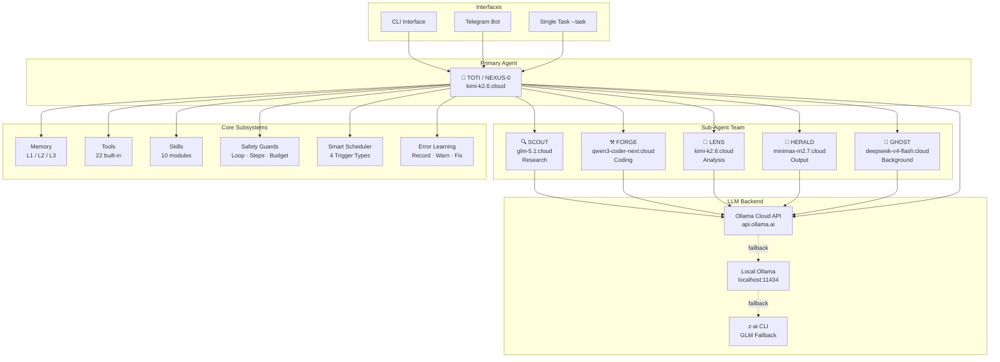
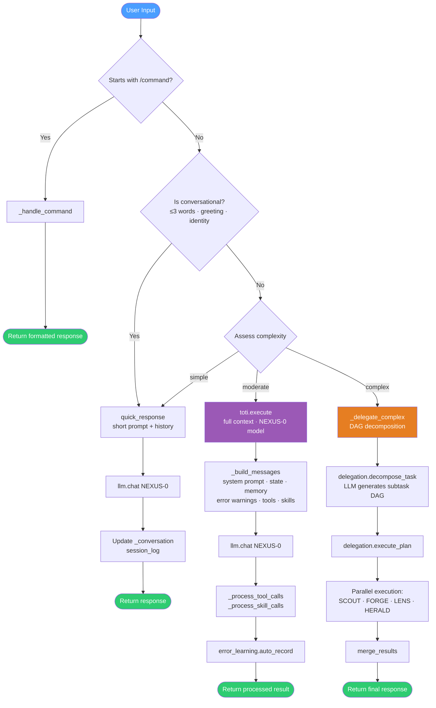
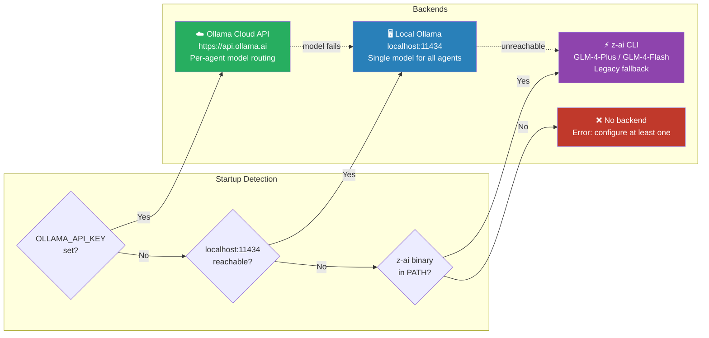
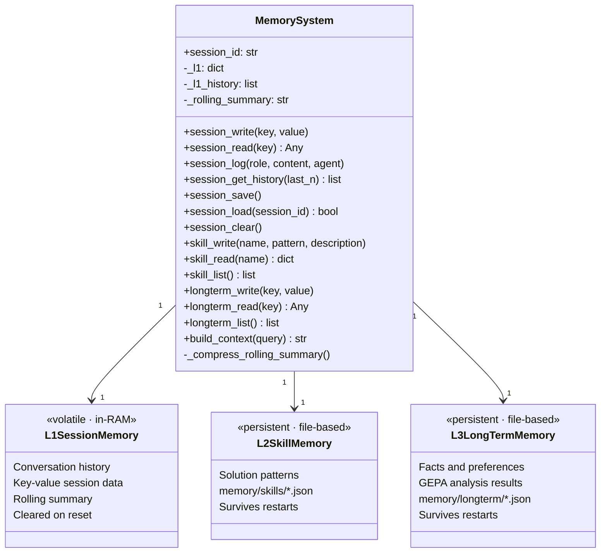
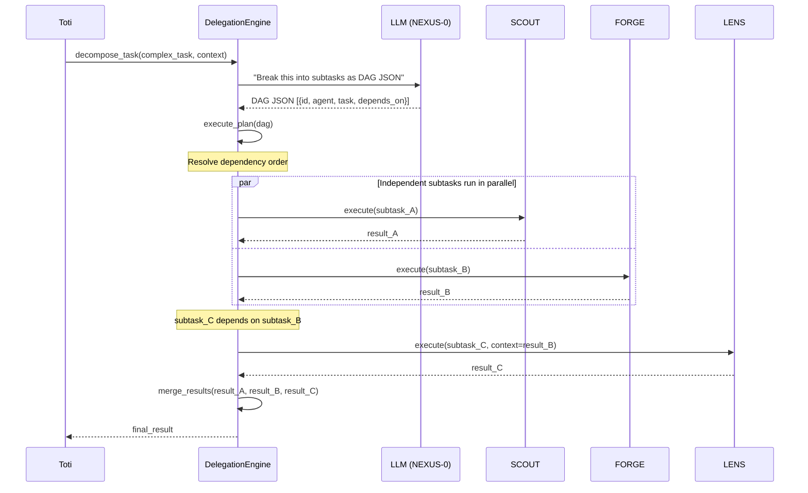
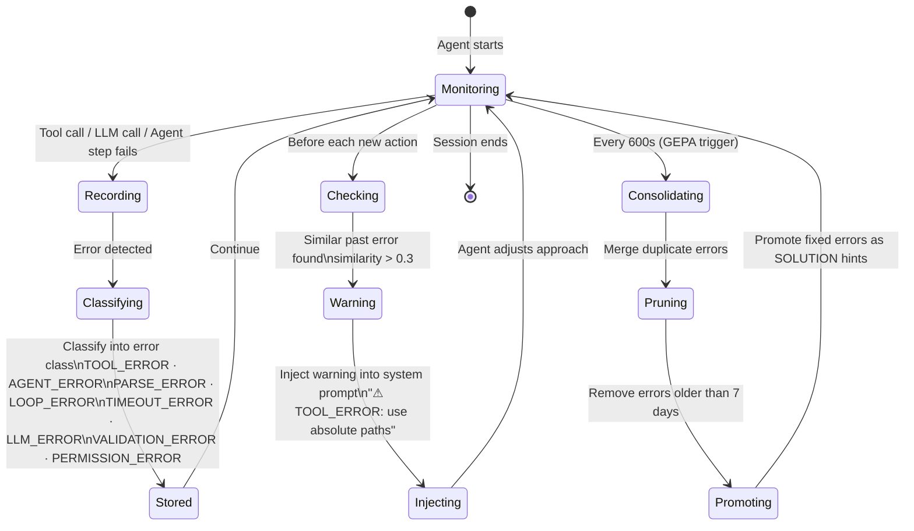
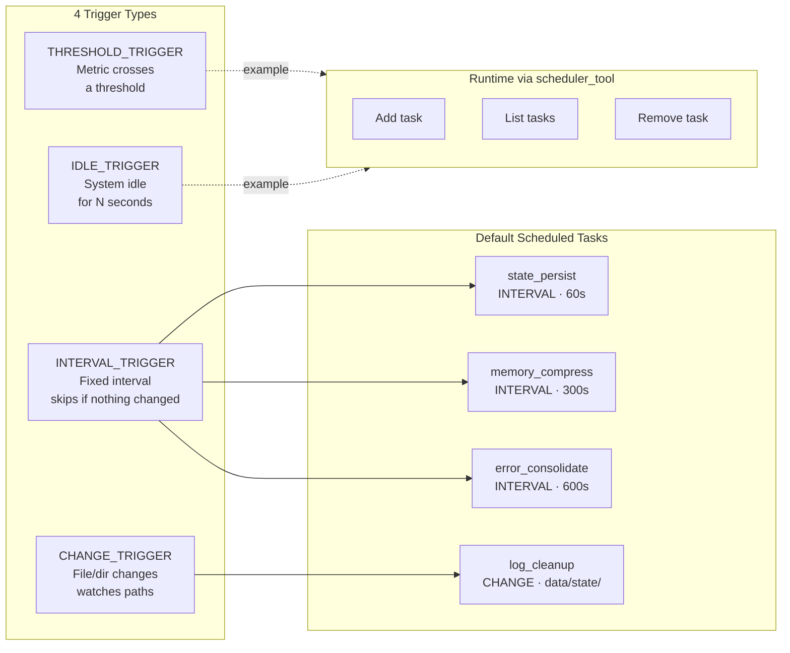
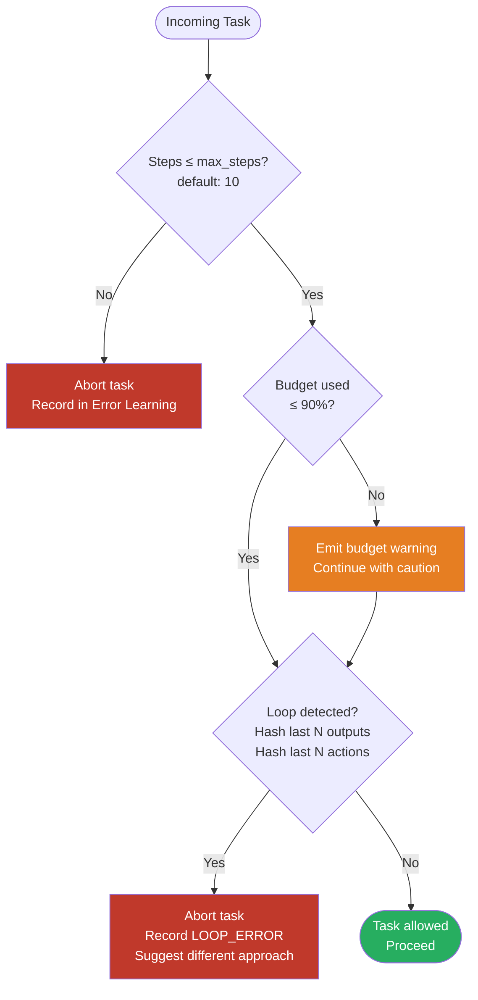
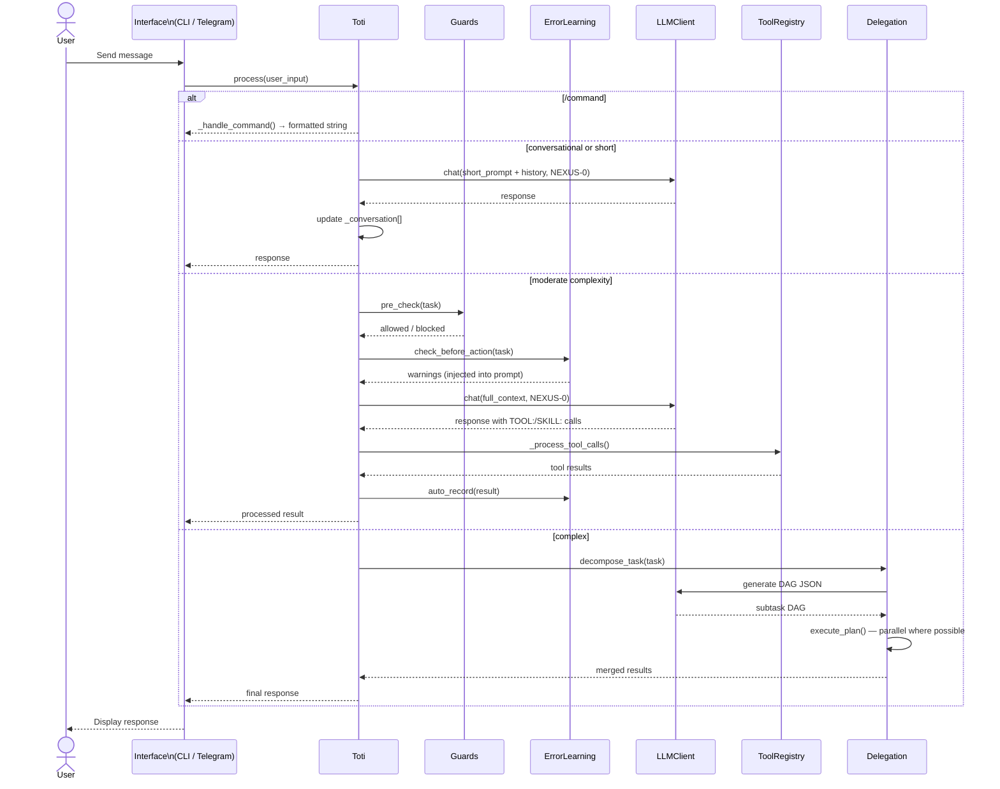
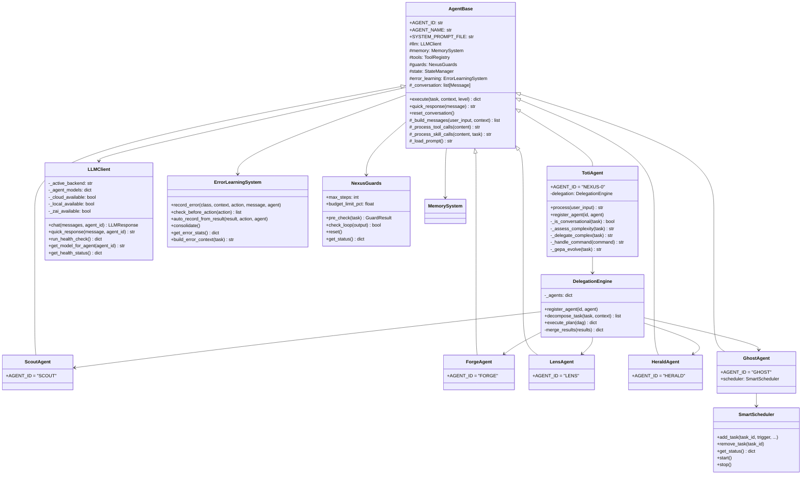

# NEXUS — Toti Agent System v3.0

> Autonomous multi-agent framework powered by Ollama Cloud · Per-agent model routing · Error Learning · 22 Tools · 10 Skills · Telegram Interface

[](LICENSE)
[](https://www.python.org/)
[](https://ollama.ai)

---

## Table of Contents

- [What is NEXUS?](#what-is-nexus)
- [Architecture](#architecture)
  - [System Overview](#system-overview)
  - [Agent Team](#agent-team)
  - [Agent Routing](#agent-routing)
  - [LLM Backend Stack](#llm-backend-stack)
  - [Memory System](#memory-system)
  - [Delegation Engine](#delegation-engine)
  - [Error Learning](#error-learning)
  - [Smart Scheduler](#smart-scheduler)
  - [Safety Guards](#safety-guards)
  - [Request Flow](#request-flow)
  - [Class Structure](#class-structure)
- [Tool Registry](#tool-registry)
- [Skill System](#skill-system)
- [Installation](#installation)
  - [Local Setup](#local-setup)
  - [Docker Setup](#docker-setup)
- [Configuration](#configuration)
- [Usage](#usage)
- [Commands](#commands)
- [Project Structure](#project-structure)
- [Contributing](#contributing)
- [License](#license)

---

## What is NEXUS?

NEXUS is an autonomous multi-agent system built around **Toti** — a primary agent that thinks, delegates, learns, and acts without waiting for approval. Unlike typical chatbot wrappers, NEXUS is built for developers: it runs shell commands, writes and executes code, manages Docker containers, queries databases, and coordinates specialized sub-agents to tackle complex multi-step tasks.

**Key characteristics:**

- **Autonomous by default** — Toti acts, then reports. No confirmation loops for routine operations.
- **Per-agent model routing** — Each sub-agent runs on the best-fit LLM for its specialty.
- **Error learning** — NEXUS remembers every failure, classifies it, and avoids repeating mistakes.
- **Three interfaces** — Interactive CLI, single-task CLI, and a Telegram bot.
- **Multi-backend LLM** — Ollama Cloud, local Ollama, or z-ai CLI — auto-detected with auto-fallback.

---

## Architecture

### System Overview



---

### Agent Team

NEXUS uses a team of 6 specialized agents, each running on the LLM best suited for its role.

| Agent | Model | Specialty | Temp | Max Tokens |
|-------|-------|-----------|------|------------|
| **NEXUS-0 / Toti** | `kimi-k2.6:cloud` | Orchestration, decision-making, general tasks | 0.7 | 4096 |
| **SCOUT** | `glm-5.1:cloud` | Web research, data extraction, fact-finding | 0.5 | 8192 |
| **FORGE** | `qwen3-coder-next:cloud` | Code generation, debugging, testing, deployment | 0.3 | 8192 |
| **LENS** | `kimi-k2.6:cloud` | Code review, security analysis, performance profiling | 0.4 | 4096 |
| **HERALD** | `minimax-m2.7:cloud` | Documentation, formatting, structured output | 0.6 | 4096 |
| **GHOST** | `deepseek-v4-flash:cloud` | Background monitoring, state persistence, scheduling | 0.3 | 2048 |

---

### Agent Routing

Every incoming message passes through a three-layer routing decision before reaching an agent.



---

### LLM Backend Stack

NEXUS auto-detects the available backend at startup and falls back gracefully.



---

### Memory System



---

### Delegation Engine



---

### Error Learning



---

### Smart Scheduler



---

### Safety Guards



---

### Request Flow



---

### Class Structure



---

## Tool Registry

22 built-in tools dispatched via `TOOL:name(params)` syntax in LLM output.

<details>
<summary><strong>Base Tools — 6 (click to expand)</strong></summary>

| Tool | Parameters | Description |
|------|-----------|-------------|
| `terminal` | `cmd` | Execute shell commands |
| `read_file` | `path` | Read file contents |
| `write_file` | `path, content` | Write file contents |
| `web_search` | `query, num` | Web search (requires backend support) |
| `list_dir` | `path` | List directory contents |
| `code_exec` | `code` | Execute Python code |

</details>

<details>
<summary><strong>Developer Tools — 10 (click to expand)</strong></summary>

| Tool | Parameters | Description |
|------|-----------|-------------|
| `git` | `action, args` | Git: status, log, diff, commit, push, pull, branch, merge, tag, blame |
| `docker` | `action, args` | Docker: ps, images, run, stop, build, logs, compose, inspect, exec, pull, stats |
| `pkg_install` | `manager, package, dev` | Install packages via pip, npm, or apt |
| `http_request` | `method, url, headers, body` | HTTP GET/POST/PUT/DELETE/PATCH |
| `file_search` | `pattern, path, type` | Find files by name or grep for content |
| `process_manager` | `action, pid, name` | List, find, kill processes; show top |
| `env_check` | — | Check OS, Python, Node, Git, Docker, disk, memory |
| `port_check` | `port, host` | Check if a port is open |
| `json_yaml` | `action, data, query` | Parse, convert, query, validate JSON/YAML |
| `file_ops` | `action, src, dst` | tree, copy, move, delete, diff, tail, head, mkdir, chmod |

</details>

<details>
<summary><strong>Advanced Tools — 6 (click to expand)</strong></summary>

| Tool | Parameters | Description |
|------|-----------|-------------|
| `db_query` | `action, db_path, query, db_type` | SQLite / PostgreSQL / MySQL: query, tables, schema, insert |
| `api_test` | `action, url, method, headers, body, expected_status` | Test API endpoints, validate OpenAPI/Swagger specs |
| `code_lint` | `action, path, linter, fix` | Lint (flake8/pylint/eslint), format (black/prettier), type-check (mypy) |
| `archive_ops` | `action, src, dst, format` | Create/extract tar.gz, zip, gzip archives |
| `csv_ops` | `action, path, data, delimiter, query, output` | Read, write, filter, sort, convert CSV; compute statistics |
| `scheduler_tool` | `action, task_id, trigger, interval_seconds, command` | Manage Smart Scheduler tasks at runtime |

</details>

---

## Skill System

Skills are specialized Python modules in `skills/` implementing multi-step workflows. Agents invoke them via `SKILL:name(params)` syntax.

| Skill | Description |
|-------|-------------|
| `web_research` | Deep web research with source triangulation and confidence scoring |
| `code_debug` | Root-cause error analysis: read error → identify cause → fix → validate |
| `code_review` | Structured code review with quality verdict and improvement suggestions |
| `security_scan` | Scan code and dependencies for known vulnerabilities |
| `data_extract` | Extract and process data from CSV, JSON, APIs, web pages, or databases |
| `test_gen` | Automatically generate unit tests for Python/JS code |
| `doc_gen` | Generate README, API docs, or CHANGELOG from code |
| `deploy_prep` | Validate and prepare deployments for Docker, Kubernetes, or VPS |
| `dependency_check` | Check dependencies for updates, conflicts, and security issues |
| `performance` | Profile and optimize code performance |

---

## Installation

### Local Setup

**Requirements:** Python 3.10+, [Ollama](https://ollama.ai) installed

```bash
# Clone
git clone https://github.com/TitoPrausee/nexus-toti.git
cd nexus-toti

# Install dependencies
pip install rich pyyaml
pip install python-telegram-bot  # optional, for Telegram bot

# Pull a local model (if not using Ollama Cloud)
ollama pull qwen2.5:3b        # ~2 GB RAM — recommended for local use
ollama pull llama3.2:latest   # ~4 GB RAM

# Configure (optional — works out of the box with local Ollama)
cp .env.example .env

# Run
python nexus.py
```

**Using Ollama Cloud:**

```bash
# Option A: environment variable
export OLLAMA_API_KEY=your-key-here
python nexus.py

# Option B: interactive setup wizard
python nexus.py --setup

# Option C: edit config.yaml directly
# ollama.api_key: "your-key-here"
```

### Docker Setup

```bash
cp .env.example .env  # edit as needed

# Interactive CLI
docker compose run --rm nexus

# Telegram bot (runs as daemon)
docker compose --profile telegram up nexus-telegram -d

# Single task
docker compose run --rm nexus --task "List all Python files in /app"
```

| Variable | Description | Default |
|----------|-------------|---------|
| `OLLAMA_HOST` | Ollama server URL | `http://host.docker.internal:11434` |
| `OLLAMA_API_KEY` | Ollama Cloud API key | — |
| `NEXUS_MODEL_FAST` | Override fast model | `qwen2.5:3b` |
| `NEXUS_MODEL_STANDARD` | Override standard model | `qwen2.5:3b` |
| `NEXUS_TG_TOKEN` | Telegram bot token | — |

---

## Configuration

All configuration lives in `config.yaml`.

<details>
<summary><strong>Ollama / Model config (click to expand)</strong></summary>

```yaml
ollama:
  base_url: "https://api.ollama.ai"
  local_url: "http://localhost:11434"
  api_key: ""                # or OLLAMA_API_KEY env var
  mode: "cloud"              # "cloud" | "local" | "hybrid"

  agent_models:
    NEXUS-0:
      model: "kimi-k2.6:cloud"
      temperature: 0.7
      max_tokens: 4096
    FORGE:
      model: "qwen3-coder-next:cloud"
      temperature: 0.3
      max_tokens: 8192
```

</details>

<details>
<summary><strong>Guards config (click to expand)</strong></summary>

```yaml
guards:
  max_steps: 10
  budget_limit_pct: 90.0
  loop_detection_window: 3
  action_loop_window: 5
```

</details>

<details>
<summary><strong>Scheduler config (click to expand)</strong></summary>

```yaml
scheduler:
  enabled: true
  default_tasks:
    state_persist:
      trigger: INTERVAL_TRIGGER
      interval_seconds: 60
    log_cleanup:
      trigger: CHANGE_TRIGGER
      watch: "data/state/"
```

</details>

<details>
<summary><strong>Telegram config (click to expand)</strong></summary>

```yaml
telegram:
  enabled: false
  token: ""                  # or NEXUS_TG_TOKEN env var
  authorized_users: []       # empty = all users; [12345678] = restrict
```

</details>

---

## Usage

```bash
python nexus.py                          # Interactive CLI
python nexus.py --task "..."             # Single task and exit
python nexus.py --telegram               # Start Telegram bot
python nexus.py --health                 # LLM health check
python nexus.py --models                 # Show model routing table
python nexus.py --setup                  # Ollama Cloud setup wizard
python nexus.py --session ID             # Resume previous session
```

---

## Commands

Available in both CLI and Telegram:

| Command | Description |
|---------|-------------|
| `/status` | System status: guards, budget, LLM calls, agents, scheduler |
| `/health` | Run LLM health check for all configured models |
| `/memory` | Memory overview: L1 session history, L2 skills, L3 long-term |
| `/state` | Raw state JSON |
| `/errors` | Error Learning stats: known errors, recent failures, avoidance count |
| `/tools` | All 22 tools listed by category |
| `/skills` | All 10 skills with descriptions |
| `/reset` | Clear session memory and state |
| `/evolve` | GEPA self-improvement: analyze session, generate improvement proposals |
| `/help` | Show all commands |

---

## Project Structure

```
nexus-toti/
│
├── nexus.py                  # Entry point — arg parsing, mode selection
├── config.yaml               # All configuration
├── requirements.txt          # Python dependencies
├── setup.sh                  # Interactive setup script
├── ollama_setup.py           # Ollama Cloud setup wizard
│
├── agents/
│   ├── toti.py               # Primary agent — routing, delegation, commands
│   ├── scout.py              # Research agent
│   ├── forge.py              # Code / dev agent
│   ├── lens.py               # Analysis / review agent
│   ├── herald.py             # Output / docs agent
│   ├── ghost.py              # Background / monitoring agent
│   └── orchestrator.py       # DAG orchestration helper
│
├── core/
│   ├── agent_base.py         # Base class all agents inherit from
│   ├── llm_client.py         # Multi-backend LLM client
│   ├── memory.py             # 3-level memory (L1 session / L2 skills / L3 longterm)
│   ├── tools.py              # Tool registry and dispatch (22 tools)
│   ├── delegation.py         # DAG task decomposition and parallel execution
│   ├── error_learning.py     # Error record · warn · consolidate
│   ├── guards.py             # Loop detection · max steps · budget tracking
│   ├── scheduler.py          # Smart scheduler (4 trigger types)
│   └── state.py              # Persistent state management
│
├── interfaces/
│   ├── cli.py                # Interactive Rich terminal CLI
│   └── telegram_bot.py       # Telegram bot with per-user sessions
│
├── prompts/                  # System prompts per agent
│   ├── toti.txt
│   ├── scout.txt
│   ├── forge.txt
│   ├── lens.txt
│   ├── herald.txt
│   └── ghost.txt
│
├── skills/                   # 10 skill modules
│   └── *.py
│
├── memory/skills/            # Persistent skill patterns (JSON)
├── Dockerfile
├── docker-compose.yml
└── .env.example
```

---

## Contributing

1. Fork the repository
2. Create a feature branch: `git checkout -b feature/your-feature`
3. Commit: `git commit -m "Add your feature"`
4. Push: `git push origin feature/your-feature`
5. Open a Pull Request

**Extension points:**

| What | Where | How |
|------|-------|-----|
| New Tool | `core/tools.py` | Add handler, register in `_register_defaults()` |
| New Skill | `skills/your_skill.py` | Implement `execute(llm_client, tools, **kwargs)` |
| New Agent | `agents/your_agent.py` | Subclass `AgentBase`, set `AGENT_ID` + `SYSTEM_PROMPT_FILE` |
| New Trigger | `core/scheduler.py` | Extend `ScheduledTask` with new trigger logic |

---

## License

MIT License — see [LICENSE](LICENSE) for full text.
