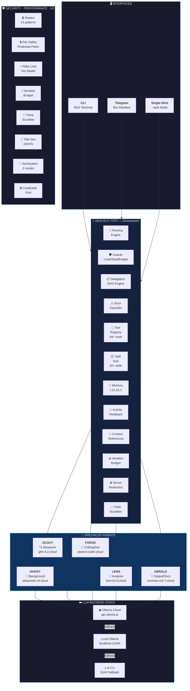
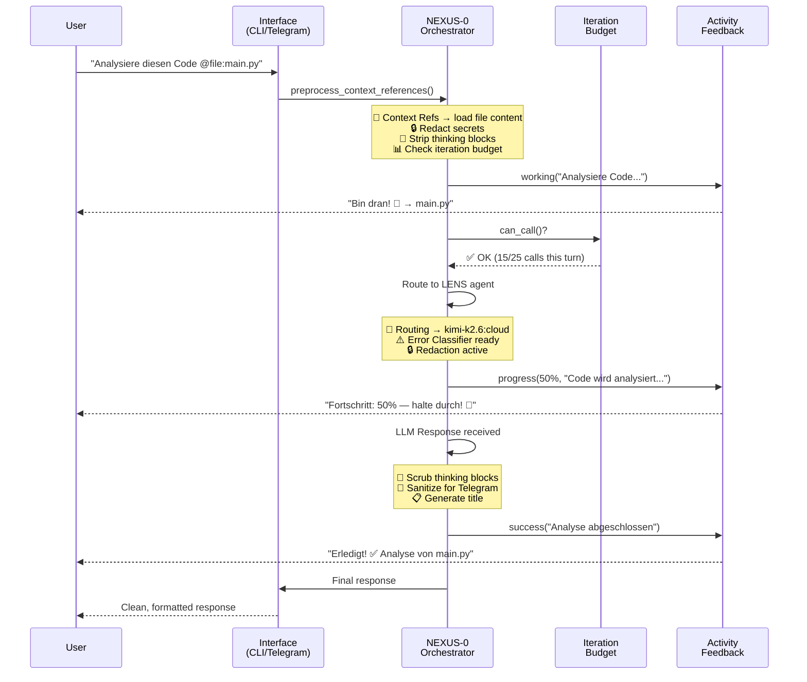
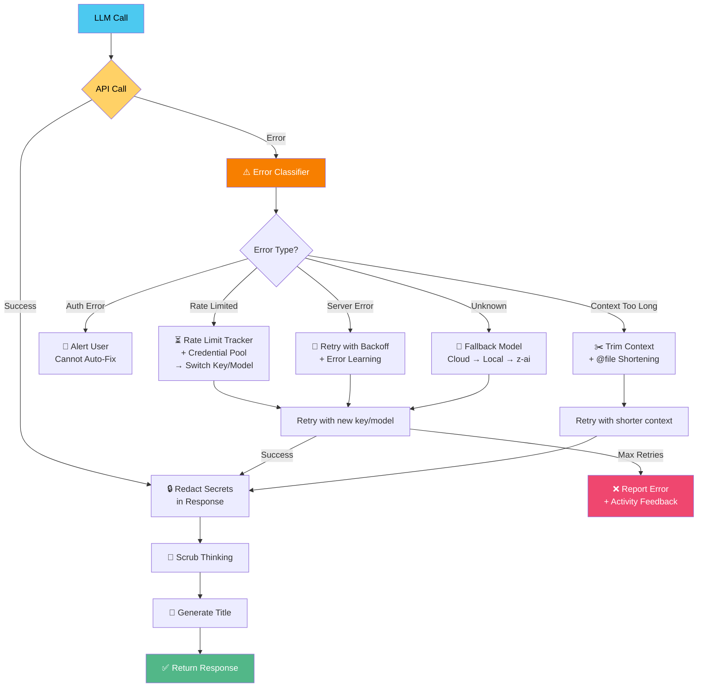
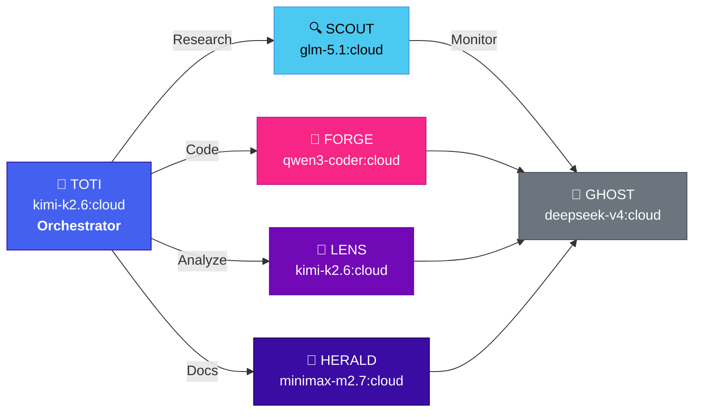

# NEXUS v6.0 — Autonomous Multi-Agent Framework

> **44+ Tools · 20+ Skills via Skill Hub · 6 Agents mit per-agent LLM-Routing · Fehlerklassifikation · Secret Redaction · Activity Feedback · Rate Limit Tracking · Iteration Budget**

[](LICENSE)

[](https://www.python.org/)
[](https://ollama.ai)
[](https://www.docker.com/)

---

**🇩🇪 NEXUS ist ein autonomes Multi-Agenten-Framework.** Es koordiniert ein Team spezialisierter KI-Agenten, die selbstständig denken, delegieren, Code ausführen und Probleme lösen — mit nur einem Ziel: komplexe Aufgaben vollständig autonom zu erledigen. Per-agent LLM-Routing, intelligentes Fehlermanagement (Error Classifier mit 20+ Fehlertypen) und ein lebendiges Activity-Feedback-System machen NEXUS zu einem der fortschrittlichsten Open-Source-Frameworks für KI-Agenten-Orchestrierung.

🇬🇧 **English:** NEXUS is an autonomous multi-agent framework that coordinates a team of specialized AI agents thinking, delegating, executing code, and solving problems autonomously — with one goal: complete complex tasks fully autonomously.

---

## Table of Contents

- [System Architecture](#system-architecture)
- [Agent Team](#agent-team)
- [Data Flow](#data-flow)
- [Key Features v6.0](#key-features-v60)
  - [Phase 1 — Security](#phase-1--security)
  - [Phase 2 — Performance](#phase-2--performance)
  - [Phase 3 — UX](#phase-3--ux)
  - [Phase 4 — Advanced](#phase-4--advanced)
  - [Phase 5 — Activity Feedback](#phase-5--activity-feedback)
- [Skill Hub](#skill-hub)
- [Quick Start](#quick-start)
- [Configuration](#configuration)
- [Project Structure](#project-structure)
- [License](#license)

---

## System Architecture



### Detailed System Architecture

```
┌─────────────────────────────────────────────────────────────────────────────┐
│                              🖥️ INTERFACES                                  │
│  ┌──────────────┐    ┌──────────────┐    ┌──────────────────────────────┐  │
│  │  CLI (Rich)   │    │  Telegram Bot │    │  --task Single-Shot Mode    │  │
│  │  Interactive   │    │  /start /ask  │    │  One-shot · Pipeline         │  │
│  └──────┬───────┘    └──────┬───────┘    └──────────────┬───────────────┘  │
│         │                    │                          │                   │
└─────────┼────────────────────┼──────────────────────────┼───────────────────┘
          │                    │                          │
          ▼                    ▼                          ▼
┌─────────────────────────────────────────────────────────────────────────────┐
│                        🧠 NEXUS-0 / TOTI — Orchestrator                      │
│                        Model: kimi-k2.6:cloud · Temp: 0.7                    │
│                                                                              │
│  ┌────────────┐  ┌──────────────┐  ┌──────────────┐  ┌──────────────────┐  │
│  │ 🔀 Routing │  │ 🛡️ Guards    │  │ 📋 Delegation│  │ ⚠️ Error         │  │
│  │   Engine   │  │ Loop · Step  │  │   DAG Engine │  │  Classifier      │  │
│  │ Per-Agent  │  │ Budget · ReAct│  │ DAG · Parallel│ │ 20+ FailoverTypes│  │
│  └────────────┘  └──────────────┘  └──────────────┘  └──────────────────┘  │
│  ┌────────────┐  ┌──────────────┐  ┌──────────────┐  ┌──────────────────┐  │
│  │ 🔧 Tool    │  │ 📦 Skill Hub │  │ 💾 Memory    │  │ 💬 Activity      │  │
│  │  Registry  │  │ 20+ Skills   │  │  L1/L2/L3   │  │  Feedback         │  │
│  │  44+ tools │  │ Built-in+Hub │  │ Sessions·RAG │  │ 19 DE Messages    │  │
│  └────────────┘  └──────────────┘  └──────────────┘  └──────────────────┘  │
│  ┌────────────┐  ┌──────────────┐  ┌──────────────┐  ┌──────────────────┐  │
│  │ 📎 Context │  │ 📊 Iteration│  │ 🔒 Redaction │  │ 🧹 Think         │  │
│  │ References │  │   Budget    │  │ 15 Patterns  │  │  Scrubber         │  │
│  │ @file @url │  │ Turn/Conv   │  │ Keys·Tokens  │  │  6 Block Types    │  │
│  └────────────┘  └──────────────┘  └──────────────┘  └──────────────────┘  │
└──────────────────────────────────────┬──────────────────────────────────────┘
                                       │
              ┌────────────────────────┼─────────────────────┐
              ▼                        ▼                     ▼
┌──────────────────┐  ┌──────────────────┐  ┌──────────────────┐  ┌──────────────────┐
│   🔍 SCOUT       │  │   🔨 FORGE       │  │   🔎 LENS        │  │   📝 HERALD      │
│  glm-5.1:cloud   │  │ qwen3-coder:cloud│  │  kimi-k2.6:cloud │  │minimax-m2.7:cloud│
│                  │  │                  │  │                  │  │                  │
│  • Web Research  │  │  • Code Gen      │  │  • Code Review   │  │  • Documentation  │
│  • Data Extract  │  │  • Debugging     │  │  • Security Scan │  │  • Formatting     │
│  • Fact-Finding  │  │  • Deployment    │  │  • Profiling     │  │  • Translation    │
│  • Triangulation │  │  • Refactoring  │  │  • Testing       │  │  • Summaries      │
└──────────────────┘  └──────────────────┘  └──────────────────┘  └──────────────────┘
              │                                    
              ▼                                    
    ┌──────────────────┐                           
    │   👻 GHOST       │                           
    │ deepseek-v4:cloud│                           
    │                  │                           
    │  • Monitoring    │                           
    │  • State Persist │                           
    │  • Background    │                           
    └──────────────────┘                           

┌─────────────────────────────────────────────────────────────────────────────┐
│                           ☁️ LLM BACKEND STACK                               │
│                                                                              │
│   ┌──────────────────┐    ┌──────────────────┐    ┌──────────────────┐     │
│   │  ◉ Ollama Cloud  │───▶│  Local Ollama    │───▶│  z-ai CLI       │     │
│   │  api.ollama.ai   │    │  localhost:11434  │    │  GLM Fallback   │     │
│   │  kimi · glm · qwen│    │  qwen2.5:3b      │    │  glm-4-plus      │     │
│   └──────────────────┘    └──────────────────┘    └──────────────────┘     │
│                                                                              │
│   Auto-detected · Auto-fallback · Per-agent model routing · Credential Pool │
│   Rate Limit Tracking · Error Classification · Secret Redaction             │
└─────────────────────────────────────────────────────────────────────────────┘
```

---

## Data Flow

How a message flows through NEXUS from user input to final response:



### Error Handling Flow



---

## Agent Team

NEXUS v6.0 coordinates **6 specialized agents**, each running on the LLM best suited for its role.



| Agent | Model | Role | Specialization | Temperature | Max Tokens |
|-------|-------|------|----------------|-------------|------------|
| **NEXUS-0 / Toti** | `kimi-k2.6:cloud` | Orchestrator | Decision-making, routing, delegation | 0.7 | 4096 |
| **SCOUT** | `glm-5.1:cloud` | Researcher | Web search, fact-finding, triangulation | 0.5 | 8192 |
| **FORGE** | `qwen3-coder-next:cloud` | Developer | Code generation, debugging, deployment | 0.3 | 8192 |
| **LENS** | `kimi-k2.6:cloud` | Analyst | Code review, security analysis, profiling | 0.4 | 4096 |
| **HERALD** | `minimax-m2.7:cloud` | Writer | Documentation, formatting, translation | 0.6 | 4096 |
| **GHOST** | `deepseek-v4-flash:cloud` | Monitor | Background tasks, state persistence | 0.3 | 2048 |

Each agent routes to its configured model automatically. If a model becomes unavailable, NEXUS falls back through the stack: **Cloud → Local → z-ai CLI**.

---

## Key Features v6.0

### Phase 1 — Security

#### 🔒 Error Classifier (`error_classifier.py`)
A sophisticated error classification system with a **FailoverReason taxonomy** covering 20+ error types:

| Category | Error Types | Auto-Recovery |
|----------|------------|---------------|
| **Auth** | `AUTH_INVALID_KEY`, `AUTH_EXPIRED`, `AUTH_PERMISSION` | ❌ Alert user |
| **Billing** | `BILLING_RATE_LIMITED`, `BILLING_QUOTA_EXCEEDED` | ⏳ Backoff + key rotation |
| **Server** | `SERVER_OVERLOADED`, `SERVER_INTERNAL_ERROR`, `SERVER_MAINTENANCE` | 🔄 Retry with backoff |
| **Transport** | `TRANSPORT_TIMEOUT`, `TRANSPORT_CONNECTION`, `TRANSPORT_DNS` | 🔄 Retry + fallback |
| **Context** | `CONTEXT_TOO_LONG`, `CONTEXT_CONTENT_FILTER` | ✂️ Trim / rephrase |
| **Policy** | `POLICY_MODEL_UNAVAILABLE`, `POLICY_MODEL_REJECTED` | 🔀 Failover model |
| **Tool** | `TOOL_EXECUTION_FAILED`, `TOOL_NOT_FOUND`, `TOOL_PERMISSION_DENIED` | 🔄 Retry / alternate tool |

#### 🔒 Secret Redaction (`redact.py`)
Regex-based secret detection and redaction for logs, tool output, and conversation history:

| Pattern Type | Examples | Coverage |
|-------------|----------|----------|
| API Keys | `sk-...`, `ghp_...`, `hf_...`, `ollama-...` | 10+ providers |
| Auth Tokens | `Bearer ...`, `api_key=...` | Query + JSON |
| Sensitive Params | `password=`, `secret=`, `token=` | URL + Body |
| Env Variables | `export OPENAI_API_KEY=...` | Shell + Config |

#### 🔒 File Safety (`file_safety.py`)
Protected path validation preventing accidental agent overwrites:

- **Protected filenames**: `.env`, `config.yaml`, `credentials.json`, `*.key`, `*.pem`
- **Protected directories**: `/etc/`, `~/.ssh/`, `data/auth/`, `data/secrets/`
- **Path traversal prevention**: `../`, symlinks to sensitive locations

---

### Phase 2 — Performance

#### ⚡ Context References (`context_references.py`)
Inject file contents and web pages into messages with `@file:path` and `@url:url` syntax:

```
"Analysiere diesen Code @file:core/agent_base.py und vergleiche mit @url:https://example.com/api"
```

- ✅ `<context-ref>` tags wrap injected content
- ✅ Budget tracking (4MB max total injection)
- ✅ Blocked binary extensions (`.exe`, `.png`, `.sqlite`, etc.)

#### ⚡ Rate Limit Tracker (`rate_limit_tracker.py`)
Per-model rate limit tracking from `x-ratelimit-*` API headers:

- 📊 Tracks requests-per-minute, tokens-per-minute, requests-per-day
- ⏳ Auto-backoff when approaching limits (80% threshold)
- 🔄 Persists state across sessions for continuity
- 🔄 Integrates with Credential Pool for key rotation

#### ⚡ Iteration Budget (`iteration_budget.py`)
Prevent runaway agent loops with per-turn and per-conversation budgets:

| Budget | Default | Scope |
|--------|---------|-------|
| Turn calls | 25 | Per user turn |
| Turn tokens | 100,000 | Per user turn |
| Total calls | 200 | Per conversation |
| Total tokens | 1,000,000 | Per conversation |

---

### Phase 3 — UX

#### 🎨 Think Scrubber (`think_scrubber.py`)
Strips thinking/reasoning blocks from model output before display:

| Block Type | Pattern | Use Case |
|-----------|---------|----------|
| `<think>` | DeepSeek-R1, QwQ | Primary reasoning blocks |
| `<thinking>` | Claude-style | Extended thinking |
| `<reasoning>` | o1-style | Step-by-step reasoning |
| `<reflection>` | Claude | Self-reflection blocks |
| `<chain-of-thought>` | Experimental | Explicit CoT |
| `<scratchpad>` | Research | Internal scratchpad |

#### 🎨 Title Generator (`title_generator.py`)
German/English pattern-based conversation title generation:

- 🇩🇪 German patterns: "Mmm, mal überlegen...", "Bin dran!"
- 🇬🇧 English patterns: "Looking into...", "Working on it!"
- 🏷️ Category detection: Bug-Fix, Feature, Research, Architecture

#### 🎨 Message Sanitization (`message_sanitization.py`)
Three sanitization modes for different output targets:

| Mode | Targets | Behavior |
|------|---------|----------|
| `sanitize_for_telegram()` | Telegram | Aggressive: strip thinking + artifacts, 3900 char limit |
| `sanitize_for_conversation_history()` | Context | Preserved: keep tool calls, 50K char limit |
| `sanitize_for_logging()` | Logs | Safe: redact secrets + sanitize |

---

### Phase 4 — Advanced

#### 🧠 Skill Bundles (`skill_bundles.py`)
Pre-configured skill groups that load together:

| Bundle | Skills | Agents |
|--------|--------|--------|
| **coding** | code_debug, code_review, test_gen, dependency_check, performance | SCOUT, FORGE |
| **research** | web_research, data_extract, doc_gen | SCOUT, LENS |
| **devops** | deploy_prep, security_scan, dependency_check | FORGE, GHOST |
| **creative** | doc_gen, web_research, data_extract | HERALD |
| **monitoring** | security_scan, dependency_check, performance | GHOST |
| **full** | All 10 skills | NEXUS-0 |

#### 🧠 Credential Pool (`credential_pool.py`)
Multi-key API key management with rotation and health tracking:

- 🔑 Multiple keys per provider (Ollama Cloud, z-ai, etc.)
- 🔄 Automatic rotation when rate limited
- 📊 Health scoring (0.0–1.0) based on error rate + usage
- 💾 Persisted state across sessions
- 🌍 Env var auto-detection (`OLLAMA_API_KEY`, `ZAI_API_KEY`, etc.)

#### 🧠 Skill Hub (`skill_hub.py`)
Dynamic skill marketplace with built-in + downloadable skills:

| Category | Built-in Skills | Hub Skills |
|----------|----------------|------------|
| **coding** | code_debug, code_review, test_gen, dependency_check, performance | github_integration, api_testing |
| **research** | web_research, data_extract, doc_gen | database_query, sentiment_analysis |
| **devops** | deploy_prep, security_scan | system_monitoring |
| **creative** | doc_gen | translation, diagram_gen |
| **analysis** | — | project_planning, image_analysis |

---

### Phase 5 — Activity Feedback

#### 💬 Activity Feedback System (`activity_feedback.py`)
**Makes NEXUS feel alive.** Instead of radio silence during processing, NEXUS provides constant feedback:

| Situation | Example Messages (🇩🇪) | Count |
|-----------|------------------------|-------|
| **Thinking** | "Mmm, mal überlegen... 🤔", "Analyziere das mal schnell... 🔍" | 12 |
| **Working** | "Bin dran! 🔧", "Wird gemacht! 🛠️", "Auf geht's! 🚀" | 10 |
| **Progress** | "Fortschritt: 75% — halte durch! 💪", "Noch ein Moment... ⏳" | 8 |
| **Success** | "Erledigt! ✅", "Passt! Alles erledigt! 👍" | 8 |
| **Error** | "Mist, Fehler! Aber ich hab noch Ideen... 🔄" | 5 |
| **Human-like** | "Endlich mal was Spannendes! 😎", "Das ist genau meine Art von Problem! 🔥" | 10 |
| **Tool call** | "Rufe {tool} auf... 🔌" | 4 |

**Streaming Feedback** provides periodic updates during long operations (10-second intervals) so users never think the agent is offline.

---

## Skill Hub

```mermaid
graph LR
    subgraph builtin["📦 Built-in Skills (10)"]
        WR["web_research"]
        CD["code_debug"]
        CR["code_review"]
        SS["security_scan"]
        DE["data_extract"]
        TG["test_gen"]
        DG["doc_gen"]
        DP["deploy_prep"]
        DC["dependency_check"]
        PF["performance"]
    end
    
    subgraph hub["🌐 Hub Skills (10)"]
        GH["github_integration"]
        GL["gitlab_integration"]
        DQ["database_query"]
        AT["api_testing"]
        SA["sentiment_analysis"]
        TR["translation"]
        DIAG["diagram_gen"]
        PP["project_planning"]
        IA["image_analysis"]
        SM["system_monitoring"]
    end
    
    subgraph bundles["🎯 Skill Bundles"]
        CODING["coding"]
        RESEARCH["research"]
        DEVOPS["devops"]
        CREATIVE["creative"]
        MONITOR["monitoring"]
        FULL["full"]
    end
    
    builtin --> bundles
    hub --> bundles
    
    style builtin fill:#1a1a2e,stroke:#4cc9f0,color:#e0e0e0
    style hub fill:#16213e,stroke:#f72585,color:#e0e0e0
    style bundles fill:#0f3460,stroke:#4cc9f0,color:#e0e0e0
```



---

## Quick Start

### One-Line Install (Docker)

```bash
curl -fsSL https://raw.githubusercontent.com/TitoPrausee/nexus-toti/main/install.sh | bash
```

### Manual Setup

```bash
# Clone
git clone https://github.com/TitoPrausee/nexus-toti.git
cd nexus-toti

# Configure
cp .env.example .env
# Edit .env with your Ollama API key and Telegram token

# Start (CLI mode)
docker compose up nexus

# Start (Telegram bot)
NEXUS_TG_TOKEN=your_token docker compose --profile telegram up nexus-telegram

# Background
docker compose up -d nexus
```

### Auto-Start on Install

```bash
NEXUS_AUTO_START=1 NEXUS_TG_TOKEN=your_token \
  curl -fsSL https://raw.githubusercontent.com/TitoPrausee/nexus-toti/main/install.sh | bash
```

---

## Configuration

All configuration is in `config.yaml`. Key environment variables:

| Variable | Default | Description |
|----------|---------|-------------|
| `OLLAMA_HOST` | `http://host.docker.internal:11434` | Ollama API endpoint |
| `OLLAMA_API_KEY` | — | Ollama Cloud API key |
| `NEXUS_MODEL_FAST` | `glm-5.1:cloud` | Fast model (monitoring) |
| `NEXUS_MODEL_STANDARD` | `kimi-k2.6:cloud` | Standard model (coding) |
| `NEXUS_MODEL_THINK` | `kimi-k2.6:cloud` | Thinking model (reasoning) |
| `NEXUS_TG_TOKEN` | — | Telegram bot token |
| `NEXUS_MAX_CALLS` | `200` | Max LLM calls per conversation |
| `NEXUS_MAX_TOKENS` | `1000000` | Max tokens per conversation |

---

## Project Structure

```
nexus-toti/
├── nexus.py                    # Main entry point
├── config.yaml                 # Agent/model routing config
├── Dockerfile                  # Multi-stage Docker build
├── docker-compose.yml          # CLI + Telegram profiles
├── install.sh                  # One-line installer
├── .env.example                # Environment template
├── requirements.txt            # Python dependencies
│
├── agents/                     # 🤖 Agent implementations
│   ├── toti.py                 # NEXUS-0: Primary orchestrator
│   ├── scout.py                # Research agent
│   ├── forge.py                # Coding agent
│   ├── lens.py                 # Analysis agent
│   ├── herald.py               # Output/docs agent
│   └── ghost.py                # Background/monitoring agent
│
├── core/                       # 🧠 Core framework (v6.0)
│   ├── agent_base.py           # Agent base class
│   ├── llm_client.py          # Multi-backend LLM client
│   ├── memory.py               # L1/L2/L3 memory system
│   ├── tools.py                # Tool registry (44+ tools)
│   ├── delegation.py           # DAG task decomposition
│   ├── error_learning.py       # Base error learning
│   ├── guards.py               # Loop/step/budget guards
│   ├── scheduler.py            # Smart scheduler
│   ├── state.py                # Persistent state
│   │
│   ├── error_classifier.py     # v6.0: 20+ FailoverReason types
│   ├── redact.py               # v6.0: 15+ secret redaction patterns
│   ├── file_safety.py          # v6.0: Protected paths, denied files
│   ├── context_references.py   # v6.0: @file, @url references
│   ├── rate_limit_tracker.py   # v6.0: Per-model rate limit tracking
│   ├── iteration_budget.py     # v6.0: Per-turn/conversation budgets
│   ├── think_scrubber.py       # v6.0: Strip 6 thinking block types
│   ├── title_generator.py      # v6.0: DE/EN title generation
│   ├── message_sanitization.py # v6.0: 3-mode output sanitization
│   ├── skill_bundles.py        # v6.0: 6 pre-configured bundles
│   ├── credential_pool.py      # v6.0: Key rotation, health scoring
│   ├── skill_hub.py            # v6.0: Dynamic skill marketplace
│   └── activity_feedback.py    # v6.0: German feedback messages
│
├── skills/                     # 🔧 Executable skill modules
├── prompts/                    # 📝 Agent system prompts
├── interfaces/                 # 🖥️ CLI + Telegram interfaces
├── memory/                     # 💾 Session + long-term memory
│   ├── skills/                 # Skill learning data
│   └── longterm/               # Persisted knowledge
│
└── data/                       # 📊 Runtime data
    ├── state/                  # Agent state files
    ├── checkpoints/             # Conversation checkpoints
    ├── rag/                    # RAG index
    ├── error_learning/         # Error database
    ├── rate_limits/            # Rate limit state
    ├── credentials/            # Credential pool state
    └── skills/                 # Hub skill cache
```

---

## Contributing

1. Fork the repo
2. Create a feature branch: `git checkout -b feat/my-feature`
3. Commit: `git commit -m "feat: my feature"`
4. Push: `git push origin feat/my-feature`
5. Open a PR

See [Issues](https://github.com/TitoPrausee/nexus-toti/issues) for open tasks and the roadmap.

---

## License

[MIT](LICENSE) — built by [Tito Prausee](https://github.com/TitoPrausee)

---

<div align="center">

**NEXUS v6.0** — *Autonomous. Intelligent. Alive.* 🧠✨

[🏠 Home](https://github.com/TitoPrausee/nexus-toti) · [📖 Docs](https://github.com/TitoPrausee/nexus-toti#readme) · [🐛 Issues](https://github.com/TitoPrausee/nexus-toti/issues) · [💬 Discussions](https://github.com/TitoPrausee/nexus-toti/discussions)

</div>