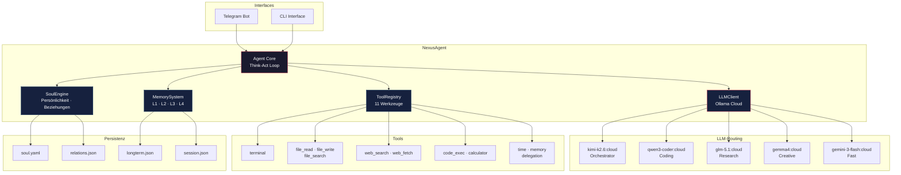
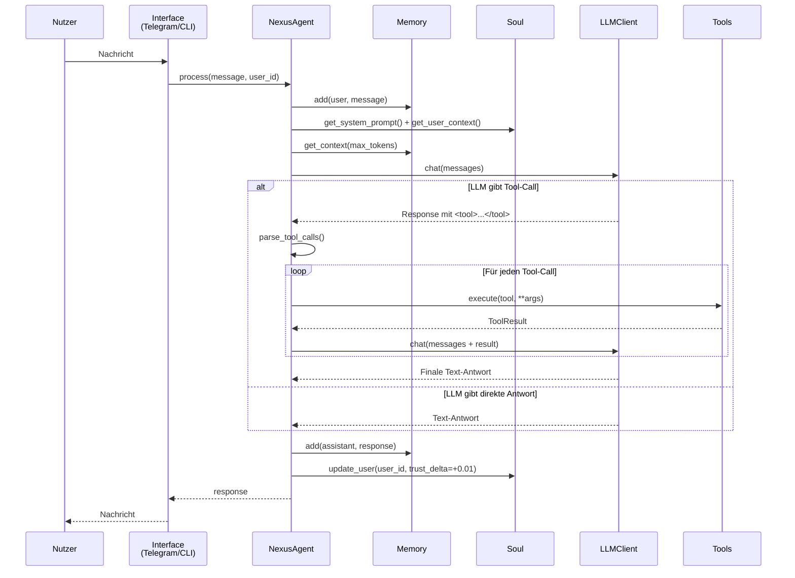
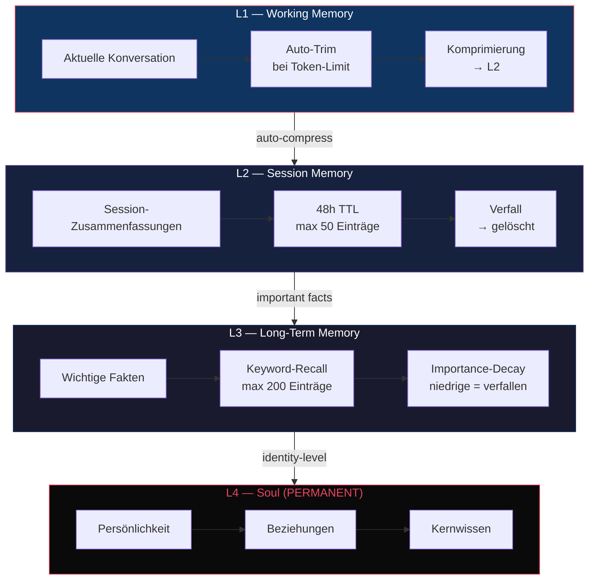
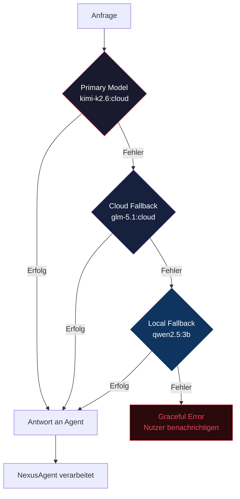
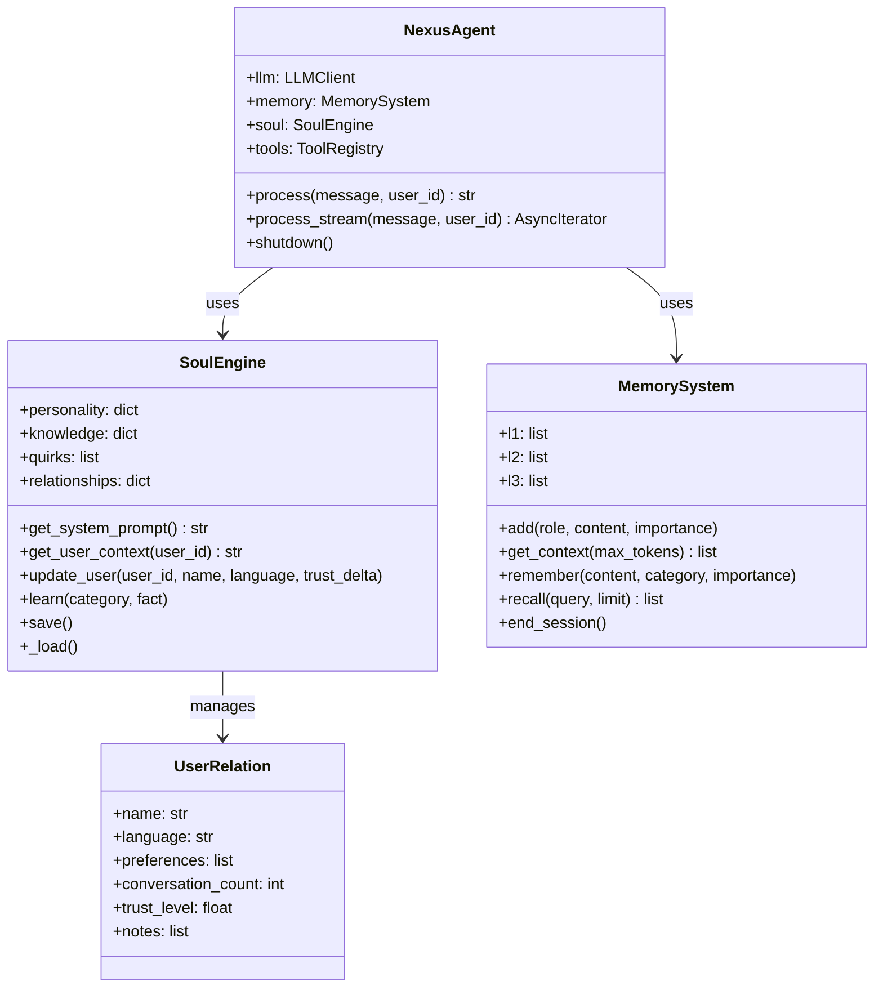

<p align="center">
  
  
  
  
</p>

<h1 align="center">NEXUS v9</h1>

<p align="center">
  <strong>Autonomer KI-Agent mit Seele.</strong><br>
  Ein einziger Agent, der denkt, delegiert und sich erinnert — nicht nur reagiert.
</p>

---

## Diagramme

### System-Architektur



### Think-Act Loop



### Memory-Hierarchie



### LLM-Fallback-Chain



### Soul-Komponenten



## Architektur

```
nexus.py                    Entry Point ─ CLI · Telegram · Self-Test
config.yaml                 Zentrale Konfiguration (LLM · Memory · Tools · Telegram)
requirements.txt            Python-Dependencies

nexus/
  core/
    agent.py                NexusAgent ─ Orchestrator, Think-Act Loop, Tool-Dispatch
    llm_client.py           Ollama Cloud Client ─ Streaming · Fallback-Chain · Retry
    memory.py               L1→L2→L3→L4 Memory ─ Working → Session → Long-Term → Soul
    tools.py                ToolRegistry ─ 11 produktive Werkzeuge, null Stubs
  interfaces/
    telegram_bot.py         Telegram Interface ─ Streaming · Typing-Indicator · Auth
    cli.py                  CLI Interface ─ interaktiver Test-Modus
  soul/
    __init__.py             SoulEngine ─ persistente Identität, Beziehungen, Eigenheiten
    soul.yaml               Persönlichkeits-Definition (Werte, Regeln, Stil)
  memory/                   Runtime-Daten (gitignored · persistent via Docker Volume)
```

## Quick Start

```bash
# 1 — Install
pip install -r requirements.txt

# 2 — Configure
cp .env.example .env
# Edit .env: OLLAMA_API_KEY, NEXUS_TG_TOKEN, NEXUS_TG_USERS

# 3 — Self-Test
python nexus.py --test

# 4 — Run
python nexus.py              # CLI-Modus
python nexus.py --telegram   # Telegram-Bot
```

### Docker

```bash
git clone https://github.com/***REMOVED***/nexus-toti.git && cd nexus-toti
cp .env.example .env         # Api-Keys eintragen
docker compose up nexus-telegram
```

## Soul-Driven Architecture

Toti besitzt eine **Seele** — persistent, adaptiv, einzigartig:

| Schicht | Funktion | Persistenz |
|---|---|---|
| **Persönlichkeit** | Werte, Regeln, Kommunikationsstil | soul.yaml — manuell &
auto |
| **Beziehungen** | Nutzer-Erkennung, Vertrauens-Modell, Präferenzen | relations.json — pro Nutzer |
| **Kernwissen** | Fakten, die über Sessions hinweg bleiben | longterm.json — L3 |
| **Eigenheiten** | Humor, Effizienz-Fokus, Deutsch-first | soul.yaml — wächst mit |

Die Seele ist kein gimmick — sie definiert **wer Toti ist**, nicht was er tut. Session-State wird gelöscht; die Seele bleibt.

## LLM-Routing

| Rolle | Modell | Einsatzgebiet |
|---|---|---|
| **Orchestrator** | `kimi-k2.6:cloud` | Gespräche, Planung, Tool-Dispatch |
| **Coding** | `qwen3-coder-next:cloud` | Code schreiben, debuggen, refactor |
| **Research** | `glm-5.1:cloud` | Recherche, Analyse, Zusammenfassungen |
| **Creative** | `gemma4:cloud` | Kreative Aufgaben, Text-Generation |
| **Fast** | `gemini-3-flash-preview:cloud` | Schnelle Antworten, Monitoring |
| **Fallback Cloud** | `glm-5.1:cloud` | Wenn primary nicht erreichbar |
| **Fallback Local** | `qwen2.5:3b` | Offline-Notbetrieb |

Der Agent entscheidet selbst wann delegiert wird — über das `delegation`-Tool.

## Memory-System

```
L1 ─ Working Memory     Aktuelle Konversation, auto-getrimmt bei Token-Limit
 │
L2 ─ Session Memory     Zusammenfassungen vergangener Sessions, 48h TTL
 │
L3 ─ Long-Term Memory   Wichtige Fakten & Präferenzen, keyword-recall, 200 Einträge
 │
L4 ─ Soul               Identität, Beziehungen, Kernwissen — PERMANENT
```

Jede Schicht hat eigene Limits, Compression- und Eviction-Strategien.  
L1 wird automatisch komprimiert, L3-Einträge decayen nach Wichtigkeit, L4 ist unantastbar.

## Tools

Alle **produktiv implementiert** — keine Platzhalter, keine Stubs:

| Tool | Beschreibung |
|---|---|
| `terminal` | Shell-Befehle ausführen (timeout, workdir) |
| `file_read` | Dateien lesen (offset, limit, Line-Numbers) |
| `file_write` | Dateien erstellen/überschreiben |
| `file_search` | Grep-artige Volltextsuche |
| `web_search` | DuckDuckGo-Suche mit Fallback-Scraper |
| `web_fetch` | URL-Inhalte abrufen und extrahieren |
| `code_exec` | Python-Code in Sandbox ausführen |
| `calculator` | Mathematische Ausdrücke berechnen |
| `time` | Aktuelle Datum/Zeit |
| `delegation` | Aufgabe an Spezialisten-Modell delegieren |
| `memory` | L1→L4 Gedächtnis verwalten (remember/recall/stats) |

Tool-Aufrufe erfolgen über XML-Tags im LLM-Output: `<tool>{"tool": "terminal", "command": "ls"}</tool>`

## Konfiguration

Alle Einstellungen zentral in `config.yaml`:

```yaml
llm:
  mode: cloud                        # cloud | local | hybrid
  default_model: kimi-k2.6:cloud
  stream: true                       # Streaming-Responses

soul:
  enabled: true                      # Persistente Persönlichkeit

memory:
  l1_max_tokens: 8000               # Working Memory Budget
  l2_max_entries: 50                 # Session Summaries
  l3_max_entries: 200                # Long-Term Facts
  auto_compress: true                # L1 automatisch komprimieren

telegram:
  streaming: true                    # Token-by-Token senden
  typing_indicator: true             # "Tippt..." anzeigen
```

Umgebungsvariablen in `.env`: `OLLAMA_API_KEY`, `NEXUS_TG_TOKEN`, `NEXUS_TG_USERS`.

## v5/v6 → v7 Migration

| | v5/v6 | v7 |
|---|---|---|
| **Agenten** | 6 separate, unkoordiniert | 1 Orchestrator + Delegation |
| **LLM** | z-ai CLI (fiktiv) | Ollama Cloud (produktiv) |
| **Tools** | 44+ Stubs | 11 implementierte Werkzeuge |
| **Gedächtnis** | Session-Files, flüchtig | L1→L4 persistent + Soul |
| **Identität** | Statische Config-Prompts | Adaptive Seele mit Beziehungen |
| **Streaming** | Nein | Ja (Token-by-Token) |
| **Codebasis** | 21.000+ Zeilen | ~1.600 Zeilen |
| **Fallback** | Kein | Cloud → Local → Graceful |

## Entwicklung

```
python nexus.py --test     # Self-Test (Imports · Tools · LLM · Soul)
python nexus.py            # CLI-Modus (interaktiv)
python nexus.py --telegram # Telegram-Bot (produktiv)
```

## Lizenz

MIT