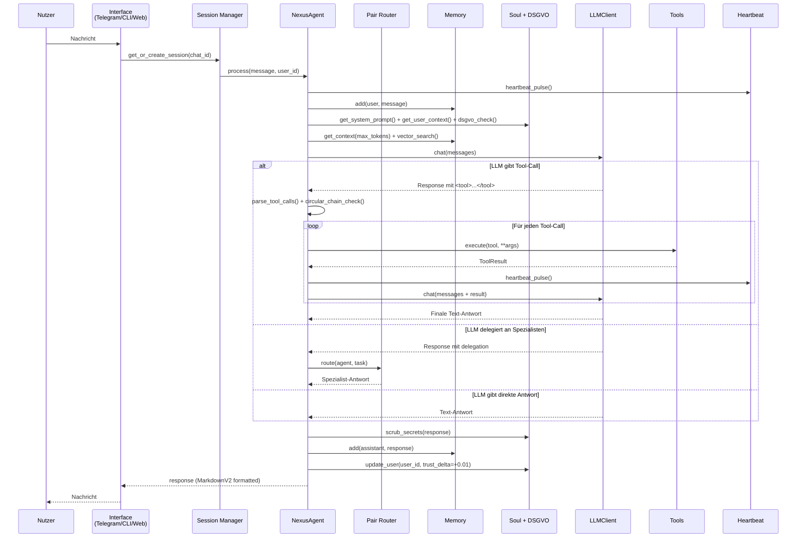
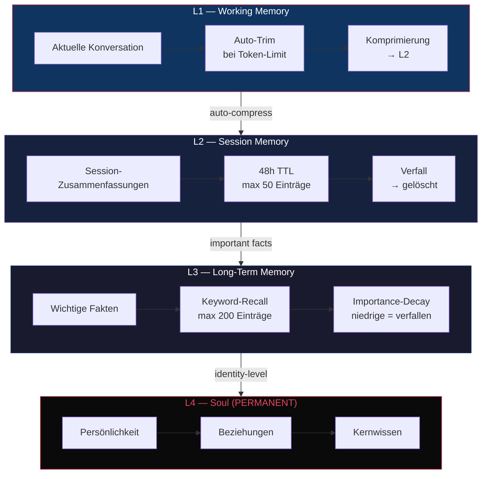
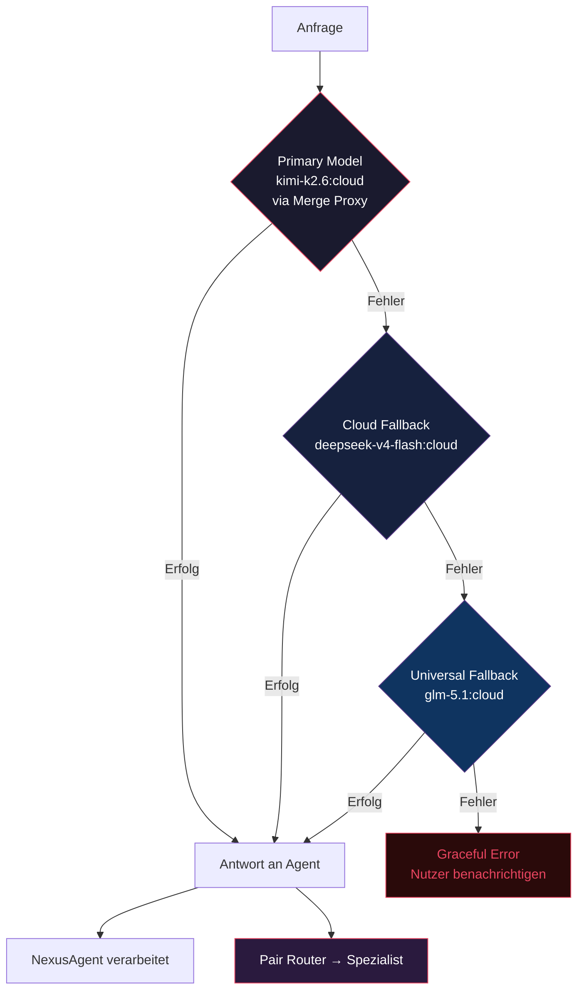
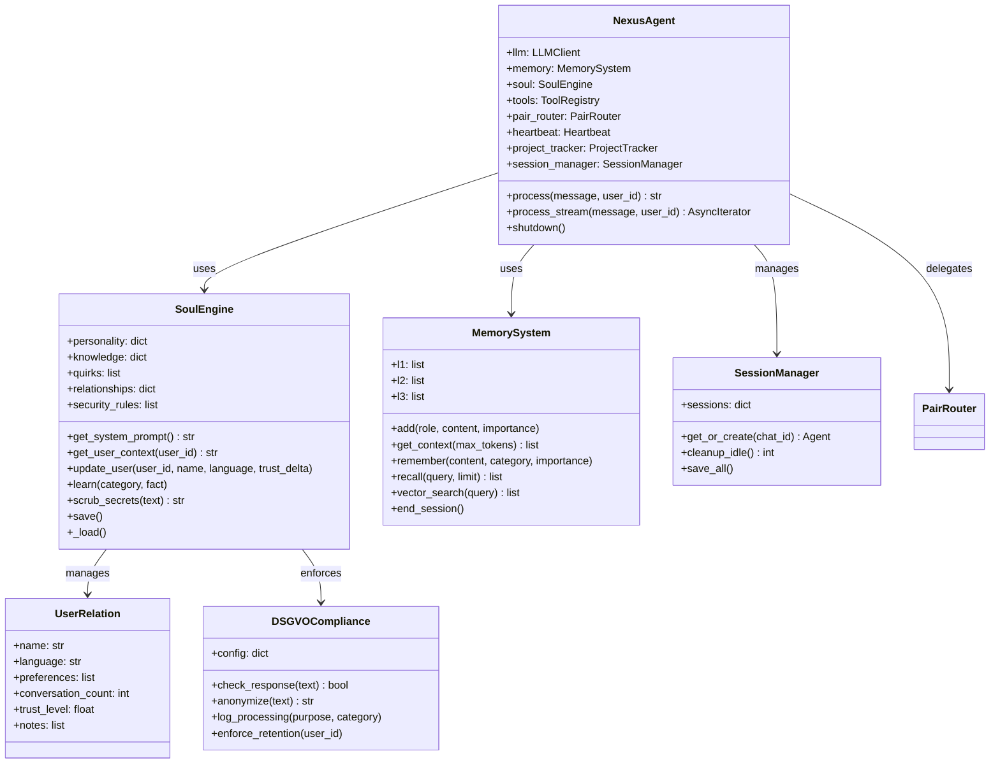

<p align="center">
  
  
  
  
</p>

<h1 align="center">NEXUS v9</h1>

<p align="center">
  <strong>Autonomer KI-Agent mit Seele und 156 Skills.</strong><br>
  6 spezialisierte Agenten, Pair Router, DSGVO-konform — denkt, delegiert und erinnert sich.
</p>

---

## Diagramme

### System-Architektur

```mermaid
graph TB
    subgraph Interfaces
        TG[Telegram Bot<br/>MarkdownV2 · Streaming · Rate-Limit]
        CLI[CLI Interface]
        WEB[Web UI<br/>FastAPI · Invite-Gate]
    end

    subgraph NexusAgent["NEXUS v9 — Agent Core"]
        AG[Agent Core<br/>Think-Act Loop · Circular-Chain Detection]
        PR[Pair Router<br/>6-Agent Delegation]
        SOUL[SoulEngine<br/>Persönlichkeit · Beziehungen · DSGVO]
        MEM[MemorySystem<br/>L1 · L2 · L3 · L4 · Vector Search]
        TOOLS[ToolRegistry<br/>11 Werkzeuge]
        LLM[LLMClient<br/>Ollama Cloud · Merge Proxy]
        HB[Heartbeat<br/>Process Health · Auto-Restart]
        PT[Project Tracker<br/>Context · Status]
        SM[Session Manager<br/>Per-Chat Isolation · Timeout]
    end

    subgraph AgentTeam["6-Agenten Team"]
        N0["NEXUS-0 · Toti<br/>kimi-k2.6:cloud<br/>Orchestration"]
        SC["SCOUT<br/>glm-5.1:cloud<br/>Recherche"]
        FG["FORGE<br/>qwen3-coder-next:cloud<br/>Coding"]
        LS["LENS<br/>kimi-k2.6:cloud<br/>Analyse"]
        HD["HERALD<br/>minimax-m2.7:cloud<br/>Output"]
        GH["GHOST<br/>deepseek-v4-flash:cloud<br/>Background"]
    end

    subgraph Tools
        T1[terminal]
        T2[file_read · file_write<br/>file_search]
        T3[web_search · web_fetch]
        T4[code_exec · calculator]
        T5[time · memory<br/>delegation]
    end

    subgraph Persistence["Persistenz"]
        SY[soul.yaml]
        RJ[relations.json]
        LJ[longterm.json]
        SJ[session.json]
        DSGVO[dsgvo_config.yaml]
    end

    TG --> SM
    CLI --> SM
    WEB --> SM
    SM --> AG

    AG --> PR
    AG --> SOUL
    AG --> MEM
    AG --> TOOLS
    AG --> LLM
    AG --> HB
    AG --> PT

    PR --> N0
    PR --> SC
    PR --> FG
    PR --> LS
    PR --> HD
    PR --> GH

    TOOLS --> T1
    TOOLS --> T2
    TOOLS --> T3
    TOOLS --> T4
    TOOLS --> T5

    SOUL --> SY
    SOUL --> RJ
    SOUL --> DSGVO
    MEM --> SJ
    MEM --> LJ

    style AG fill:#1a1a2e,stroke:#e94560,color:#fff
    style PR fill:#2a1a3e,stroke:#e94560,color:#fff
    style SOUL fill:#16213e,stroke:#0f3460,color:#fff
    style MEM fill:#16213e,stroke:#0f3460,color:#fff
    style TOOLS fill:#16213e,stroke:#0f3460,color:#fff
    style LLM fill:#16213e,stroke:#e94560,color:#fff
    style HB fill:#1a2e1a,stroke:#4CAF50,color:#fff
    style PT fill:#1a2e1a,stroke:#4CAF50,color:#fff
    style SM fill:#2e1a1a,stroke:#FF9800,color:#fff
    style N0 fill:#1a1a2e,stroke:#e94560,color:#fff
    style SC fill:#16213e,stroke:#533483,color:#fff
    style FG fill:#0f3460,stroke:#533483,color:#fff
    style LS fill:#16213e,stroke:#533483,color:#fff
    style HD fill:#0f3460,stroke:#533483,color:#fff
    style GH fill:#2a0a0a,stroke:#e94560,color:#fff
```



### Think-Act Loop (v9)



### Memory-Hierarchie



### LLM-Fallback-Chain (Cloud-Only)



### Soul-Komponenten



## Architektur

```
nexus.py                    Entry Point ─ CLI · Telegram · Self-Test
config.yaml                 Zentrale Konfiguration (LLM · Memory · Tools · Telegram)
requirements.txt            Python-Dependencies

nexus/
  core/
    agent.py                NexusAgent ─ Orchestrator, Think-Act Loop, Circular-Chain Detection
    agent_team.py            6-Agenten Team ─ Scout, Forge, Lens, Herald, Ghost
    llm_client.py           Ollama Cloud Client ─ Streaming · Fallback-Chain · Merge Proxy
    pair_router.py           Pair Router ─ intelligente Delegation an Spezialisten
    memory.py               L1→L2→L3→L4 Memory ─ Working → Session → Long-Term → Soul
    tools.py                ToolRegistry ─ 11 produktive Werkzeuge, null Stubs
    config.py               ConfigManager ─ Hot-Reload · mtime-Watcher · SIGHUP
    config_validation.py    Config-Validierung ─ Schema · Defaults · Migration
    session_manager.py      Per-Chat Sessions ─ Isolation · Timeout · Eviction
    heartbeat.py            Process Health ─ Watchdog · Auto-Restart
    project_tracker.py      Project Context ─ Status · Milestones · Progress
    conversations.py        Session Persistence ─ Speichern · Laden · Resumieren
    vector_store.py         Vector Search ─ sentence-transformers · Hybrid-Scoring
    rate_limiter.py         Token-Bucket ─ Per-User · Burst · Auto-Cleanup
    feedback.py              Feedback Loop ─ Self-Improvement · Response Quality
    personalization.py       Adaptive Personalisierung ─ Mood · Style · Preferences
    skill_autocreator.py     Skill-Auto-Erstellung ─ Pattern Detection · Template
    dsgvo.py                DSGVO Compliance ─ Data Handling · Privacy · Anonymization
  interfaces/
    telegram_bot.py         Telegram Interface ─ MarkdownV2 · Streaming · Rate-Limit · Auth
    markdown_utils.py       MarkdownV2 Formatter ─ Escaping · Splitting · Conversion
    cli.py                  CLI Interface ─ interaktiver Test-Modus
    web_ui.py               Web UI ─ FastAPI · Chat · Invite-Gate · Rate-Limit
  soul/
    __init__.py             SoulEngine ─ persistente Identität, Beziehungen, Eigenheiten, DSGVO
    soul.yaml               Persönlichkeits-Definition (Werte, Regeln, Stil, Security)
  memory/                   Runtime-Daten (gitignored · persistent via Docker Volume)
```

## Quick Start

```bash
# 1 — Install
pip install -r requirements.txt

# 2 — Configure
cp .env.example .env
# Edit .env: OLLAMA_API_KEY, NEXUS_TG_TOKEN, NEXUS_TG_USERS

# 3 — Self-Test
python nexus.py --test

# 4 — Run
python nexus.py              # CLI-Modus
python nexus.py --telegram   # Telegram-Bot
```

### Docker

```bash
git clone https://github.com/***REMOVED***/nexus-toti.git && cd nexus-toti
cp .env.example .env         # Api-Keys eintragen
docker compose up nexus-telegram
```

## Soul-Driven Architecture

Toti besitzt eine **Seele** — persistent, adaptiv, einzigartig:

| Schicht | Funktion | Persistenz |
|---|---|---|
| **Persönlichkeit** | Werte, Regeln, Kommunikationsstil | soul.yaml — manuell &
auto |
| **Beziehungen** | Nutzer-Erkennung, Vertrauens-Modell, Präferenzen | relations.json — pro Nutzer |
| **Kernwissen** | Fakten, die über Sessions hinweg bleiben | longterm.json — L3 |
| **Eigenheiten** | Humor, Effizienz-Fokus, Deutsch-first | soul.yaml — wächst mit |

Die Seele ist kein gimmick — sie definiert **wer Toti ist**, nicht was er tut. Session-State wird gelöscht; die Seele bleibt.

## 6-Agenten Team (v9)

| Agent | Modell | Rolle | Temperatur | Max Tokens |
|---|---|---|---|---|
| **NEXUS-0 · Toti** | `kimi-k2.6:cloud` | Orchestration, Gespräche, Tool-Dispatch | 0.7 | 4096 |
| **SCOUT** | `glm-5.1:cloud` | Recherche, Analyse, Zusammenfassungen | 0.5 | 8192 |
| **FORGE** | `qwen3-coder-next:cloud` | Code schreiben, debuggen, refactor | 0.3 | 8192 |
| **LENS** | `kimi-k2.6:cloud` | Tiefenanalyse, Reasoning, Bewertung | 0.4 | 4096 |
| **HERALD** | `minimax-m2.7:cloud` | Output-Generierung, Formatierung | 0.6 | 4096 |
| **GHOST** | `deepseek-v4-flash:cloud` | Background-Tasks, schnelle Antworten | 0.3 | 2048 |

| Fallback | Modell | Einsatzgebiet |
|---|---|---|
| **Cloud Fallback 1** | `deepseek-v4-flash:cloud` | Schneller Fallback bei Primärmodell-Ausfall |
| **Cloud Fallback 2** | `glm-5.1:cloud` | Universeller Fallback |
| **Emergency** | `qwen2.5:3b` | Offline-Notbetrieb (lokal, nur im Notfall) |

Der Pair Router entscheidet automatisch welcher Agent die Aufgabe bekommt — über das `delegation`-Tool.

## Memory-System

```
L1 ─ Working Memory     Aktuelle Konversation, auto-getrimmt bei Token-Limit
 │
L2 ─ Session Memory     Zusammenfassungen vergangener Sessions, 48h TTL
 │
L3 ─ Long-Term Memory   Wichtige Fakten & Präferenzen, keyword-recall, 200 Einträge
 │
L4 ─ Soul               Identität, Beziehungen, Kernwissen — PERMANENT
```

Jede Schicht hat eigene Limits, Compression- und Eviction-Strategien.  
L1 wird automatisch komprimiert, L3-Einträge decayen nach Wichtigkeit, L4 ist unantastbar.

## Tools

Alle **produktiv implementiert** — keine Platzhalter, keine Stubs:

| Tool | Beschreibung |
|---|---|
| `terminal` | Shell-Befehle ausführen (timeout, workdir) |
| `file_read` | Dateien lesen (offset, limit, Line-Numbers) |
| `file_write` | Dateien erstellen/überschreiben |
| `file_search` | Grep-artige Volltextsuche |
| `web_search` | DuckDuckGo-Suche mit Fallback-Scraper |
| `web_fetch` | URL-Inhalte abrufen und extrahieren |
| `code_exec` | Python-Code in Sandbox ausführen |
| `calculator` | Mathematische Ausdrücke berechnen |
| `time` | Aktuelle Datum/Zeit |
| `delegation` | Aufgabe an Spezialisten-Modell delegieren |
| `memory` | L1→L4 Gedächtnis verwalten (remember/recall/stats) |

Tool-Aufrufe erfolgen über XML-Tags im LLM-Output: `<tool>{"tool": "terminal", "command": "ls"}</tool>`

## Skills

Toti verfügt über **156 Skills** in 22 Kategorien — von DevOps über Creative bis Red Teaming.

```mermaid
graph TB
    Nexus((NEXUS v9<br/>156 Skills))
    devops["🔧 DevOps<br/>33 Skills"]
    Nexus --> devops
    softdev["💻 Software Dev<br/>31 Skills"]
    Nexus --> softdev
    creative["🎨 Creative<br/>17 Skills"]
    Nexus --> creative
    prod["📄 Productivity<br/>14 Skills"]
    Nexus --> prod
    mlops["🧪 MLOps<br/>13 Skills"]
    Nexus --> mlops
    github["🐙 GitHub<br/>8 Skills"]
    Nexus --> github
    agents["🤖 Autonomous Agents<br/>7 Skills"]
    Nexus --> agents
    apple["🍎 Apple<br/>6 Skills"]
    Nexus --> apple
    research["🔬 Research<br/>5 Skills"]
    Nexus --> research
    media["🎬 Media<br/>4 Skills"]
    Nexus --> media
    mcp["🔌 MCP<br/>3 Skills"]
    Nexus --> mcp
    gaming["🎮 Gaming<br/>3 Skills"]
    Nexus --> gaming
    smarthome["🏠 Smart Home<br/>2 Skills"]
    Nexus --> smarthome
    redteam["🔒 Red Teaming<br/>2 Skills"]
    Nexus --> redteam
    workflow["🔍 Workflow<br/>1 Skill"]
    Nexus --> workflow
    other["📦 7 more<br/>7 Skills"]
    Nexus --> other

    style Nexus fill:#1a1a2e,stroke:#e94560,color:#fff
    style devops fill:#16213e,stroke:#533483,color:#fff
    style softdev fill:#16213e,stroke:#533483,color:#fff
    style creative fill:#2a1a3e,stroke:#e94560,color:#fff
    style mlops fill:#1a2e1a,stroke:#4CAF50,color:#fff
    style agents fill:#0f3460,stroke:#533483,color:#fff
```



👉 **Vollständige Skill-Dokumentation mit Workflow-Diagrammen:** [data/skills/SKILLS.md](data/skills/SKILLS.md)

## Konfiguration

Alle Einstellungen zentral in `config.yaml`:

```yaml
llm:
  mode: cloud                        # cloud ONLY — kein lokaler Fallback
  default_model: glm-5.1:cloud       # via Merge Proxy
  stream: true                       # Streaming-Responses

  # 6-Agenten Delegation via Pair Router
  models:
    coding: "qwen3-coder-next:cloud"
    research: "glm-5.1:cloud"
    analysis: "kimi-k2.6:cloud"
    creative: "gemma4:cloud"
    fast: "deepseek-v4-flash:cloud"

  # Cloud-only Fallback (kein lokales Modell)
  fallback: ["deepseek-v4-flash:cloud", "glm-5.1:cloud"]

soul:
  enabled: true                      # Persistente Persönlichkeit + DSGVO

memory:
  l1_max_tokens: 8000               # Working Memory Budget
  l2_max_entries: 50                 # Session Summaries
  l3_max_entries: 200                # Long-Term Facts
  auto_compress: true                # L1 automatisch komprimieren
  vector_search:
    enabled: true                    # Semantische Suche in L3

session_manager:
  timeout_seconds: 3600              # 1h Session-Timeout
  max_sessions: 50                    # Max parallele Sessions

telegram:
  streaming: true                    # Token-by-Token senden
  typing_indicator: true             # "Tippt..." anzeigen
  parse_mode: "MarkdownV2"           # Rich Formatting
  rate_limiter:
    rate: 0.33                       # 1 Nachricht / 3s
    burst: 5                         # Max Burst

heartbeat:
  enabled: true                      # Process Health Monitoring
  interval: 60                       # Check alle 60s
```

Umgebungsvariablen in `.env`: `OLLAMA_API_KEY`, `NEXUS_TG_TOKEN`, `NEXUS_TG_USERS`.

## v7/v8 → v9 Migration

| | v7/v8 | v9 |
|---|---|---|
| **Agenten** | 1 Orchestrator + Delegation | 6-Agenten Team (Nexus-0, Scout, Forge, Lens, Herald, Ghost) |
| **LLM** | Ollama Cloud (einzelne Modelle) | Ollama Cloud Merge Proxy (round-robin, cloud-only) |
| **Routing** | Einfache Delegation | Pair Router + 6 spezialisierte Agenten |
| **Tools** | 11 implementierte Werkzeuge | 11 Werkzeuge + Circular-Chain Detection |
| **Gedächtnis** | L1→L4 persistent + Soul | L1→L4 + Vector Search (semantisch) |
| **Identität** | Adaptive Seele | Adaptive Seele + DSGVO + Secret-Leak-Schutz |
| **Sessions** | Global, shared | Per-Chat isoliert (Session Manager) |
| **Streaming** | Ja (Token-by-Token) | Ja + MarkdownV2 + Rate-Limiting |
| **Fallback** | Cloud → Local → Graceful | Cloud-only → Cloud Fallback → Emergency Local |
| **Health** | Kein Monitoring | Heartbeat + Auto-Restart |
| **Security** | Kein Output-Scrubbing | DSGVO-Modul + Secret-Leak-Schutz + Security Rules |

## Entwicklung

```
python nexus.py --test     # Self-Test (Imports · Tools · LLM · Soul)
python nexus.py            # CLI-Modus (interaktiv)
python nexus.py --telegram # Telegram-Bot (produktiv)
```

## Lizenz

GNU General Public License v3.0 (GPL-3.0)

Freie Nutzung, Modifikation und Verbreitung erlaubt — auch kommerziell.
**Aber:** Derivate müssen unter derselben Lizenz veröffentlicht werden (Copyleft).
Das verhindert Code-Klau: wer Nexus nutzt und verbessert, muss die Verbesserungen offenlegen.

Siehe [LICENSE](LICENSE) für den vollständigen Lizenztext.