# Toti Skills — Vollstaendiger Katalog

> **156 Skills** in **22 Kategorien**.
> Jeder Skill hat ein Workflow-Diagramm. Klicke auf den Skill-Namen fuer Details.

## Inhaltsverzeichnis

- [🍎 apple (6)](#apple)
- [🤖 autonomous-ai-agents (7)](#autonomous-ai-agents)
- [💬 communication (1)](#communication)
- [🎨 creative (17)](#creative)
- [📊 data-science (1)](#data-science)
- [🔧 devops (33)](#devops)
- [🐕 dogfood (1)](#dogfood)
- [📧 email (1)](#email)
- [🎮 gaming (3)](#gaming)
- [⚡ general (1)](#general)
- [🐙 github (8)](#github)
- [🔌 mcp (3)](#mcp)
- [🎬 media (4)](#media)
- [🧪 mlops (13)](#mlops)
- [📝 note-taking (1)](#note-taking)
- [📄 productivity (14)](#productivity)
- [🔒 red-teaming (2)](#red-teaming)
- [🔬 research (5)](#research)
- [🏠 smart-home (2)](#smart-home)
- [📱 social-media (1)](#social-media)
- [💻 software-development (31)](#software-development)
- [📦 workflow (1)](#workflow)

---

## 🍎 apple

### apple-device-button-failure
> Diagnose, workaround, and repair strategies for broken power/volume/home buttons on iOS devices. Covers AssistiveTouch setup, software shutdown alternatives, and hardware repair guidance.

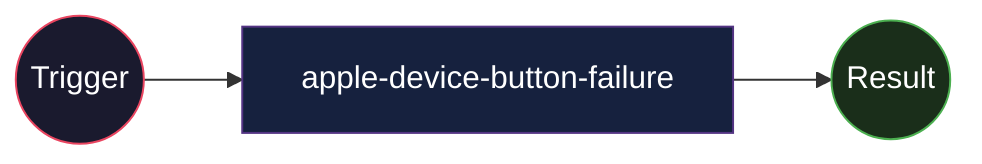

**Details:** [SKILL.md](/apple/apple-device-button-failure/SKILL.md)

---

### apple-notes
> Manage Apple Notes via the memo CLI on macOS (create, view, search, edit).

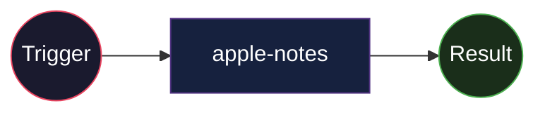

**Details:** [SKILL.md](/apple/apple-notes/SKILL.md)

---

### apple-reminders
> Manage Apple Reminders via remindctl CLI (list, add, complete, delete).

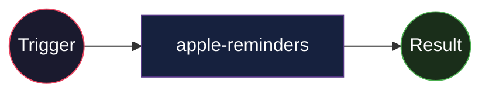

**Details:** [SKILL.md](/apple/apple-reminders/SKILL.md)

---

### findmy
> Track Apple devices and AirTags via FindMy.app on macOS using AppleScript and screen capture.

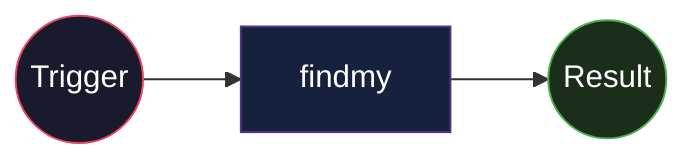

**Details:** [SKILL.md](/apple/findmy/SKILL.md)

---

### imessage
> Send and receive iMessages/SMS via the imsg CLI on macOS.

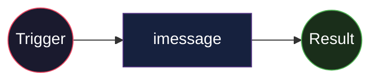

**Details:** [SKILL.md](/apple/imessage/SKILL.md)

---

### ipad-recovery-backup
> Create and manage iPad/iPhone backups when the device is stuck in Recovery Mode. Covers pymobiledevice3 usage, recovery-mode capabilities, limitations, iBoot shell access, RAM disk boot, firmware oper

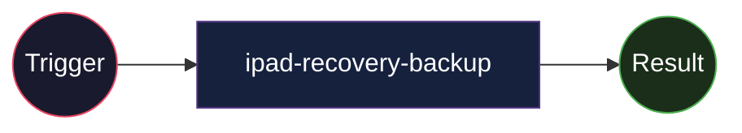

**Details:** [SKILL.md](/apple/ipad-recovery-backup/SKILL.md)

---

## 🤖 autonomous-ai-agents

### autonomous-heartbeat
> 4-phase autonomous agent heartbeat — WATCH → WORK → LEARN → DREAM cycle for self-improving, self-monitoring agents

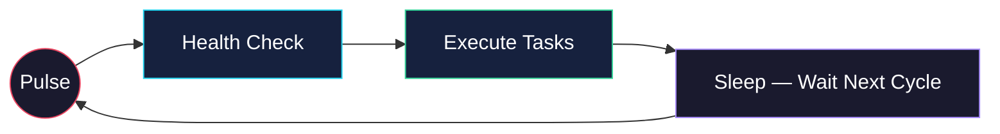

**Details:** [SKILL.md](/autonomous-ai-agents/autonomous-heartbeat/SKILL.md)

---

### claude-code
> Delegate coding tasks to Claude Code (Anthropic's CLI agent). Use for building features, refactoring, PR reviews, and iterative coding. Requires the claude CLI installed.

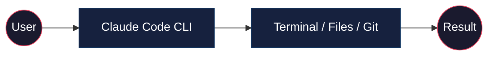

**Details:** [SKILL.md](/autonomous-ai-agents/claude-code/SKILL.md)

---

### codex
> Delegate coding tasks to OpenAI Codex CLI agent. Use for building features, refactoring, PR reviews, and batch issue fixing. Requires the codex CLI and a git repository.

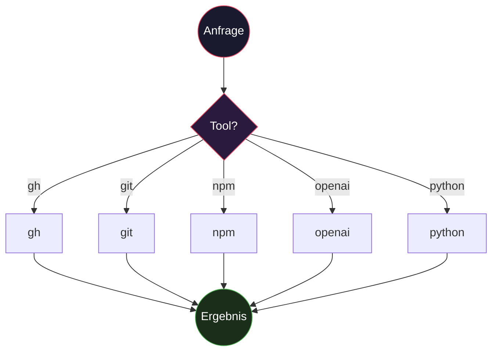

**Details:** [SKILL.md](/autonomous-ai-agents/codex/SKILL.md)

---

### hermes-agent
> Complete guide to using and extending Hermes Agent — CLI usage, setup, configuration, spawning additional agents, gateway platforms, skills, voice, tools, profiles, and a concise contributor reference

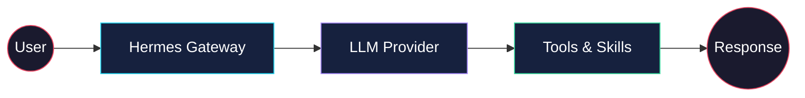

**Details:** [SKILL.md](/autonomous-ai-agents/hermes-agent/SKILL.md)

---

### inter-agent-communication
> Communication bridge between Toti and Mercury via GitLab Issues. Asynchronous message queue for coordination, handoffs, and reviews.

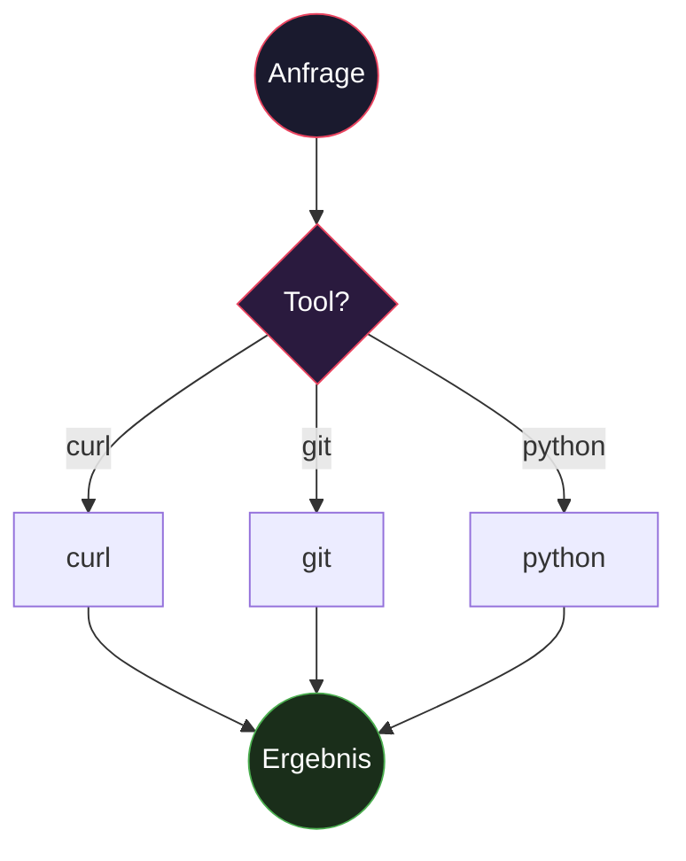

**Details:** [SKILL.md](/autonomous-ai-agents/inter-agent-communication/SKILL.md)

---

### opencode
> Delegate coding tasks to OpenCode CLI agent for feature implementation, refactoring, PR review, and long-running autonomous sessions. Requires the opencode CLI installed and authenticated.

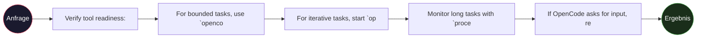

**Details:** [SKILL.md](/autonomous-ai-agents/opencode/SKILL.md)

---

### proactive-agent
> Proactive agent architecture — WAL Protocol, Working Buffer, Compaction Recovery, Security Hardening, Self-Improvement Guardrails. Adapted from Hal Stack v3.1 for Hermes Agent. Prevents context loss, 


**Details:** [SKILL.md](/autonomous-ai-agents/proactive-agent/SKILL.md)

---

## 💬 communication

### telegram-token-manager
> Bot Token Management Skill — Hilft bei der Einrichtung und Verwendung von Telegram Bot Tokens in Projekten


**Details:** [SKILL.md](/communication/telegram-token-manager/SKILL.md)

---

## 🎨 creative

### architecture-diagram
> Generate dark-themed SVG diagrams of software systems and cloud infrastructure as standalone HTML files with inline SVG graphics. Semantic component colors (cyan=frontend, emerald=backend, violet=data

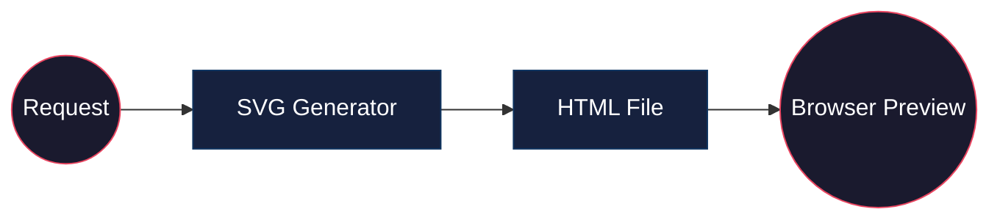

**Details:** [SKILL.md](/creative/architecture-diagram/SKILL.md)

---

### ascii-art
> Generate ASCII art using pyfiglet (571 fonts), cowsay, boxes, toilet, image-to-ascii, remote APIs (asciified, ascii.co.uk), and LLM fallback. No API keys required.

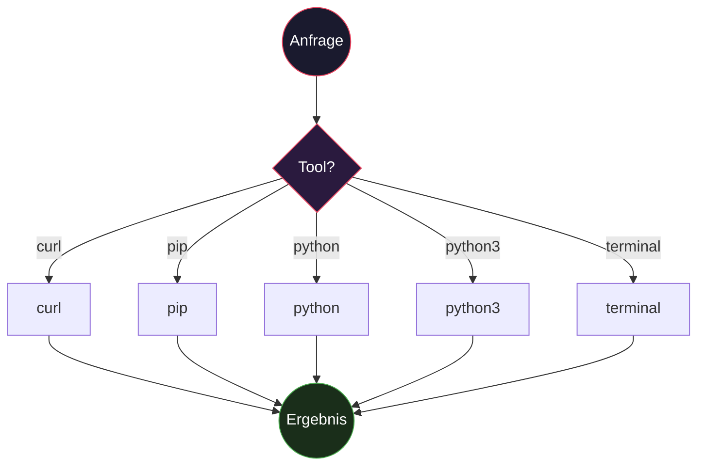

**Details:** [SKILL.md](/creative/ascii-art/SKILL.md)

---

### ascii-video
> Production pipeline for ASCII art video — any format. Converts video/audio/images/generative input into colored ASCII character video output (MP4, GIF, image sequence). Covers: video-to-ASCII conversi

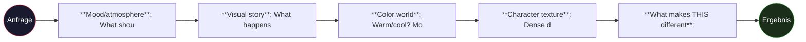

**Details:** [SKILL.md](/creative/ascii-video/SKILL.md)

---

### baoyu-comic
> Knowledge comic creator supporting multiple art styles and tones. Creates original educational comics with detailed panel layouts and sequential image generation. Use when user asks to create "知识漫画", 

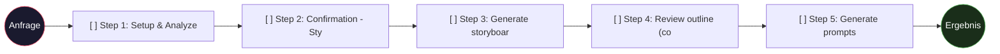

**Details:** [SKILL.md](/creative/baoyu-comic/SKILL.md)

---

### baoyu-infographic
> Generate professional infographics with 21 layout types and 21 visual styles. Analyzes content, recommends layout×style combinations, and generates publication-ready infographics. Use when user asks t

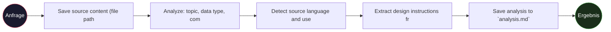

**Details:** [SKILL.md](/creative/baoyu-infographic/SKILL.md)

---

### excalidraw
> Create hand-drawn style diagrams using Excalidraw JSON format. Generate .excalidraw files for architecture diagrams, flowcharts, sequence diagrams, concept maps, and more. Files can be opened at excal

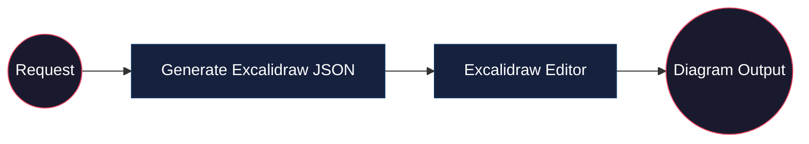

**Details:** [SKILL.md](/creative/excalidraw/SKILL.md)

---

### grok-image
> Generate images using xAI Grok/Aurora model. 7-pillar prompting system for high-quality results.

```mermaid
graph TB
    Input((Anfrage)) --> Choice{Tool?}
    t1["curl"]
    Choice -->|curl| t1
    t1 --> Output
    t2["jq"]
    Choice -->|jq| t2
    t2 --> Output
    t3["python"]
    Choice -->|python| t3
    t3 --> Output
    Output((Ergebnis))
    style Input fill:#1a1a2e,stroke:#e94560,color:#fff
    style Output fill:#1a2e1a,stroke:#4CAF50,color:#fff
    style Choice fill:#2a1a3e,stroke:#e94560,color:#fff
```

**Details:** [SKILL.md](/creative/grok-image/SKILL.md)

---

### grok-studio
> Self-hosted web UI for xAI Grok image generation and vision analysis. Quantic Design Language — deep-dark glass-morphism with purple-cyan-pink triad accents. Multi-file architecture (HTML+CSS+JS), pro

```mermaid
graph LR
    Agent((Agent)) --> Skill["grok-studio"]
    ext1("python")
    Skill --> ext1
    Result((Result))
    Skill --> Result
    style Agent fill:#1a1a2e,stroke:#e94560,color:#fff
    style Skill fill:#16213e,stroke:#533483,color:#fff
    style Result fill:#1a2e1a,stroke:#4CAF50,color:#fff
```

**Details:** [SKILL.md](/creative/grok-studio/SKILL.md)

---

### ideation
> Generate project ideas through creative constraints. Use when the user says 'I want to build something', 'give me a project idea', 'I'm bored', 'what should I make', 'inspire me', or any variant of 'I

```mermaid
graph LR
    Input((Anfrage))
    s1["**Pick a constraint** from the"]
    s2["**Interpret it broadly** — a c"]
    s3["**Generate 3 concrete project "]
    s4["**If they pick one, build it**"]
    Output((Ergebnis))
    Input --> s1
    s1 --> s2
    s2 --> s3
    s3 --> s4
    s4 --> Output
    style Input fill:#1a1a2e,stroke:#e94560,color:#fff
    style Output fill:#1a2e1a,stroke:#4CAF50,color:#fff
```

**Details:** [SKILL.md](/creative/creative-ideation/SKILL.md)

---

### manim-video
> Production pipeline for mathematical and technical animations using Manim Community Edition. Creates 3Blue1Brown-style explainer videos, algorithm visualizations, equation derivations, architecture di

```mermaid
graph LR
    Input((Anfrage))
    s1["**Subtitles** on every animati"]
    s2["**Shared color constants** at "]
    s3["**`self.camera.background_colo"]
    s4["**Clean exits** — FadeOut all "]
    Output((Ergebnis))
    Input --> s1
    s1 --> s2
    s2 --> s3
    s3 --> s4
    s4 --> Output
    style Input fill:#1a1a2e,stroke:#e94560,color:#fff
    style Output fill:#1a2e1a,stroke:#4CAF50,color:#fff
```

**Details:** [SKILL.md](/creative/manim-video/SKILL.md)

---

### p5js
> Production pipeline for interactive and generative visual art using p5.js. Creates browser-based sketches, generative art, data visualizations, interactive experiences, 3D scenes, audio-reactive visua

```mermaid
graph LR
    Input((Anfrage))
    s1["**Mood / atmosphere**: What sh"]
    s2["**Visual story**: What happens"]
    s3["**Color world**: Warm/cool? Mo"]
    s4["**Shape language**: Organic cu"]
    s5["**Motion vocabulary**: Slow dr"]
    Output((Ergebnis))
    Input --> s1
    s1 --> s2
    s2 --> s3
    s3 --> s4
    s4 --> s5
    s5 --> Output
    style Input fill:#1a1a2e,stroke:#e94560,color:#fff
    style Output fill:#1a2e1a,stroke:#4CAF50,color:#fff
```

**Details:** [SKILL.md](/creative/p5js/SKILL.md)

---

### pixel-art
> Convert images into retro pixel art with hardware-accurate palettes (NES, Game Boy, PICO-8, C64, etc.), and animate them into short videos. Presets cover arcade, SNES, and 10+ era-correct looks. Use `

```mermaid
graph TB
    Input((Anfrage)) --> Choice{Tool?}
    t1["ffmpeg"]
    Choice -->|ffmpeg| t1
    t1 --> Output
    t2["pip"]
    Choice -->|pip| t2
    t2 --> Output
    t3["python"]
    Choice -->|python| t3
    t3 --> Output
    t4["terminal"]
    Choice -->|terminal| t4
    t4 --> Output
    Output((Ergebnis))
    style Input fill:#1a1a2e,stroke:#e94560,color:#fff
    style Output fill:#1a2e1a,stroke:#4CAF50,color:#fff
    style Choice fill:#2a1a3e,stroke:#e94560,color:#fff
```

**Details:** [SKILL.md](/creative/pixel-art/SKILL.md)

---

### popular-web-designs
> >

```mermaid
graph LR
    Input((Anfrage))
    s1["Pick a design from the catalog"]
    s2["Load it: `skill_view(name="pop"]
    s3["Use the design tokens and comp"]
    s4["Pair with the `generative-widg"]
    s5["CDN font substitute and Google"]
    Output((Ergebnis))
    Input --> s1
    s1 --> s2
    s2 --> s3
    s3 --> s4
    s4 --> s5
    s5 --> Output
    style Input fill:#1a1a2e,stroke:#e94560,color:#fff
    style Output fill:#1a2e1a,stroke:#4CAF50,color:#fff
```

**Details:** [SKILL.md](/creative/popular-web-designs/SKILL.md)

---

### quantic-design-language
> Deep-dark glass-morphism design language inspired by Quantic. Rich gradients, generous spacing, refined motion, premium SaaS aesthetic.

```mermaid
graph LR
    Agent((Agent)) --> Skill["quantic-design-language"]
    ext1("API")
    Skill --> ext1
    Result((Result))
    Skill --> Result
    style Agent fill:#1a1a2e,stroke:#e94560,color:#fff
    style Skill fill:#16213e,stroke:#533483,color:#fff
    style Result fill:#1a2e1a,stroke:#4CAF50,color:#fff
```

**Details:** [SKILL.md](/creative/quantic-design-language/SKILL.md)

---

### quantic-saas-ui
> Builds premium landing pages using Quantic + Central design systems. NOT just SaaS — adapts for private tools, internal apps, and personal projects too. Key lesson: always clarify the PRODUCT CONTEXT 

```mermaid
graph LR
    Trigger((Trigger)) --> Process["quantic-saas-ui"]
    Process --> Result((Result))
    style Trigger fill:#1a1a2e,stroke:#e94560,color:#fff
    style Process fill:#16213e,stroke:#533483,color:#fff
    style Result fill:#1a2e1a,stroke:#4CAF50,color:#fff
```

**Details:** [SKILL.md](/creative/quantic-saas-ui/SKILL.md)

---

### songwriting-and-ai-music
> >

```mermaid
graph LR
    Trigger((Trigger)) --> Process["songwriting-and-ai-music"]
    Process --> Result((Result))
    style Trigger fill:#1a1a2e,stroke:#e94560,color:#fff
    style Process fill:#16213e,stroke:#533483,color:#fff
    style Result fill:#1a2e1a,stroke:#4CAF50,color:#fff
```

**Details:** [SKILL.md](/creative/songwriting-and-ai-music/SKILL.md)

---

### toti-presentations
> Generate Toti-branded project status presentations after each heartbeat work cycle. Dark theme with teal accents, consistent visual identity.

```mermaid
graph TB
    Input((Anfrage)) --> Choice{Tool?}
    t1["docker"]
    Choice -->|docker| t1
    t1 --> Output
    t2["memory"]
    Choice -->|memory| t2
    t2 --> Output
    t3["npm"]
    Choice -->|npm| t3
    t3 --> Output
    t4["pip"]
    Choice -->|pip| t4
    t4 --> Output
    t5["python"]
    Choice -->|python| t5
    t5 --> Output
    Output((Ergebnis))
    style Input fill:#1a1a2e,stroke:#e94560,color:#fff
    style Output fill:#1a2e1a,stroke:#4CAF50,color:#fff
    style Choice fill:#2a1a3e,stroke:#e94560,color:#fff
```

**Details:** [SKILL.md](/creative/toti-presentations/SKILL.md)

---

## 📊 data-science

### jupyter-live-kernel
> >

```mermaid
graph TB
    Input((Anfrage)) --> Choice{Tool?}
    t1["curl"]
    Choice -->|curl| t1
    t1 --> Output
    t2["git"]
    Choice -->|git| t2
    t2 --> Output
    t3["python"]
    Choice -->|python| t3
    t3 --> Output
    t4["python3"]
    Choice -->|python3| t4
    t4 --> Output
    t5["terminal"]
    Choice -->|terminal| t5
    t5 --> Output
    Output((Ergebnis))
    style Input fill:#1a1a2e,stroke:#e94560,color:#fff
    style Output fill:#1a2e1a,stroke:#4CAF50,color:#fff
    style Choice fill:#2a1a3e,stroke:#e94560,color:#fff
```

**Details:** [SKILL.md](/data-science/jupyter-live-kernel/SKILL.md)

---

## 🔧 devops

### bun-effect-monorepo-tsconfig
> TypeScript configuration for Bun + Effect-TS monorepos. Fixes module resolution, downlevelIteration, workspace deps, and tsconfig pitfalls.

```mermaid
graph LR
    Trigger((Trigger)) --> Process["bun-effect-monorepo-tsconfig"]
    Process --> Result((Result))
    style Trigger fill:#1a1a2e,stroke:#e94560,color:#fff
    style Process fill:#16213e,stroke:#533483,color:#fff
    style Result fill:#1a2e1a,stroke:#4CAF50,color:#fff
```

**Details:** [SKILL.md](/devops/bun-effect-monorepo-tsconfig/SKILL.md)

---

### claude-code-cron-orchestrator
> Run Claude Code autonomously via cron — spawn background agents, auto-commit uncommitted changes after build, auto-tag and release on GitHub. Full dev cycle automation without human intervention.

```mermaid
graph TB
    Input((Anfrage)) --> Choice{Tool?}
    t1["docker"]
    Choice -->|docker| t1
    t1 --> Output
    t2["gh"]
    Choice -->|gh| t2
    t2 --> Output
    t3["git"]
    Choice -->|git| t3
    t3 --> Output
    t4["ollama"]
    Choice -->|ollama| t4
    t4 --> Output
    t5["python3"]
    Choice -->|python3| t5
    t5 --> Output
    Output((Ergebnis))
    style Input fill:#1a1a2e,stroke:#e94560,color:#fff
    style Output fill:#1a2e1a,stroke:#4CAF50,color:#fff
    style Choice fill:#2a1a3e,stroke:#e94560,color:#fff
```

**Details:** [SKILL.md](/devops/claude-code-cron-orchestrator/SKILL.md)

---

### claude-code-ollama-cloud
> Set up and use Claude Code CLI with Ollama Cloud models (ARM64 Docker). Covers installation, auth, Docker networking, and print-mode task delegation.

```mermaid
graph TB
    Input((Anfrage)) --> Choice{Tool?}
    t1["anthropic"]
    Choice -->|anthropic| t1
    t1 --> Output
    t2["curl"]
    Choice -->|curl| t2
    t2 --> Output
    t3["delegation"]
    Choice -->|delegation| t3
    t3 --> Output
    t4["docker"]
    Choice -->|docker| t4
    t4 --> Output
    t5["gh"]
    Choice -->|gh| t5
    t5 --> Output
    Output((Ergebnis))
    style Input fill:#1a1a2e,stroke:#e94560,color:#fff
    style Output fill:#1a2e1a,stroke:#4CAF50,color:#fff
    style Choice fill:#2a1a3e,stroke:#e94560,color:#fff
```

**Details:** [SKILL.md](/devops/claude-code-ollama-cloud/SKILL.md)

---

### discord-server-setup
> Automatically create categories, channels, roles, and guide embeds on a Discord server using a discord.py bot.

```mermaid
graph LR
    Agent((Agent)) --> Skill["discord-server-setup"]
    ext1("pip")
    Skill --> ext1
    ext2("python")
    Skill --> ext2
    Result((Result))
    Skill --> Result
    style Agent fill:#1a1a2e,stroke:#e94560,color:#fff
    style Skill fill:#16213e,stroke:#533483,color:#fff
    style Result fill:#1a2e1a,stroke:#4CAF50,color:#fff
```

**Details:** [SKILL.md](/devops/discord-server-setup/SKILL.md)

---

### filebrowser-cloud
> Set up FileBrowser as a self-hosted cloud file manager on Tailscale with DOCX/PDF preview

```mermaid
graph TB
    Input((Anfrage)) --> Choice{Tool?}
    t1["curl"]
    Choice -->|curl| t1
    t1 --> Output
    t2["docker"]
    Choice -->|docker| t2
    t2 --> Output
    t3["ffmpeg"]
    Choice -->|ffmpeg| t3
    t3 --> Output
    t4["latex"]
    Choice -->|latex| t4
    t4 --> Output
    t5["pandoc"]
    Choice -->|pandoc| t5
    t5 --> Output
    Output((Ergebnis))
    style Input fill:#1a1a2e,stroke:#e94560,color:#fff
    style Output fill:#1a2e1a,stroke:#4CAF50,color:#fff
    style Choice fill:#2a1a3e,stroke:#e94560,color:#fff
```

**Details:** [SKILL.md](/devops/filebrowser-cloud/SKILL.md)

---

### flutter-arm64-no-sudo
> Install Flutter SDK on ARM64 Linux (aarch64) without root or apt. Handles the missing unzip, x86_64 tarball trap, and Dart SDK initialization.

```mermaid
graph TB
    Input((Anfrage)) --> Choice{Tool?}
    t1["curl"]
    Choice -->|curl| t1
    t1 --> Output
    t2["git"]
    Choice -->|git| t2
    t2 --> Output
    t3["python"]
    Choice -->|python| t3
    t3 --> Output
    t4["python3"]
    Choice -->|python3| t4
    t4 --> Output
    Output((Ergebnis))
    style Input fill:#1a1a2e,stroke:#e94560,color:#fff
    style Output fill:#1a2e1a,stroke:#4CAF50,color:#fff
    style Choice fill:#2a1a3e,stroke:#e94560,color:#fff
```

**Tags:** flutter,arm64,aarch64,linux,setup | **Details:** [SKILL.md](/devops/flutter-arm64-no-sudo/SKILL.md)

---

### git-commit-identity
> Enforce the correct Git commit identity across all AI agents, cron jobs, orchestrators, and shell scripts. Stop rogue commits from Hermes Agent/Ollama Cloud ghost accounts. Two approaches: agents comm

```mermaid
graph LR
    Input((Anfrage))
    s1["`git config --global user.name"]
    s2["Set per-repo local configs (sa"]
    s3["Update ALL cron prompts with g"]
    s4["Patch ALL shell scripts that s"]
    s5["Update ALL skill files that me"]
    Output((Ergebnis))
    Input --> s1
    s1 --> s2
    s2 --> s3
    s3 --> s4
    s4 --> s5
    s5 --> Output
    style Input fill:#1a1a2e,stroke:#e94560,color:#fff
    style Output fill:#1a2e1a,stroke:#4CAF50,color:#fff
```

**Details:** [SKILL.md](/devops/git-commit-identity/SKILL.md)

---

### github-issue-watcher
> Automatischer GitHub Issue Watcher — checkt alle N Minuten auf neue Issues, assigned sie an den Owner, kommentiert und queued sie zur Verarbeitung via Cron.

```mermaid
graph TB
    Input((Anfrage)) --> Choice{Tool?}
    t1["curl"]
    Choice -->|curl| t1
    t1 --> Output
    t2["delegation"]
    Choice -->|delegation| t2
    t2 --> Output
    t3["git"]
    Choice -->|git| t3
    t3 --> Output
    t4["npm"]
    Choice -->|npm| t4
    t4 --> Output
    t5["python"]
    Choice -->|python| t5
    t5 --> Output
    Output((Ergebnis))
    style Input fill:#1a1a2e,stroke:#e94560,color:#fff
    style Output fill:#1a2e1a,stroke:#4CAF50,color:#fff
    style Choice fill:#2a1a3e,stroke:#e94560,color:#fff
```

**Details:** [SKILL.md](/devops/github-issue-watcher/SKILL.md)

---

### inter-agent-gitlab-message-queue
> Use GitLab Issues as an asynchronous message queue between AI agents (Mercury, Toti, etc.). Structured, persistent, no extra infrastructure needed.

```mermaid
graph LR
    AgentA((Agent A)) --> Issue["GitLab Issue"]
    Issue --> AgentB((Agent B))
    AgentB --> Response["Response Comment"]
    Response --> AgentA
    style AgentA fill:#1a1a2e,stroke:#22d3ee,color:#fff
    style Issue fill:#16213e,stroke:#fbbf24,color:#fff
    style AgentB fill:#1a1a2e,stroke:#34d399,color:#fff
    style Response fill:#16213e,stroke:#a78bfa,color:#fff
```

**Details:** [SKILL.md](/devops/inter-agent-gitlab-message-queue/SKILL.md)

---

### mac-daily-maintenance
> Tägliche Mac-Reinigung und Ressourcen-Überwachung via Mercury Remote. Prüft RAM, Swap, Disk und räumt Caches/Logs auf. Kann als Cron-Job laufen.

```mermaid
graph LR
    Input((Anfrage))
    s1["`df -h /System/Volumes/Data | "]
    s2["`sysctl vm.swapusage` — Swap: "]
    s3["`ps aux | grep -i DisplayLinkU"]
    s4["`uptime | sed 's/.*up //' | se"]
    s5["Docker-Container, Images, Volu"]
    Output((Ergebnis))
    Input --> s1
    s1 --> s2
    s2 --> s3
    s3 --> s4
    s4 --> s5
    s5 --> Output
    style Input fill:#1a1a2e,stroke:#e94560,color:#fff
    style Output fill:#1a2e1a,stroke:#4CAF50,color:#fff
```

**Details:** [SKILL.md](/devops/mac-daily-maintenance/SKILL.md)

---

### mac-remote-control
> Vollständige Mac-Fernsteuerung via Mercury Remote — Maus, Tastatur, Apps, Safari, Dateien, Clipboard, System

```mermaid
graph TB
    Input((Anfrage)) --> Choice{Tool?}
    t1["curl"]
    Choice -->|curl| t1
    t1 --> Output
    t2["git"]
    Choice -->|git| t2
    t2 --> Output
    t3["python3"]
    Choice -->|python3| t3
    t3 --> Output
    Output((Ergebnis))
    style Input fill:#1a1a2e,stroke:#e94560,color:#fff
    style Output fill:#1a2e1a,stroke:#4CAF50,color:#fff
    style Choice fill:#2a1a3e,stroke:#e94560,color:#fff
```

**Details:** [SKILL.md](/devops/mac-remote-control/SKILL.md)

---

### mac-vision
> Mac-Screenshot-basierte Vision — macht Screenshots vom Mac und analysiert sie mit AI Vision. Ermöglicht Mercury den Mac-Bildschirm zu "sehen".

```mermaid
graph TB
    Input((Anfrage)) --> Choice{Tool?}
    t1["python"]
    Choice -->|python| t1
    t1 --> Output
    t2["python3"]
    Choice -->|python3| t2
    t2 --> Output
    t3["terminal"]
    Choice -->|terminal| t3
    t3 --> Output
    Output((Ergebnis))
    style Input fill:#1a1a2e,stroke:#e94560,color:#fff
    style Output fill:#1a2e1a,stroke:#4CAF50,color:#fff
    style Choice fill:#2a1a3e,stroke:#e94560,color:#fff
```

**Details:** [SKILL.md](/devops/mac-vision/SKILL.md)

---

### macos-calendar-via-mercury
> Read, create, and manage macOS Calendar events from a remote server via Mercury Remote (Tailscale TCP :9443 Shell). Handles macOS 26+ permission quirks and sqlite3 / icalBuddy approaches.

```mermaid
graph LR
    Trigger((Trigger)) --> Process["macos-calendar-via-mercury"]
    Process --> Result((Result))
    style Trigger fill:#1a1a2e,stroke:#e94560,color:#fff
    style Process fill:#16213e,stroke:#533483,color:#fff
    style Result fill:#1a2e1a,stroke:#4CAF50,color:#fff
```

**Details:** [SKILL.md](/devops/macos-calendar-via-mercury/SKILL.md)

---

### mercury-mesh-watcher
> Cron-basierter Mesh Watcher, der Tailscale-Peers scannt, Mercury-Dienste erkennt, mit gespeicherten Peers vergleicht und Änderungen meldet.

```mermaid
graph TB
    Input((Anfrage)) --> Choice{Tool?}
    t1["docker"]
    Choice -->|docker| t1
    t1 --> Output
    t2["python"]
    Choice -->|python| t2
    t2 --> Output
    t3["python3"]
    Choice -->|python3| t3
    t3 --> Output
    Output((Ergebnis))
    style Input fill:#1a1a2e,stroke:#e94560,color:#fff
    style Output fill:#1a2e1a,stroke:#4CAF50,color:#fff
    style Choice fill:#2a1a3e,stroke:#e94560,color:#fff
```

**Details:** [SKILL.md](/devops/mercury-mesh-watcher/SKILL.md)

---

### mercury-remote-agent
> Bau eines Zero-Dependency Remote-Access Tools (Server + Client) mit reinem Python asyncio. Ermöglicht Mercury (dem Dev-Server) vollen Shell-/File-/Minecraft-Log-Zugriff auf entfernte Rechner via TCP.

```mermaid
graph LR
    Local((Local Agent)) --> SSH["SSH / TCP API"]
    SSH --> Remote["Remote Mercury Server"]
    Remote --> Response((Response))
    style Local fill:#1a1a2e,stroke:#e94560,color:#fff
    style SSH fill:#16213e,stroke:#fbbf24,color:#fff
    style Remote fill:#16213e,stroke:#0f3460,color:#fff
    style Response fill:#1a1a2e,stroke:#e94560,color:#fff
```

**Details:** [SKILL.md](/devops/mercury-remote-agent/SKILL.md)

---

### mercury-remote-macos-calendar
> Read macOS Calendar events via Mercury Remote (TCP :9443) using icalBuddy/AppleScript

```mermaid
graph LR
    Trigger((Trigger)) --> Process["mercury-remote-macos-calendar"]
    Process --> Result((Result))
    style Trigger fill:#1a1a2e,stroke:#e94560,color:#fff
    style Process fill:#16213e,stroke:#533483,color:#fff
    style Result fill:#1a2e1a,stroke:#4CAF50,color:#fff
```

**Details:** [SKILL.md](/devops/mercury-remote-macos-calendar/SKILL.md)

---

### mercury-remote-v2
> Mercury Remote v3.0 — Peer-to-Peer Mesh über Tailscale. Zero-Dependency, jeder Rechner ist Server + Client gleichzeitig. Kein zentraler Server nötig.

```mermaid
graph TB
    Input((Anfrage)) --> Choice{Tool?}
    t1["curl"]
    Choice -->|curl| t1
    t1 --> Output
    t2["docker"]
    Choice -->|docker| t2
    t2 --> Output
    t3["gh"]
    Choice -->|gh| t3
    t3 --> Output
    t4["git"]
    Choice -->|git| t4
    t4 --> Output
    t5["python"]
    Choice -->|python| t5
    t5 --> Output
    Output((Ergebnis))
    style Input fill:#1a1a2e,stroke:#e94560,color:#fff
    style Output fill:#1a2e1a,stroke:#4CAF50,color:#fff
    style Choice fill:#2a1a3e,stroke:#e94560,color:#fff
```

**Details:** [SKILL.md](/devops/mercury-remote-v2/SKILL.md)

---

### mercury-web-dashboard
> aiohttp WebSocket Dashboard that bridges browser clients to a Tailscale mesh of Mercury peers — live desktop streaming, remote input, terminal, file browser.

```mermaid
graph TB
    Input((Anfrage)) --> Choice{Tool?}
    t1["curl"]
    Choice -->|curl| t1
    t1 --> Output
    t2["docker"]
    Choice -->|docker| t2
    t2 --> Output
    t3["gh"]
    Choice -->|gh| t3
    t3 --> Output
    t4["git"]
    Choice -->|git| t4
    t4 --> Output
    t5["python"]
    Choice -->|python| t5
    t5 --> Output
    Output((Ergebnis))
    style Input fill:#1a1a2e,stroke:#e94560,color:#fff
    style Output fill:#1a2e1a,stroke:#4CAF50,color:#fff
    style Choice fill:#2a1a3e,stroke:#e94560,color:#fff
```

**Details:** [SKILL.md](/devops/mercury-web-dashboard/SKILL.md)

---

### mercury-web-dashboard-deploy
> Deploy and maintain the Mercury Web Dashboard — aiohttp server, Tailscale mesh connectivity, peer discovery fixes, port management, and auto-health-cron.

```mermaid
graph TB
    Input((Anfrage)) --> Choice{Tool?}
    t1["docker"]
    Choice -->|docker| t1
    t1 --> Output
    t2["python"]
    Choice -->|python| t2
    t2 --> Output
    t3["python3"]
    Choice -->|python3| t3
    t3 --> Output
    Output((Ergebnis))
    style Input fill:#1a1a2e,stroke:#e94560,color:#fff
    style Output fill:#1a2e1a,stroke:#4CAF50,color:#fff
    style Choice fill:#2a1a3e,stroke:#e94560,color:#fff
```

**Details:** [SKILL.md](/devops/mercury-web-dashboard-deploy/SKILL.md)

---

### modrinth-upload
> Upload Minecraft mods to Modrinth — project setup, icon generation/upload, gallery management, and version release via API.

```mermaid
graph TB
    Input((Anfrage)) --> Choice{Tool?}
    t1["curl"]
    Choice -->|curl| t1
    t1 --> Output
    t2["ffmpeg"]
    Choice -->|ffmpeg| t2
    t2 --> Output
    t3["git"]
    Choice -->|git| t3
    t3 --> Output
    t4["jq"]
    Choice -->|jq| t4
    t4 --> Output
    t5["python"]
    Choice -->|python| t5
    t5 --> Output
    Output((Ergebnis))
    style Input fill:#1a1a2e,stroke:#e94560,color:#fff
    style Output fill:#1a2e1a,stroke:#4CAF50,color:#fff
    style Choice fill:#2a1a3e,stroke:#e94560,color:#fff
```

**Details:** [SKILL.md](/devops/modrinth-upload/SKILL.md)

---

### mrpack-modpack-builder
> Build a Modrinth .mrpack from a curated mod list — auto-resolve versions, build manifest, ZIP it, and upload to GitHub Releases.

```mermaid
graph LR
    Input((Anfrage))
    s1["Use `primary` flag first, fall"]
    s2["`"1.21"` in `game_versions` is"]
    s3["Some mods have wrong project I"]
    s4["`versionId` = Minecraft versio"]
    s5["`path` always starts with `mod"]
    Output((Ergebnis))
    Input --> s1
    s1 --> s2
    s2 --> s3
    s3 --> s4
    s4 --> s5
    s5 --> Output
    style Input fill:#1a1a2e,stroke:#e94560,color:#fff
    style Output fill:#1a2e1a,stroke:#4CAF50,color:#fff
```

**Details:** [SKILL.md](/devops/mrpack-modpack-builder/SKILL.md)

---

### multi-project-247-orchestrator
> Run multiple software projects in parallel with 24/7 autonomous agent teams using Hermes native cron jobs. Agents now commit+push directly, generate improvement issues automatically, and auto-release 

```mermaid
graph TB
    Input((Anfrage)) --> Choice{Tool?}
    t1["curl"]
    Choice -->|curl| t1
    t1 --> Output
    t2["docker"]
    Choice -->|docker| t2
    t2 --> Output
    t3["gh"]
    Choice -->|gh| t3
    t3 --> Output
    t4["git"]
    Choice -->|git| t4
    t4 --> Output
    t5["jq"]
    Choice -->|jq| t5
    t5 --> Output
    Output((Ergebnis))
    style Input fill:#1a1a2e,stroke:#e94560,color:#fff
    style Output fill:#1a2e1a,stroke:#4CAF50,color:#fff
    style Choice fill:#2a1a3e,stroke:#e94560,color:#fff
```

**Details:** [SKILL.md](/devops/multi-project-247-orchestrator/SKILL.md)

---

### ollama-cloud-model-routing
> >

```mermaid
graph LR
    Input((Request)) --> Router["Model Router"]
    Router --> Coding["Coding — qwen3-coder"]
    Router --> Reasoning["Reasoning — deepseek-v4"]
    Router --> Chat["Chat — glm-5.1"]
    Coding --> Result((Result))
    Reasoning --> Result
    Chat --> Result
    style Input fill:#1a1a2e,stroke:#e94560,color:#fff
    style Router fill:#16213e,stroke:#fbbf24,color:#fff
    style Coding fill:#16213e,stroke:#34d399,color:#fff
    style Reasoning fill:#16213e,stroke:#a78bfa,color:#fff
    style Chat fill:#16213e,stroke:#22d3ee,color:#fff
    style Result fill:#1a1a2e,stroke:#e94560,color:#fff
```

**Details:** [SKILL.md](/devops/ollama-cloud-model-routing/SKILL.md)

---

### ollama-launch-setup
> Set up Ollama with `ollama launch` integration — Claude Code, Codex, Hermes, etc. using Ollama cloud models.

```mermaid
graph TB
    Input((Anfrage)) --> Choice{Tool?}
    t1["anthropic"]
    Choice -->|anthropic| t1
    t1 --> Output
    t2["curl"]
    Choice -->|curl| t2
    t2 --> Output
    t3["npm"]
    Choice -->|npm| t3
    t3 --> Output
    t4["ollama"]
    Choice -->|ollama| t4
    t4 --> Output
    t5["openai"]
    Choice -->|openai| t5
    t5 --> Output
    Output((Ergebnis))
    style Input fill:#1a1a2e,stroke:#e94560,color:#fff
    style Output fill:#1a2e1a,stroke:#4CAF50,color:#fff
    style Choice fill:#2a1a3e,stroke:#e94560,color:#fff
```

**Details:** [SKILL.md](/devops/ollama-launch-setup/SKILL.md)

---

### ollama-model-benchmark
> Benchmark Ollama Cloud models for coding subagent delegation — test speed, quality, reasoning overhead, and delegation compatibility

```mermaid
graph TB
    Input((Anfrage)) --> Choice{Tool?}
    t1["curl"]
    Choice -->|curl| t1
    t1 --> Output
    t2["delegation"]
    Choice -->|delegation| t2
    t2 --> Output
    t3["docker"]
    Choice -->|docker| t3
    t3 --> Output
    t4["ollama"]
    Choice -->|ollama| t4
    t4 --> Output
    t5["python"]
    Choice -->|python| t5
    t5 --> Output
    Output((Ergebnis))
    style Input fill:#1a1a2e,stroke:#e94560,color:#fff
    style Output fill:#1a2e1a,stroke:#4CAF50,color:#fff
    style Choice fill:#2a1a3e,stroke:#e94560,color:#fff
```

**Details:** [SKILL.md](/devops/ollama-model-benchmark/SKILL.md)

---

### tailscale-docker
> Set up Tailscale VPN inside a Docker container using userspace networking (no TUN device required).

```mermaid
graph TB
    Input((Anfrage)) --> Choice{Tool?}
    t1["curl"]
    Choice -->|curl| t1
    t1 --> Output
    t2["docker"]
    Choice -->|docker| t2
    t2 --> Output
    t3["terminal"]
    Choice -->|terminal| t3
    t3 --> Output
    Output((Ergebnis))
    style Input fill:#1a1a2e,stroke:#e94560,color:#fff
    style Output fill:#1a2e1a,stroke:#4CAF50,color:#fff
    style Choice fill:#2a1a3e,stroke:#e94560,color:#fff
```

**Details:** [SKILL.md](/devops/tailscale-docker/SKILL.md)

---

### tailscale-docker-setup
> Install and run Tailscale in a containerized environment without /dev/net/tun, using userspace-networking mode.

```mermaid
graph TB
    Input((Anfrage)) --> Choice{Tool?}
    t1["curl"]
    Choice -->|curl| t1
    t1 --> Output
    t2["docker"]
    Choice -->|docker| t2
    t2 --> Output
    t3["python3"]
    Choice -->|python3| t3
    t3 --> Output
    Output((Ergebnis))
    style Input fill:#1a1a2e,stroke:#e94560,color:#fff
    style Output fill:#1a2e1a,stroke:#4CAF50,color:#fff
    style Choice fill:#2a1a3e,stroke:#e94560,color:#fff
```

**Details:** [SKILL.md](/devops/tailscale-docker-setup/SKILL.md)

---

### tailscale-docker-userspace
> Set up Tailscale VPN inside a Docker container using userspace networking (no TUN device). Use when the user asks to install Tailscale in a containerized environment.

```mermaid
graph LR
    Agent((Agent)) --> Skill["tailscale-docker-userspace"]
    ext1("curl")
    Skill --> ext1
    ext2("docker")
    Skill --> ext2
    Result((Result))
    Skill --> Result
    style Agent fill:#1a1a2e,stroke:#e94560,color:#fff
    style Skill fill:#16213e,stroke:#533483,color:#fff
    style Result fill:#1a2e1a,stroke:#4CAF50,color:#fff
```

**Details:** [SKILL.md](/devops/tailscale-docker-userspace/SKILL.md)

---

### tauri-rust-backend
> >

```mermaid
graph LR
    Trigger((Trigger)) --> Process["tauri-rust-backend"]
    Process --> Result((Result))
    style Trigger fill:#1a1a2e,stroke:#e94560,color:#fff
    style Process fill:#16213e,stroke:#533483,color:#fff
    style Result fill:#1a2e1a,stroke:#4CAF50,color:#fff
```

**Details:** [SKILL.md](/devops/tauri-rust-backend/SKILL.md)

---

### tauri-svelte-setup
> Bootstrap a Tauri 2 + Svelte 5 desktop app project on Linux (ARM64). Covers Rust install, webkit2gtk deps, project scaffold, and verification.

```mermaid
graph TB
    Input((Anfrage)) --> Choice{Tool?}
    t1["curl"]
    Choice -->|curl| t1
    t1 --> Output
    t2["delegation"]
    Choice -->|delegation| t2
    t2 --> Output
    t3["git"]
    Choice -->|git| t3
    t3 --> Output
    t4["npm"]
    Choice -->|npm| t4
    t4 --> Output
    t5["npx"]
    Choice -->|npx| t5
    t5 --> Output
    Output((Ergebnis))
    style Input fill:#1a1a2e,stroke:#e94560,color:#fff
    style Output fill:#1a2e1a,stroke:#4CAF50,color:#fff
    style Choice fill:#2a1a3e,stroke:#e94560,color:#fff
```

**Details:** [SKILL.md](/devops/tauri-svelte-setup/SKILL.md)

---

### titocloud-microservice-proxy
> Pattern for integrating microservices into TitoCloud via reverse proxy. Covers _proxy_to method, URL path stripping, relative frontend URLs, and POST body forwarding.

```mermaid
graph LR
    Trigger((Trigger)) --> Process["titocloud-microservice-proxy"]
    Process --> Result((Result))
    style Trigger fill:#1a1a2e,stroke:#e94560,color:#fff
    style Process fill:#16213e,stroke:#533483,color:#fff
    style Result fill:#1a2e1a,stroke:#4CAF50,color:#fff
```

**Details:** [SKILL.md](/devops/titocloud-microservice-proxy/SKILL.md)

---

### webhook-subscriptions
> Create and manage webhook subscriptions for event-driven agent activation, or for direct push notifications (zero LLM cost). Use when the user wants external services to trigger agent runs OR push not

```mermaid
graph LR
    Input((Anfrage))
    s1["`hermes webhook subscribe` wri"]
    s2["The webhook adapter hot-reload"]
    s3["When a POST arrives matching a"]
    s4["The agent's response is delive"]
    Output((Ergebnis))
    Input --> s1
    s1 --> s2
    s2 --> s3
    s3 --> s4
    s4 --> Output
    style Input fill:#1a1a2e,stroke:#e94560,color:#fff
    style Output fill:#1a2e1a,stroke:#4CAF50,color:#fff
```

**Details:** [SKILL.md](/devops/webhook-subscriptions/SKILL.md)

---

### websocket-tcp-bridge-dashboard
> Build a web dashboard that bridges WebSocket clients to an existing TCP protocol server via aiohttp. Pattern: Web UI to WebSocket to Python Bridge to TCP Protocol to Remote Services.

```mermaid
graph TB
    Input((Anfrage)) --> Choice{Tool?}
    t1["curl"]
    Choice -->|curl| t1
    t1 --> Output
    t2["git"]
    Choice -->|git| t2
    t2 --> Output
    t3["python"]
    Choice -->|python| t3
    t3 --> Output
    t4["python3"]
    Choice -->|python3| t4
    t4 --> Output
    Output((Ergebnis))
    style Input fill:#1a1a2e,stroke:#e94560,color:#fff
    style Output fill:#1a2e1a,stroke:#4CAF50,color:#fff
    style Choice fill:#2a1a3e,stroke:#e94560,color:#fff
```

**Tags:** web-dashboard,aiohttp,websocket,tcp-bridge,remote-control | **Details:** [SKILL.md](/devops/websocket-tcp-bridge-dashboard/SKILL.md)

---

## 🐕 dogfood

### ui-pattern-analysis
> Deep web UI analysis combining code inspection with visual screenshot evaluation to identify, catalog, and remember design patterns.

```mermaid
graph LR
    Trigger((Trigger)) --> Process["ui-pattern-analysis"]
    Process --> Result((Result))
    style Trigger fill:#1a1a2e,stroke:#e94560,color:#fff
    style Process fill:#16213e,stroke:#533483,color:#fff
    style Result fill:#1a2e1a,stroke:#4CAF50,color:#fff
```

**Details:** [SKILL.md](/dogfood/ui-pattern-analysis/SKILL.md)

---

## 📧 email

### himalaya
> CLI to manage emails via IMAP/SMTP. Use himalaya to list, read, write, reply, forward, search, and organize emails from the terminal. Supports multiple accounts and message composition with MML (MIME 

```mermaid
graph LR
    IMAP("IMAP / SMTP") --> CLI["himalaya CLI"]
    CLI --> Ops["Read / Send / Search"]
    Ops --> Response((Response))
    style IMAP fill:#16213e,stroke:#fbbf24,color:#fff
    style CLI fill:#16213e,stroke:#22d3ee,color:#fff
    style Ops fill:#16213e,stroke:#34d399,color:#fff
    style Response fill:#1a1a2e,stroke:#e94560,color:#fff
```

**Details:** [SKILL.md](/email/himalaya/SKILL.md)

---

## 🎮 gaming

### fabric-121-api-pitfalls
> Common Fabric 1.21 Yarn mapping & API gotchas — screen handlers, block entities, slot classes, NBT, fuel detection, and property delegates. Use when developing or fixing Fabric mods targeting 1.21.

```mermaid
graph LR
    Agent((Agent)) --> Skill["fabric-121-api-pitfalls"]
    ext1("python")
    Skill --> ext1
    Result((Result))
    Skill --> Result
    style Agent fill:#1a1a2e,stroke:#e94560,color:#fff
    style Skill fill:#16213e,stroke:#533483,color:#fff
    style Result fill:#1a2e1a,stroke:#4CAF50,color:#fff
```

**Details:** [SKILL.md](/gaming/fabric-121-api-pitfalls/SKILL.md)

---

### minecraft-modpack-server
> Set up a modded Minecraft server from a CurseForge/Modrinth server pack zip. Covers NeoForge/Forge install, Java version, JVM tuning, firewall, LAN config, backups, and launch scripts.

```mermaid
graph LR
    Input((Anfrage))
    s1["Minecraft 1.21+ → Java 21: `su"]
    s2["Minecraft 1.18-1.20 → Java 17:"]
    s3["Minecraft 1.16 and below → Jav"]
    s4["Verify: `java -version`"]
    s5["100-200 mods: 6-12GB"]
    Output((Ergebnis))
    Input --> s1
    s1 --> s2
    s2 --> s3
    s3 --> s4
    s4 --> s5
    s5 --> Output
    style Input fill:#1a1a2e,stroke:#e94560,color:#fff
    style Output fill:#1a2e1a,stroke:#4CAF50,color:#fff
```

**Details:** [SKILL.md](/gaming/minecraft-modpack-server/SKILL.md)

---

### pokemon-player
> Play Pokemon games autonomously via headless emulation. Starts a game server, reads structured game state from RAM, makes strategic decisions, and sends button inputs — all from the terminal.

```mermaid
graph TB
    Input((Anfrage)) --> Choice{Tool?}
    t1["memory"]
    Choice -->|memory| t1
    t1 --> Output
    t2["pip"]
    Choice -->|pip| t2
    t2 --> Output
    t3["python"]
    Choice -->|python| t3
    t3 --> Output
    t4["python3"]
    Choice -->|python3| t4
    t4 --> Output
    t5["terminal"]
    Choice -->|terminal| t5
    t5 --> Output
    Output((Ergebnis))
    style Input fill:#1a1a2e,stroke:#e94560,color:#fff
    style Output fill:#1a2e1a,stroke:#4CAF50,color:#fff
    style Choice fill:#2a1a3e,stroke:#e94560,color:#fff
```

**Details:** [SKILL.md](/gaming/pokemon-player/SKILL.md)

---

## ⚡ general

### dogfood
> Systematic exploratory QA testing of web applications — find bugs, capture evidence, and generate structured reports

```mermaid
graph LR
    Input((Anfrage))
    s1["Create the output directory st"]
    s2["Identify the testing scope bas"]
    s3["Build a rough sitemap by plann"]
    s4["**Navigate** to the page:"]
    s5["**Take a snapshot** to underst"]
    Output((Ergebnis))
    Input --> s1
    s1 --> s2
    s2 --> s3
    s3 --> s4
    s4 --> s5
    s5 --> Output
    style Input fill:#1a1a2e,stroke:#e94560,color:#fff
    style Output fill:#1a2e1a,stroke:#4CAF50,color:#fff
```

**Details:** [SKILL.md](/dogfood/SKILL.md)

---

## 🐙 github

### codebase-inspection
> Inspect and analyze codebases using pygount for LOC counting, language breakdown, and code-vs-comment ratios. Use when asked to check lines of code, repo size, language composition, or codebase stats.

```mermaid
graph TB
    Input((Anfrage)) --> Choice{Tool?}
    t1["git"]
    Choice -->|git| t1
    t1 --> Output
    t2["pip"]
    Choice -->|pip| t2
    t2 --> Output
    t3["python"]
    Choice -->|python| t3
    t3 --> Output
    Output((Ergebnis))
    style Input fill:#1a1a2e,stroke:#e94560,color:#fff
    style Output fill:#1a2e1a,stroke:#4CAF50,color:#fff
    style Choice fill:#2a1a3e,stroke:#e94560,color:#fff
```

**Details:** [SKILL.md](/github/codebase-inspection/SKILL.md)

---

### github-auth
> Set up GitHub authentication for the agent using git (universally available) or the gh CLI. Covers HTTPS tokens, SSH keys, credential helpers, and gh auth — with a detection flow to pick the right met

```mermaid
graph TB
    Input((Anfrage)) --> Choice{Tool?}
    t1["curl"]
    Choice -->|curl| t1
    t1 --> Output
    t2["gh"]
    Choice -->|gh| t2
    t2 --> Output
    t3["git"]
    Choice -->|git| t3
    t3 --> Output
    t4["memory"]
    Choice -->|memory| t4
    t4 --> Output
    Output((Ergebnis))
    style Input fill:#1a1a2e,stroke:#e94560,color:#fff
    style Output fill:#1a2e1a,stroke:#4CAF50,color:#fff
    style Choice fill:#2a1a3e,stroke:#e94560,color:#fff
```

**Details:** [SKILL.md](/github/github-auth/SKILL.md)

---

### github-code-review
> Review code changes by analyzing git diffs, leaving inline comments on PRs, and performing thorough pre-push review. Works with gh CLI or falls back to git + GitHub REST API via curl.

```mermaid
graph TB
    Input((Anfrage)) --> Choice{Tool?}
    t1["curl"]
    Choice -->|curl| t1
    t1 --> Output
    t2["gh"]
    Choice -->|gh| t2
    t2 --> Output
    t3["git"]
    Choice -->|git| t3
    t3 --> Output
    t4["jq"]
    Choice -->|jq| t4
    t4 --> Output
    t5["npm"]
    Choice -->|npm| t5
    t5 --> Output
    Output((Ergebnis))
    style Input fill:#1a1a2e,stroke:#e94560,color:#fff
    style Output fill:#1a2e1a,stroke:#4CAF50,color:#fff
    style Choice fill:#2a1a3e,stroke:#e94560,color:#fff
```

**Details:** [SKILL.md](/github/github-code-review/SKILL.md)

---

### github-issues
> Create, manage, triage, and close GitHub issues. Search existing issues, add labels, assign people, and link to PRs. Works with gh CLI or falls back to git + GitHub REST API via curl.

```mermaid
graph LR
    Input((Anfrage))
    s1["Navigate to /settings while lo"]
    s2["Get redirected to /login?next="]
    s3["Log in"]
    s4["Actual: redirected to /dashboa"]
    s5["<step>"]
    Output((Ergebnis))
    Input --> s1
    s1 --> s2
    s2 --> s3
    s3 --> s4
    s4 --> s5
    s5 --> Output
    style Input fill:#1a1a2e,stroke:#e94560,color:#fff
    style Output fill:#1a2e1a,stroke:#4CAF50,color:#fff
```

**Details:** [SKILL.md](/github/github-issues/SKILL.md)

---

### github-pr-workflow
> Full pull request lifecycle — create branches, commit changes, open PRs, monitor CI status, auto-fix failures, and merge. Works with gh CLI or falls back to git + GitHub REST API via curl.

```mermaid
graph TB
    Input((Anfrage)) --> Choice{Tool?}
    t1["curl"]
    Choice -->|curl| t1
    t1 --> Output
    t2["gh"]
    Choice -->|gh| t2
    t2 --> Output
    t3["git"]
    Choice -->|git| t3
    t3 --> Output
    t4["python3"]
    Choice -->|python3| t4
    t4 --> Output
    Output((Ergebnis))
    style Input fill:#1a1a2e,stroke:#e94560,color:#fff
    style Output fill:#1a2e1a,stroke:#4CAF50,color:#fff
    style Choice fill:#2a1a3e,stroke:#e94560,color:#fff
```

**Details:** [SKILL.md](/github/github-pr-workflow/SKILL.md)

---

### github-repo-management
> Clone, create, fork, configure, and manage GitHub repositories. Manage remotes, secrets, releases, and workflows. Works with gh CLI or falls back to git + GitHub REST API via curl.

```mermaid
graph TB
    Input((Anfrage)) --> Choice{Tool?}
    t1["curl"]
    Choice -->|curl| t1
    t1 --> Output
    t2["gh"]
    Choice -->|gh| t2
    t2 --> Output
    t3["git"]
    Choice -->|git| t3
    t3 --> Output
    t4["jq"]
    Choice -->|jq| t4
    t4 --> Output
    t5["python"]
    Choice -->|python| t5
    t5 --> Output
    Output((Ergebnis))
    style Input fill:#1a1a2e,stroke:#e94560,color:#fff
    style Output fill:#1a2e1a,stroke:#4CAF50,color:#fff
    style Choice fill:#2a1a3e,stroke:#e94560,color:#fff
```

**Details:** [SKILL.md](/github/github-repo-management/SKILL.md)

---

### gitlab-issues-bulk
> Bulk create and manage GitLab issues with research notes, auto-close after analysis, and track via project board.

```mermaid
graph LR
    Input((Anfrage))
    s1["Create issues with categories "]
    s2["After research, add detailed a"]
    s3["Close issues that are fully re"]
    s4["Keep open issues that need sta"]
    s5["Add checklists to open issues "]
    Output((Ergebnis))
    Input --> s1
    s1 --> s2
    s2 --> s3
    s3 --> s4
    s4 --> s5
    s5 --> Output
    style Input fill:#1a1a2e,stroke:#e94560,color:#fff
    style Output fill:#1a2e1a,stroke:#4CAF50,color:#fff
```

**Details:** [SKILL.md](/github/gitlab-issues-bulk/SKILL.md)

---

### gitlab-management
> Manage GitLab projects, issues, milestones, and merge requests via the REST API. Handles auth with PRIVATE-TOKEN and covers project discovery, issue CRUD, label management, and milestone linking.

```mermaid
graph TB
    Input((Anfrage)) --> Choice{Tool?}
    t1["curl"]
    Choice -->|curl| t1
    t1 --> Output
    t2["memory"]
    Choice -->|memory| t2
    t2 --> Output
    t3["python"]
    Choice -->|python| t3
    t3 --> Output
    t4["python3"]
    Choice -->|python3| t4
    t4 --> Output
    Output((Ergebnis))
    style Input fill:#1a1a2e,stroke:#e94560,color:#fff
    style Output fill:#1a2e1a,stroke:#4CAF50,color:#fff
    style Choice fill:#2a1a3e,stroke:#e94560,color:#fff
```

**Details:** [SKILL.md](/github/gitlab-management/SKILL.md)

---

## 🔌 mcp

### mcp-ecosystem
> MCP (Model Context Protocol) ecosystem overview — key concepts, cool servers, setup for Hermes Agent, and security best practices. Reference for adding MCP capabilities.

```mermaid
graph TB
    Input((Anfrage)) --> Choice{Tool?}
    t1["anthropic"]
    Choice -->|anthropic| t1
    t1 --> Output
    t2["git"]
    Choice -->|git| t2
    t2 --> Output
    t3["memory"]
    Choice -->|memory| t3
    t3 --> Output
    t4["npx"]
    Choice -->|npx| t4
    t4 --> Output
    t5["openai"]
    Choice -->|openai| t5
    t5 --> Output
    Output((Ergebnis))
    style Input fill:#1a1a2e,stroke:#e94560,color:#fff
    style Output fill:#1a2e1a,stroke:#4CAF50,color:#fff
    style Choice fill:#2a1a3e,stroke:#e94560,color:#fff
```

**Details:** [SKILL.md](/mcp/mcp-ecosystem/SKILL.md)

---

### native-mcp
> Built-in MCP (Model Context Protocol) client that connects to external MCP servers, discovers their tools, and registers them as native Hermes Agent tools. Supports stdio and HTTP transports with auto

```mermaid
graph LR
    Agent((Agent)) --> Client["MCP Client"]
    Client --> Server["MCP Server"]
    Server --> Tool("External Tool")
    Tool --> Response((Response))
    style Agent fill:#1a1a2e,stroke:#e94560,color:#fff
    style Client fill:#16213e,stroke:#22d3ee,color:#fff
    style Server fill:#16213e,stroke:#0f3460,color:#fff
    style Tool fill:#16213e,stroke:#fbbf24,color:#fff
    style Response fill:#1a1a2e,stroke:#e94560,color:#fff
```

**Details:** [SKILL.md](/mcp/native-mcp/SKILL.md)

---

### skill-repo-management
> Manage the Toti Skills git repository on GitLab — sync, evaluate third-party skill repos, and import new skills.

```mermaid
graph LR
    Agent((Agent)) --> Skill["skill-repo-management"]
    ext1("git")
    Skill --> ext1
    ext2("memory")
    Skill --> ext2
    Result((Result))
    Skill --> Result
    style Agent fill:#1a1a2e,stroke:#e94560,color:#fff
    style Skill fill:#16213e,stroke:#533483,color:#fff
    style Result fill:#1a2e1a,stroke:#4CAF50,color:#fff
```

**Details:** [SKILL.md](/mcp/skill-repo-management/SKILL.md)

---

## 🎬 media

### gif-search
> Search and download GIFs from Tenor using curl. No dependencies beyond curl and jq. Useful for finding reaction GIFs, creating visual content, and sending GIFs in chat.

```mermaid
graph LR
    Agent((Agent)) --> Skill["gif-search"]
    ext1("curl")
    Skill --> ext1
    ext2("jq")
    Skill --> ext2
    Result((Result))
    Skill --> Result
    style Agent fill:#1a1a2e,stroke:#e94560,color:#fff
    style Skill fill:#16213e,stroke:#533483,color:#fff
    style Result fill:#1a2e1a,stroke:#4CAF50,color:#fff
```

**Details:** [SKILL.md](/media/gif-search/SKILL.md)

---

### heartmula
> Set up and run HeartMuLa, the open-source music generation model family (Suno-like). Generates full songs from lyrics + tags with multilingual support.

```mermaid
graph LR
    Input((Anfrage))
    s1["RTF (Real-Time Factor) ≈ 1.0 —"]
    s2["Output: MP3, 48kHz stereo, 128"]
    Output((Ergebnis))
    Input --> s1
    s1 --> s2
    s2 --> Output
    style Input fill:#1a1a2e,stroke:#e94560,color:#fff
    style Output fill:#1a2e1a,stroke:#4CAF50,color:#fff
```

**Details:** [SKILL.md](/media/heartmula/SKILL.md)

---

### songsee
> Generate spectrograms and audio feature visualizations (mel, chroma, MFCC, tempogram, etc.) from audio files via CLI. Useful for audio analysis, music production debugging, and visual documentation.

```mermaid
graph LR
    Agent((Agent)) --> Skill["songsee"]
    ext1("ffmpeg")
    Skill --> ext1
    Result((Result))
    Skill --> Result
    style Agent fill:#1a1a2e,stroke:#e94560,color:#fff
    style Skill fill:#16213e,stroke:#533483,color:#fff
    style Result fill:#1a2e1a,stroke:#4CAF50,color:#fff
```

**Details:** [SKILL.md](/media/songsee/SKILL.md)

---

### youtube-content
> >

```mermaid
graph LR
    Input((Anfrage))
    s1["**Fetch** the transcript using"]
    s2["**Validate**: confirm the outp"]
    s3["**Chunk if needed**: if the tr"]
    s4["**Transform** into the request"]
    s5["**Verify**: re-read the transf"]
    Output((Ergebnis))
    Input --> s1
    s1 --> s2
    s2 --> s3
    s3 --> s4
    s4 --> s5
    s5 --> Output
    style Input fill:#1a1a2e,stroke:#e94560,color:#fff
    style Output fill:#1a2e1a,stroke:#4CAF50,color:#fff
```

**Details:** [SKILL.md](/media/youtube-content/SKILL.md)

---

## 🧪 mlops

### audiocraft-audio-generation
> PyTorch library for audio generation including text-to-music (MusicGen) and text-to-sound (AudioGen). Use when you need to generate music from text descriptions, create sound effects, or perform melod

```mermaid
graph TB
    Input((Anfrage)) --> Choice{Tool?}
    t1["git"]
    Choice -->|git| t1
    t1 --> Output
    t2["huggingface"]
    Choice -->|huggingface| t2
    t2 --> Output
    t3["memory"]
    Choice -->|memory| t3
    t3 --> Output
    t4["openai"]
    Choice -->|openai| t4
    t4 --> Output
    t5["pip"]
    Choice -->|pip| t5
    t5 --> Output
    Output((Ergebnis))
    style Input fill:#1a1a2e,stroke:#e94560,color:#fff
    style Output fill:#1a2e1a,stroke:#4CAF50,color:#fff
    style Choice fill:#2a1a3e,stroke:#e94560,color:#fff
```

**Details:** [SKILL.md](/mlops/models/audiocraft/SKILL.md)

---

### axolotl
> Expert guidance for fine-tuning LLMs with Axolotl - YAML configs, 100+ models, LoRA/QLoRA, DPO/KTO/ORPO/GRPO, multimodal support

```mermaid
graph LR
    Trigger((Trigger)) --> Process["axolotl"]
    Process --> Result((Result))
    style Trigger fill:#1a1a2e,stroke:#e94560,color:#fff
    style Process fill:#16213e,stroke:#533483,color:#fff
    style Result fill:#1a2e1a,stroke:#4CAF50,color:#fff
```

**Details:** [SKILL.md](/mlops/training/axolotl/SKILL.md)

---

### dspy
> Build complex AI systems with declarative programming, optimize prompts automatically, create modular RAG systems and agents with DSPy - Stanford NLP's framework for systematic LM programming

```mermaid
graph TB
    Input((Anfrage)) --> Choice{Tool?}
    t1["anthropic"]
    Choice -->|anthropic| t1
    t1 --> Output
    t2["git"]
    Choice -->|git| t2
    t2 --> Output
    t3["ollama"]
    Choice -->|ollama| t3
    t3 --> Output
    t4["openai"]
    Choice -->|openai| t4
    t4 --> Output
    t5["pip"]
    Choice -->|pip| t5
    t5 --> Output
    Output((Ergebnis))
    style Input fill:#1a1a2e,stroke:#e94560,color:#fff
    style Output fill:#1a2e1a,stroke:#4CAF50,color:#fff
    style Choice fill:#2a1a3e,stroke:#e94560,color:#fff
```

**Details:** [SKILL.md](/mlops/research/dspy/SKILL.md)

---

### evaluating-llms-harness
> Evaluates LLMs across 60+ academic benchmarks (MMLU, HumanEval, GSM8K, TruthfulQA, HellaSwag). Use when benchmarking model quality, comparing models, reporting academic results, or tracking training p

```mermaid
graph TB
    Input((Anfrage)) --> Choice{Tool?}
    t1["anthropic"]
    Choice -->|anthropic| t1
    t1 --> Output
    t2["huggingface"]
    Choice -->|huggingface| t2
    t2 --> Output
    t3["memory"]
    Choice -->|memory| t3
    t3 --> Output
    t4["openai"]
    Choice -->|openai| t4
    t4 --> Output
    t5["pip"]
    Choice -->|pip| t5
    t5 --> Output
    Output((Ergebnis))
    style Input fill:#1a1a2e,stroke:#e94560,color:#fff
    style Output fill:#1a2e1a,stroke:#4CAF50,color:#fff
    style Choice fill:#2a1a3e,stroke:#e94560,color:#fff
```

**Details:** [SKILL.md](/mlops/evaluation/lm-evaluation-harness/SKILL.md)

---

### fine-tuning-with-trl
> Fine-tune LLMs using reinforcement learning with TRL - SFT for instruction tuning, DPO for preference alignment, PPO/GRPO for reward optimization, and reward model training. Use when need RLHF, align 

```mermaid
graph TB
    Input((Anfrage)) --> Choice{Tool?}
    t1["huggingface"]
    Choice -->|huggingface| t1
    t1 --> Output
    t2["memory"]
    Choice -->|memory| t2
    t2 --> Output
    t3["pip"]
    Choice -->|pip| t3
    t3 --> Output
    t4["python"]
    Choice -->|python| t4
    t4 --> Output
    Output((Ergebnis))
    style Input fill:#1a1a2e,stroke:#e94560,color:#fff
    style Output fill:#1a2e1a,stroke:#4CAF50,color:#fff
    style Choice fill:#2a1a3e,stroke:#e94560,color:#fff
```

**Details:** [SKILL.md](/mlops/training/trl-fine-tuning/SKILL.md)

---

### huggingface-hub
> Hugging Face Hub CLI (hf) — search, download, and upload models and datasets, manage repos, query datasets with SQL, deploy inference endpoints, manage Spaces and buckets.

```mermaid
graph TB
    Input((Anfrage)) --> Choice{Tool?}
    t1["curl"]
    Choice -->|curl| t1
    t1 --> Output
    t2["git"]
    Choice -->|git| t2
    t2 --> Output
    t3["huggingface"]
    Choice -->|huggingface| t3
    t3 --> Output
    t4["python"]
    Choice -->|python| t4
    t4 --> Output
    Output((Ergebnis))
    style Input fill:#1a1a2e,stroke:#e94560,color:#fff
    style Output fill:#1a2e1a,stroke:#4CAF50,color:#fff
    style Choice fill:#2a1a3e,stroke:#e94560,color:#fff
```

**Details:** [SKILL.md](/mlops/huggingface-hub/SKILL.md)

---

### llama-cpp
> llama.cpp local GGUF inference + HF Hub model discovery.

```mermaid
graph TB
    Input((Anfrage)) --> Choice{Tool?}
    t1["curl"]
    Choice -->|curl| t1
    t1 --> Output
    t2["docker"]
    Choice -->|docker| t2
    t2 --> Output
    t3["git"]
    Choice -->|git| t3
    t3 --> Output
    t4["huggingface"]
    Choice -->|huggingface| t4
    t4 --> Output
    t5["memory"]
    Choice -->|memory| t5
    t5 --> Output
    Output((Ergebnis))
    style Input fill:#1a1a2e,stroke:#e94560,color:#fff
    style Output fill:#1a2e1a,stroke:#4CAF50,color:#fff
    style Choice fill:#2a1a3e,stroke:#e94560,color:#fff
```

**Details:** [SKILL.md](/mlops/inference/llama-cpp/SKILL.md)

---

### obliteratus
> Remove refusal behaviors from open-weight LLMs using OBLITERATUS — mechanistic interpretability techniques (diff-in-means, SVD, whitened SVD, LEACE, SAE decomposition, etc.) to excise guardrails while

```mermaid
graph TB
    Input((Anfrage)) --> Choice{Tool?}
    t1["git"]
    Choice -->|git| t1
    t1 --> Output
    t2["huggingface"]
    Choice -->|huggingface| t2
    t2 --> Output
    t3["pip"]
    Choice -->|pip| t3
    t3 --> Output
    t4["python"]
    Choice -->|python| t4
    t4 --> Output
    t5["python3"]
    Choice -->|python3| t5
    t5 --> Output
    Output((Ergebnis))
    style Input fill:#1a1a2e,stroke:#e94560,color:#fff
    style Output fill:#1a2e1a,stroke:#4CAF50,color:#fff
    style Choice fill:#2a1a3e,stroke:#e94560,color:#fff
```

**Details:** [SKILL.md](/mlops/inference/obliteratus/SKILL.md)

---

### outlines
> Guarantee valid JSON/XML/code structure during generation, use Pydantic models for type-safe outputs, support local models (Transformers, vLLM), and maximize inference speed with Outlines - dottxt.ai'

```mermaid
graph TB
    Input((Anfrage)) --> Choice{Tool?}
    t1["memory"]
    Choice -->|memory| t1
    t1 --> Output
    t2["openai"]
    Choice -->|openai| t2
    t2 --> Output
    t3["pip"]
    Choice -->|pip| t3
    t3 --> Output
    t4["python"]
    Choice -->|python| t4
    t4 --> Output
    Output((Ergebnis))
    style Input fill:#1a1a2e,stroke:#e94560,color:#fff
    style Output fill:#1a2e1a,stroke:#4CAF50,color:#fff
    style Choice fill:#2a1a3e,stroke:#e94560,color:#fff
```

**Details:** [SKILL.md](/mlops/inference/outlines/SKILL.md)

---

### segment-anything-model
> Foundation model for image segmentation with zero-shot transfer. Use when you need to segment any object in images using points, boxes, or masks as prompts, or automatically generate all object masks 

```mermaid
graph TB
    Input((Anfrage)) --> Choice{Tool?}
    t1["git"]
    Choice -->|git| t1
    t1 --> Output
    t2["huggingface"]
    Choice -->|huggingface| t2
    t2 --> Output
    t3["memory"]
    Choice -->|memory| t3
    t3 --> Output
    t4["pip"]
    Choice -->|pip| t4
    t4 --> Output
    t5["python"]
    Choice -->|python| t5
    t5 --> Output
    Output((Ergebnis))
    style Input fill:#1a1a2e,stroke:#e94560,color:#fff
    style Output fill:#1a2e1a,stroke:#4CAF50,color:#fff
    style Choice fill:#2a1a3e,stroke:#e94560,color:#fff
```

**Details:** [SKILL.md](/mlops/models/segment-anything/SKILL.md)

---

### serving-llms-vllm
> Serves LLMs with high throughput using vLLM's PagedAttention and continuous batching. Use when deploying production LLM APIs, optimizing inference latency/throughput, or serving models with limited GP

```mermaid
graph TB
    Input((Anfrage)) --> Choice{Tool?}
    t1["curl"]
    Choice -->|curl| t1
    t1 --> Output
    t2["docker"]
    Choice -->|docker| t2
    t2 --> Output
    t3["huggingface"]
    Choice -->|huggingface| t3
    t3 --> Output
    t4["memory"]
    Choice -->|memory| t4
    t4 --> Output
    t5["openai"]
    Choice -->|openai| t5
    t5 --> Output
    Output((Ergebnis))
    style Input fill:#1a1a2e,stroke:#e94560,color:#fff
    style Output fill:#1a2e1a,stroke:#4CAF50,color:#fff
    style Choice fill:#2a1a3e,stroke:#e94560,color:#fff
```

**Details:** [SKILL.md](/mlops/inference/vllm/SKILL.md)

---

### unsloth
> Expert guidance for fast fine-tuning with Unsloth - 2-5x faster training, 50-80% less memory, LoRA/QLoRA optimization

```mermaid
graph LR
    Trigger((Trigger)) --> Process["unsloth"]
    Process --> Result((Result))
    style Trigger fill:#1a1a2e,stroke:#e94560,color:#fff
    style Process fill:#16213e,stroke:#533483,color:#fff
    style Result fill:#1a2e1a,stroke:#4CAF50,color:#fff
```

**Details:** [SKILL.md](/mlops/training/unsloth/SKILL.md)

---

### weights-and-biases
> Track ML experiments with automatic logging, visualize training in real-time, optimize hyperparameters with sweeps, and manage model registry with W&B - collaborative MLOps platform

```mermaid
graph TB
    Input((Anfrage)) --> Choice{Tool?}
    t1["huggingface"]
    Choice -->|huggingface| t1
    t1 --> Output
    t2["memory"]
    Choice -->|memory| t2
    t2 --> Output
    t3["pip"]
    Choice -->|pip| t3
    t3 --> Output
    t4["python"]
    Choice -->|python| t4
    t4 --> Output
    Output((Ergebnis))
    style Input fill:#1a1a2e,stroke:#e94560,color:#fff
    style Output fill:#1a2e1a,stroke:#4CAF50,color:#fff
    style Choice fill:#2a1a3e,stroke:#e94560,color:#fff
```

**Details:** [SKILL.md](/mlops/evaluation/weights-and-biases/SKILL.md)

---

## 📝 note-taking

### obsidian
> Read, search, and create notes in the Obsidian vault.

```mermaid
graph LR
    Trigger((Trigger)) --> Process["obsidian"]
    Process --> Result((Result))
    style Trigger fill:#1a1a2e,stroke:#e94560,color:#fff
    style Process fill:#16213e,stroke:#533483,color:#fff
    style Result fill:#1a2e1a,stroke:#4CAF50,color:#fff
```

**Details:** [SKILL.md](/note-taking/obsidian/SKILL.md)

---

## 📄 productivity

### ai-ui-mockup-docs
> Generate realistic UI screenshots with AI image APIs and include them in LaTeX Beamer presentations for documentation

```mermaid
graph LR
    Input((Anfrage))
    s1["**Identify needed screenshots*"]
    s2["**Generate via AI** — Use `gro"]
    s3["**Download images** — Use curl"]
    s4["**Include in LaTeX** — `\inclu"]
    s5["**Build PDF** — `pdflatex` twi"]
    Output((Ergebnis))
    Input --> s1
    s1 --> s2
    s2 --> s3
    s3 --> s4
    s4 --> s5
    s5 --> Output
    style Input fill:#1a1a2e,stroke:#e94560,color:#fff
    style Output fill:#1a2e1a,stroke:#4CAF50,color:#fff
```

**Details:** [SKILL.md](/productivity/ai-ui-mockup-docs/SKILL.md)

---

### beamer-tikz-guide
> Create interactive presentation-style PDFs using LaTeX Beamer + TikZ illustrations. Use when you need visual documentation with diagrams, but don't have access to screenshot actual UIs. Replaces scree

```mermaid
graph LR
    Trigger((Trigger)) --> Process["beamer-tikz-guide"]
    Process --> Result((Result))
    style Trigger fill:#1a1a2e,stroke:#e94560,color:#fff
    style Process fill:#16213e,stroke:#533483,color:#fff
    style Result fill:#1a2e1a,stroke:#4CAF50,color:#fff
```

**Details:** [SKILL.md](/productivity/beamer-tikz-guide/SKILL.md)

---

### document-extraction
> Extract text content from .docx, .xlsx, and .pdf files when specialized Python libraries aren't available. Uses zipfile + xml.etree for office formats. Works in constrained environments (Docker contai

```mermaid
graph TB
    Input((Anfrage)) --> Choice{Tool?}
    t1["docker"]
    Choice -->|docker| t1
    t1 --> Output
    t2["git"]
    Choice -->|git| t2
    t2 --> Output
    t3["pip"]
    Choice -->|pip| t3
    t3 --> Output
    t4["python"]
    Choice -->|python| t4
    t4 --> Output
    t5["python3"]
    Choice -->|python3| t5
    t5 --> Output
    Output((Ergebnis))
    style Input fill:#1a1a2e,stroke:#e94560,color:#fff
    style Output fill:#1a2e1a,stroke:#4CAF50,color:#fff
    style Choice fill:#2a1a3e,stroke:#e94560,color:#fff
```

**Details:** [SKILL.md](/productivity/document-extraction/SKILL.md)

---

### google-workspace
> Gmail, Calendar, Drive, Contacts, Sheets, and Docs integration for Hermes. Uses Hermes-managed OAuth2 setup, prefers the Google Workspace CLI (`gws`) when available for broader API coverage, and falls

```mermaid
graph LR
    Agent((Agent)) --> Skill["google-workspace"]
    ext1("jq")
    Skill --> ext1
    ext2("python")
    Skill --> ext2
    Result((Result))
    Skill --> Result
    style Agent fill:#1a1a2e,stroke:#e94560,color:#fff
    style Skill fill:#16213e,stroke:#533483,color:#fff
    style Result fill:#1a2e1a,stroke:#4CAF50,color:#fff
```

**Details:** [SKILL.md](/productivity/google-workspace/SKILL.md)

---

### latex-documents
> Generate professional German academic/scientific documents using LaTeX (KOMA-Script scrartcl), compile to PDF. Color-coded priority boxes, proper German typesetting, and compilation workflow.

```mermaid
graph LR
    Trigger((Trigger)) --> Process["latex-documents"]
    Process --> Result((Result))
    style Trigger fill:#1a1a2e,stroke:#e94560,color:#fff
    style Process fill:#16213e,stroke:#533483,color:#fff
    style Result fill:#1a2e1a,stroke:#4CAF50,color:#fff
```

**Details:** [SKILL.md](/productivity/latex-documents/SKILL.md)

---

### linear
> Manage Linear issues, projects, and teams via the GraphQL API. Create, update, search, and organize issues. Uses API key auth (no OAuth needed). All operations via curl — no dependencies.

```mermaid
graph TB
    Input((Anfrage)) --> Choice{Tool?}
    t1["curl"]
    Choice -->|curl| t1
    t1 --> Output
    t2["jq"]
    Choice -->|jq| t2
    t2 --> Output
    t3["python3"]
    Choice -->|python3| t3
    t3 --> Output
    t4["terminal"]
    Choice -->|terminal| t4
    t4 --> Output
    Output((Ergebnis))
    style Input fill:#1a1a2e,stroke:#e94560,color:#fff
    style Output fill:#1a2e1a,stroke:#4CAF50,color:#fff
    style Choice fill:#2a1a3e,stroke:#e94560,color:#fff
```

**Details:** [SKILL.md](/productivity/linear/SKILL.md)

---

### maps
> >

```mermaid
graph LR
    Input((Anfrage))
    s1["`nearby --near "Colosseum Rome"]
    s2["Extract lat/lon from the Teleg"]
    s3["`nearby LAT LON cafe --radius "]
    s4["`directions "Hotel Name" --to "]
    s5["`area "Downtown Seattle"` → ge"]
    Output((Ergebnis))
    Input --> s1
    s1 --> s2
    s2 --> s3
    s3 --> s4
    s4 --> s5
    s5 --> Output
    style Input fill:#1a1a2e,stroke:#e94560,color:#fff
    style Output fill:#1a2e1a,stroke:#4CAF50,color:#fff
```

**Details:** [SKILL.md](/productivity/maps/SKILL.md)

---

### mercury-heartbeat
> Run the 4-phase Mercury Heartbeat cycle — WATCH → WORK → LEARN → DREAM — for autonomous self-improvement and project maintenance.

```mermaid
graph TB
    Input((Anfrage)) --> Choice{Tool?}
    t1["git"]
    Choice -->|git| t1
    t1 --> Output
    t2["python"]
    Choice -->|python| t2
    t2 --> Output
    t3["python3"]
    Choice -->|python3| t3
    t3 --> Output
    Output((Ergebnis))
    style Input fill:#1a1a2e,stroke:#e94560,color:#fff
    style Output fill:#1a2e1a,stroke:#4CAF50,color:#fff
    style Choice fill:#2a1a3e,stroke:#e94560,color:#fff
```

**Details:** [SKILL.md](/productivity/mercury-heartbeat/SKILL.md)

---

### mercury-speed-protocol
> Speed & responsiveness guarantee — auto-delegation, context-compaction, and 15-second pings to prevent Mercury from getting slow or unresponsive.

```mermaid
graph TB
    Input((Anfrage)) --> Choice{Tool?}
    t1["delegation"]
    Choice -->|delegation| t1
    t1 --> Output
    t2["memory"]
    Choice -->|memory| t2
    t2 --> Output
    t3["terminal"]
    Choice -->|terminal| t3
    t3 --> Output
    Output((Ergebnis))
    style Input fill:#1a1a2e,stroke:#e94560,color:#fff
    style Output fill:#1a2e1a,stroke:#4CAF50,color:#fff
    style Choice fill:#2a1a3e,stroke:#e94560,color:#fff
```

**Details:** [SKILL.md](/productivity/mercury-speed-protocol/SKILL.md)

---

### nano-pdf
> Edit PDFs with natural-language instructions using the nano-pdf CLI. Modify text, fix typos, update titles, and make content changes to specific pages without manual editing.

```mermaid
graph LR
    Agent((Agent)) --> Skill["nano-pdf"]
    ext1("pip")
    Skill --> ext1
    Result((Result))
    Skill --> Result
    style Agent fill:#1a1a2e,stroke:#e94560,color:#fff
    style Skill fill:#16213e,stroke:#533483,color:#fff
    style Result fill:#1a2e1a,stroke:#4CAF50,color:#fff
```

**Details:** [SKILL.md](/productivity/nano-pdf/SKILL.md)

---

### notion
> Notion API for creating and managing pages, databases, and blocks via curl. Search, create, update, and query Notion workspaces directly from the terminal.

```mermaid
graph TB
    Input((Anfrage)) --> Choice{Tool?}
    t1["curl"]
    Choice -->|curl| t1
    t1 --> Output
    t2["jq"]
    Choice -->|jq| t2
    t2 --> Output
    t3["terminal"]
    Choice -->|terminal| t3
    t3 --> Output
    Output((Ergebnis))
    style Input fill:#1a1a2e,stroke:#e94560,color:#fff
    style Output fill:#1a2e1a,stroke:#4CAF50,color:#fff
    style Choice fill:#2a1a3e,stroke:#e94560,color:#fff
```

**Details:** [SKILL.md](/productivity/notion/SKILL.md)

---

### ocr-and-documents
> Extract text from PDFs and scanned documents. Use web_extract for remote URLs, pymupdf for local text-based PDFs, marker-pdf for OCR/scanned docs. For DOCX use python-docx, for PPTX see the powerpoint

```mermaid
graph TB
    Input((Anfrage)) --> Choice{Tool?}
    t1["huggingface"]
    Choice -->|huggingface| t1
    t1 --> Output
    t2["latex"]
    Choice -->|latex| t2
    t2 --> Output
    t3["pip"]
    Choice -->|pip| t3
    t3 --> Output
    t4["python"]
    Choice -->|python| t4
    t4 --> Output
    t5["python3"]
    Choice -->|python3| t5
    t5 --> Output
    Output((Ergebnis))
    style Input fill:#1a1a2e,stroke:#e94560,color:#fff
    style Output fill:#1a2e1a,stroke:#4CAF50,color:#fff
    style Choice fill:#2a1a3e,stroke:#e94560,color:#fff
```

**Details:** [SKILL.md](/productivity/ocr-and-documents/SKILL.md)

---

### pilot-proposal-matrix
> Create structured effort-benefit matrices with multiple pilot/MVP proposals from requirements lists, with transparent reasoning and comparison tables.

```mermaid
graph LR
    Trigger((Trigger)) --> Process["pilot-proposal-matrix"]
    Process --> Result((Result))
    style Trigger fill:#1a1a2e,stroke:#e94560,color:#fff
    style Process fill:#16213e,stroke:#533483,color:#fff
    style Result fill:#1a2e1a,stroke:#4CAF50,color:#fff
```

**Details:** [SKILL.md](/productivity/pilot-proposal-matrix/SKILL.md)

---

### powerpoint
> Use this skill any time a .pptx file is involved in any way — as input, output, or both. This includes: creating slide decks, pitch decks, or presentations; reading, parsing, or extracting text from a

```mermaid
graph TB
    Input((Anfrage)) --> Choice{Tool?}
    t1["npm"]
    Choice -->|npm| t1
    t1 --> Output
    t2["pip"]
    Choice -->|pip| t2
    t2 --> Output
    t3["python"]
    Choice -->|python| t3
    t3 --> Output
    t4["terminal"]
    Choice -->|terminal| t4
    t4 --> Output
    Output((Ergebnis))
    style Input fill:#1a1a2e,stroke:#e94560,color:#fff
    style Output fill:#1a2e1a,stroke:#4CAF50,color:#fff
    style Choice fill:#2a1a3e,stroke:#e94560,color:#fff
```

**Details:** [SKILL.md](/productivity/powerpoint/SKILL.md)

---

## 🔒 red-teaming

### ethical-hacking
> Ethical hacking and penetration testing methodology for Tito's own infrastructure. Covers reconnaissance, vulnerability assessment, exploitation simulation, and remediation — tailored to Docker/Hermes

```mermaid
graph TB
    Input((Anfrage)) --> Choice{Tool?}
    t1["curl"]
    Choice -->|curl| t1
    t1 --> Output
    t2["docker"]
    Choice -->|docker| t2
    t2 --> Output
    t3["ffmpeg"]
    Choice -->|ffmpeg| t3
    t3 --> Output
    t4["git"]
    Choice -->|git| t4
    t4 --> Output
    t5["python"]
    Choice -->|python| t5
    t5 --> Output
    Output((Ergebnis))
    style Input fill:#1a1a2e,stroke:#e94560,color:#fff
    style Output fill:#1a2e1a,stroke:#4CAF50,color:#fff
    style Choice fill:#2a1a3e,stroke:#e94560,color:#fff
```

**Details:** [SKILL.md](/red-teaming/ethical-hacking/SKILL.md)

---

### godmode
> Jailbreak API-served LLMs using G0DM0D3 techniques — Parseltongue input obfuscation (33 techniques), GODMODE CLASSIC system prompt templates, ULTRAPLINIAN multi-model racing, encoding escalation, and 

```mermaid
graph TB
    Input((Anfrage)) --> Choice{Tool?}
    t1["anthropic"]
    Choice -->|anthropic| t1
    t1 --> Output
    t2["openai"]
    Choice -->|openai| t2
    t2 --> Output
    t3["python"]
    Choice -->|python| t3
    t3 --> Output
    t4["python3"]
    Choice -->|python3| t4
    t4 --> Output
    Output((Ergebnis))
    style Input fill:#1a1a2e,stroke:#e94560,color:#fff
    style Output fill:#1a2e1a,stroke:#4CAF50,color:#fff
    style Choice fill:#2a1a3e,stroke:#e94560,color:#fff
```

**Details:** [SKILL.md](/red-teaming/godmode/SKILL.md)

---

## 🔬 research

### arxiv
> Search and retrieve academic papers from arXiv using their free REST API. No API key needed. Search by keyword, author, category, or ID. Combine with web_extract or the ocr-and-documents skill to read

```mermaid
graph LR
    Topic((Topic)) --> Search["Search arXiv"]
    Search --> Filter["Filter & Sort"]
    Filter --> Read["Read Papers"]
    Read --> Summarize["Summarize & Cite"]
    Summarize --> Result((Research Result))
    style Topic fill:#1a1a2e,stroke:#e94560,color:#fff
    style Search fill:#16213e,stroke:#22d3ee,color:#fff
    style Filter fill:#16213e,stroke:#fbbf24,color:#fff
    style Read fill:#16213e,stroke:#34d399,color:#fff
    style Summarize fill:#16213e,stroke:#a78bfa,color:#fff
    style Result fill:#1a1a2e,stroke:#34d399,color:#fff
```

**Details:** [SKILL.md](/research/arxiv/SKILL.md)

---

### blogwatcher
> Monitor blogs and RSS/Atom feeds for updates using the blogwatcher-cli tool. Add blogs, scan for new articles, track read status, and filter by category.

```mermaid
graph LR
    Agent((Agent)) --> Skill["blogwatcher"]
    ext1("curl")
    Skill --> ext1
    ext2("docker")
    Skill --> ext2
    Result((Result))
    Skill --> Result
    style Agent fill:#1a1a2e,stroke:#e94560,color:#fff
    style Skill fill:#16213e,stroke:#533483,color:#fff
    style Result fill:#1a2e1a,stroke:#4CAF50,color:#fff
```

**Details:** [SKILL.md](/research/blogwatcher/SKILL.md)

---

### llm-wiki
> Karpathy's LLM Wiki — build and maintain a persistent, interlinked markdown knowledge base. Ingest sources, query compiled knowledge, and lint for consistency.

```mermaid
graph LR
    Trigger((Trigger)) --> Process["llm-wiki"]
    Process --> Result((Result))
    style Trigger fill:#1a1a2e,stroke:#e94560,color:#fff
    style Process fill:#16213e,stroke:#533483,color:#fff
    style Result fill:#1a2e1a,stroke:#4CAF50,color:#fff
```

**Details:** [SKILL.md](/research/llm-wiki/SKILL.md)

---

### polymarket
> Query Polymarket prediction market data — search markets, get prices, orderbooks, and price history. Read-only via public REST APIs, no API key needed.

```mermaid
graph LR
    Agent((Agent)) --> Skill["polymarket"]
    ext1("curl")
    Skill --> ext1
    ext2("python")
    Skill --> ext2
    Result((Result))
    Skill --> Result
    style Agent fill:#1a1a2e,stroke:#e94560,color:#fff
    style Skill fill:#16213e,stroke:#533483,color:#fff
    style Result fill:#1a2e1a,stroke:#4CAF50,color:#fff
```

**Details:** [SKILL.md](/research/polymarket/SKILL.md)

---

### research-paper-writing
> End-to-end pipeline for writing ML/AI research papers — from experiment design through analysis, drafting, revision, and submission. Covers NeurIPS, ICML, ICLR, ACL, AAAI, COLM. Integrates automated e

```mermaid
graph TB
    Input((Anfrage)) --> Choice{Tool?}
    t1["anthropic"]
    Choice -->|anthropic| t1
    t1 --> Output
    t2["delegation"]
    Choice -->|delegation| t2
    t2 --> Output
    t3["docker"]
    Choice -->|docker| t3
    t3 --> Output
    t4["git"]
    Choice -->|git| t4
    t4 --> Output
    t5["latex"]
    Choice -->|latex| t5
    t5 --> Output
    Output((Ergebnis))
    style Input fill:#1a1a2e,stroke:#e94560,color:#fff
    style Output fill:#1a2e1a,stroke:#4CAF50,color:#fff
    style Choice fill:#2a1a3e,stroke:#e94560,color:#fff
```

**Details:** [SKILL.md](/research/research-paper-writing/SKILL.md)

---

## 🏠 smart-home

### macos-remote
> Connect to and manage remote Mac machines in Tito's network via Tailscale VPN and SSH. Homebridge, Home Assistant, Calendar, and general remote control.

```mermaid
graph LR
    Trigger((Trigger)) --> Process["macos-remote"]
    Process --> Result((Result))
    style Trigger fill:#1a1a2e,stroke:#e94560,color:#fff
    style Process fill:#16213e,stroke:#533483,color:#fff
    style Result fill:#1a2e1a,stroke:#4CAF50,color:#fff
```

**Details:** [SKILL.md](/smart-home/macos-remote/SKILL.md)

---

### openhue
> Control Philips Hue lights, rooms, and scenes via the OpenHue CLI. Turn lights on/off, adjust brightness, color, color temperature, and activate scenes.

```mermaid
graph LR
    Agent((Agent)) --> Skill["openhue"]
    ext1("curl")
    Skill --> ext1
    ext2("terminal")
    Skill --> ext2
    Result((Result))
    Skill --> Result
    style Agent fill:#1a1a2e,stroke:#e94560,color:#fff
    style Skill fill:#16213e,stroke:#533483,color:#fff
    style Result fill:#1a2e1a,stroke:#4CAF50,color:#fff
```

**Details:** [SKILL.md](/smart-home/openhue/SKILL.md)

---

## 📱 social-media

### xurl
> Interact with X/Twitter via xurl, the official X API CLI. Use for posting, replying, quoting, searching, timelines, mentions, likes, reposts, bookmarks, follows, DMs, media upload, and raw v2 endpoint

```mermaid
graph LR
    Input((Anfrage))
    s1["`POST_ID` accepts full URLs to"]
    s2["Usernames work with or without"]
    Output((Ergebnis))
    Input --> s1
    s1 --> s2
    s2 --> Output
    style Input fill:#1a1a2e,stroke:#e94560,color:#fff
    style Output fill:#1a2e1a,stroke:#4CAF50,color:#fff
```

**Details:** [SKILL.md](/social-media/xurl/SKILL.md)

---

## 💻 software-development

### agent-architecture-integration
> Progressive integration of Hermes-style agent architecture into existing projects. 8-layer reference model for building autonomous AI agent systems.

```mermaid
graph TB
    Input((Anfrage)) --> Choice{Tool?}
    t1["delegation"]
    Choice -->|delegation| t1
    t1 --> Output
    t2["docker"]
    Choice -->|docker| t2
    t2 --> Output
    t3["memory"]
    Choice -->|memory| t3
    t3 --> Output
    t4["terminal"]
    Choice -->|terminal| t4
    t4 --> Output
    Output((Ergebnis))
    style Input fill:#1a1a2e,stroke:#e94560,color:#fff
    style Output fill:#1a2e1a,stroke:#4CAF50,color:#fff
    style Choice fill:#2a1a3e,stroke:#e94560,color:#fff
```

**Details:** [SKILL.md](/software-development/agent-architecture-integration/SKILL.md)

---

### claude-code-mod-orchestrator
> Automated Minecraft Mod development pipeline — scans open GitHub issues, dispatches Claude Code agents (Ollama Cloud), builds, and signals Mercury to commit. Agents NEVER commit/push themselves.

```mermaid
graph TB
    Input((Anfrage)) --> Choice{Tool?}
    t1["docker"]
    Choice -->|docker| t1
    t1 --> Output
    t2["gh"]
    Choice -->|gh| t2
    t2 --> Output
    t3["git"]
    Choice -->|git| t3
    t3 --> Output
    t4["ollama"]
    Choice -->|ollama| t4
    t4 --> Output
    t5["python3"]
    Choice -->|python3| t5
    t5 --> Output
    Output((Ergebnis))
    style Input fill:#1a1a2e,stroke:#e94560,color:#fff
    style Output fill:#1a2e1a,stroke:#4CAF50,color:#fff
    style Choice fill:#2a1a3e,stroke:#e94560,color:#fff
```

**Details:** [SKILL.md](/software-development/claude-code-mod-orchestrator/SKILL.md)

---

### cloud-orchestrator
> >

```mermaid
graph LR
    Input((Anfrage))
    s1["**Task summary** (1–2 sentence"]
    s2["**Sub-agent roster** (min 2, m"]
    s3["**Execution order** — pipeline"]
    s4["**Termination criteria** — wha"]
    Output((Ergebnis))
    Input --> s1
    s1 --> s2
    s2 --> s3
    s3 --> s4
    s4 --> Output
    style Input fill:#1a1a2e,stroke:#e94560,color:#fff
    style Output fill:#1a2e1a,stroke:#4CAF50,color:#fff
```

**Details:** [SKILL.md](/software-development/cloud-orchestrator/SKILL.md)

---

### codebase-vs-epic-gap-analysis
> Compare EPIC checklists, user stories, and architecture docs against actual code to identify truly missing features, partial implementations, and unplanned code.

```mermaid
graph LR
    Input((Anfrage))
    s1["**Find all planning documents*"]
    s2["**Extract requirements**: From"]
    s3["**Survey the actual codebase**"]
    s4["**Cross-reference**: For each "]
    s5["**Identify critical gaps**:"]
    Output((Ergebnis))
    Input --> s1
    s1 --> s2
    s2 --> s3
    s3 --> s4
    s4 --> s5
    s5 --> Output
    style Input fill:#1a1a2e,stroke:#e94560,color:#fff
    style Output fill:#1a2e1a,stroke:#4CAF50,color:#fff
```

**Details:** [SKILL.md](/software-development/codebase-vs-epic-gap-analysis/SKILL.md)

---

### dependency-upgrade-test-fixes
> Systematic fixes for test file compilation errors after upgrading Riverpod, Mocktail, gotrue, or postgrest. 7 known patterns with exact fixes.

```mermaid
graph LR
    Agent((Agent)) --> Skill["dependency-upgrade-test-fixes"]
    ext1("API")
    Skill --> ext1
    Result((Result))
    Skill --> Result
    style Agent fill:#1a1a2e,stroke:#e94560,color:#fff
    style Skill fill:#16213e,stroke:#533483,color:#fff
    style Result fill:#1a2e1a,stroke:#4CAF50,color:#fff
```

**Details:** [SKILL.md](/software-development/dependency-upgrade-test-fixes/SKILL.md)

---

### dorfhub-issue-autodev
> Complete auto-dev cycle for DorfHub — generate issues, select the oldest real non-epic issue, implement code changes, commit+push, and close. Used by the 30-min cron job.

```mermaid
graph TB
    Input((Anfrage)) --> Choice{Tool?}
    t1["curl"]
    Choice -->|curl| t1
    t1 --> Output
    t2["docker"]
    Choice -->|docker| t2
    t2 --> Output
    t3["gh"]
    Choice -->|gh| t3
    t3 --> Output
    t4["git"]
    Choice -->|git| t4
    t4 --> Output
    t5["npm"]
    Choice -->|npm| t5
    t5 --> Output
    Output((Ergebnis))
    style Input fill:#1a1a2e,stroke:#e94560,color:#fff
    style Output fill:#1a2e1a,stroke:#4CAF50,color:#fff
    style Choice fill:#2a1a3e,stroke:#e94560,color:#fff
```

**Details:** [SKILL.md](/software-development/dorfhub-issue-autodev/SKILL.md)

---

### effect-ts-patterns
> Effect-TS v3 patterns and pitfalls for OpenCode Fusion. Includes TaskOrchestrator wave-based parallel execution pattern. — error channel narrowing, service definitions (Context.Tag vs Effect.Service B

```mermaid
graph LR
    Schema["Schema"] --> Pipe["Pipe / gen"]
    Pipe --> Effect["Effect Runtime"]
    Effect --> ErrorCh["Error Channel"]
    ErrorCh --> Result((Result))
    style Schema fill:#16213e,stroke:#a78bfa,color:#fff
    style Pipe fill:#16213e,stroke:#22d3ee,color:#fff
    style Effect fill:#16213e,stroke:#34d399,color:#fff
    style ErrorCh fill:#16213e,stroke:#e94560,color:#fff
    style Result fill:#1a1a2e,stroke:#34d399,color:#fff
```

**Details:** [SKILL.md](/software-development/effect-ts-patterns/SKILL.md)

---

### effect-ts-testing
> Testing pattern for Effect-TS services using mock Layer.sync layers and in-memory SQLite. Used in OpenCode Fusion but applicable to any Effect-TS project.

```mermaid
graph LR
    Trigger((Trigger)) --> Process["effect-ts-testing"]
    Process --> Result((Result))
    style Trigger fill:#1a1a2e,stroke:#e94560,color:#fff
    style Process fill:#16213e,stroke:#533483,color:#fff
    style Result fill:#1a2e1a,stroke:#4CAF50,color:#fff
```

**Details:** [SKILL.md](/software-development/effect-ts-testing/SKILL.md)

---

### effect-ts-testing-and-drizzle
> Testing patterns for Effect-TS services with Drizzle ORM and SQLite. Covers the critical Drizzle field-name gotcha, shared-layer composition, and silent no-op pitfalls.

```mermaid
graph LR
    Trigger((Trigger)) --> Process["effect-ts-testing-and-drizzle"]
    Process --> Result((Result))
    style Trigger fill:#1a1a2e,stroke:#e94560,color:#fff
    style Process fill:#16213e,stroke:#533483,color:#fff
    style Result fill:#1a2e1a,stroke:#4CAF50,color:#fff
```

**Details:** [SKILL.md](/software-development/effect-ts-testing-and-drizzle/SKILL.md)

---

### effect-ts-ts-errors
> >

```mermaid
graph LR
    Trigger((Trigger)) --> Process["effect-ts-ts-errors"]
    Process --> Result((Result))
    style Trigger fill:#1a1a2e,stroke:#e94560,color:#fff
    style Process fill:#16213e,stroke:#533483,color:#fff
    style Result fill:#1a2e1a,stroke:#4CAF50,color:#fff
```

**Details:** [SKILL.md](/software-development/effect-ts-ts-errors/SKILL.md)

---

### flutter-client-side-encryption
> Implement AES-256-CBC client-side encryption in Flutter for DSGVO-compliant local storage (SharedPreferences). Key generation, random IV per encryption, backward compatibility, and integration with ex

```mermaid
graph LR
    Trigger((Trigger)) --> Process["flutter-client-side-encryption"]
    Process --> Result((Result))
    style Trigger fill:#1a1a2e,stroke:#e94560,color:#fff
    style Process fill:#16213e,stroke:#533483,color:#fff
    style Result fill:#1a2e1a,stroke:#4CAF50,color:#fff
```

**Details:** [SKILL.md](/software-development/flutter-client-side-encryption/SKILL.md)

---

### flutter-performance-optimization
> Systematically optimize Flutter widget rebuild performance — add `const` to safe widget instantiations, wrap heavy areas in `RepaintBoundary`, and extract repeated widget subtrees. Uses Python scannin

```mermaid
graph TB
    Input((Anfrage)) --> Choice{Tool?}
    t1["git"]
    Choice -->|git| t1
    t1 --> Output
    t2["memory"]
    Choice -->|memory| t2
    t2 --> Output
    t3["python"]
    Choice -->|python| t3
    t3 --> Output
    Output((Ergebnis))
    style Input fill:#1a1a2e,stroke:#e94560,color:#fff
    style Output fill:#1a2e1a,stroke:#4CAF50,color:#fff
    style Choice fill:#2a1a3e,stroke:#e94560,color:#fff
```

**Details:** [SKILL.md](/software-development/flutter-performance-optimization/SKILL.md)

---

### flutter-sdk-wrapper-test-pattern
> Pattern for testing Flutter services that wrap native SDKs with static methods — create an injectable wrapper interface, refactor to dependency injection, and test with mocktail.

```mermaid
graph LR
    Trigger((Trigger)) --> Process["flutter-sdk-wrapper-test-pattern"]
    Process --> Result((Result))
    style Trigger fill:#1a1a2e,stroke:#e94560,color:#fff
    style Process fill:#16213e,stroke:#533483,color:#fff
    style Result fill:#1a2e1a,stroke:#4CAF50,color:#fff
```

**Details:** [SKILL.md](/software-development/flutter-sdk-wrapper-test-pattern/SKILL.md)

---

### git-context-memory
> Store persistent agent context in Git repos when in-memory storage is limited. Survives server restarts, session resets, and cross-session context loss.

```mermaid
graph TB
    Input((Anfrage)) --> Choice{Tool?}
    t1["git"]
    Choice -->|git| t1
    t1 --> Output
    t2["latex"]
    Choice -->|latex| t2
    t2 --> Output
    t3["memory"]
    Choice -->|memory| t3
    t3 --> Output
    t4["pandoc"]
    Choice -->|pandoc| t4
    t4 --> Output
    t5["python"]
    Choice -->|python| t5
    t5 --> Output
    Output((Ergebnis))
    style Input fill:#1a1a2e,stroke:#e94560,color:#fff
    style Output fill:#1a2e1a,stroke:#4CAF50,color:#fff
    style Choice fill:#2a1a3e,stroke:#e94560,color:#fff
```

**Details:** [SKILL.md](/software-development/git-context-memory/SKILL.md)

---

### jest-setup-dom-matchers
> Fix Jest + @testing-library/jest-dom setup where custom matchers (toHaveAttribute, toHaveClass, toHaveStyle) fail because jest-dom loaded too early in setupFiles instead of setupFilesAfterEnv.

```mermaid
graph LR
    Trigger((Trigger)) --> Process["jest-setup-dom-matchers"]
    Process --> Result((Result))
    style Trigger fill:#1a1a2e,stroke:#e94560,color:#fff
    style Process fill:#16213e,stroke:#533483,color:#fff
    style Result fill:#1a2e1a,stroke:#4CAF50,color:#fff
```

**Details:** [SKILL.md](/software-development/jest-setup-dom-matchers/SKILL.md)

---

### minecraft-mod-client-feedback
> Ensure Minecraft Fabric mods give visible feedback to the player on world join — avoid Thread.sleep, use tick-based delays and chat messages.

```mermaid
graph LR
    Trigger((Trigger)) --> Process["minecraft-mod-client-feedback"]
    Process --> Result((Result))
    style Trigger fill:#1a1a2e,stroke:#e94560,color:#fff
    style Process fill:#16213e,stroke:#533483,color:#fff
    style Result fill:#1a2e1a,stroke:#4CAF50,color:#fff
```

**Details:** [SKILL.md](/software-development/minecraft-mod-client-feedback/SKILL.md)

---

### minecraft-mod-crash-handler
> Add a CrashHandler system to Minecraft Fabric mods — AWT/Swing popup window on init failure, auto-log-read, crash report saving. Minecraft starts EVEN when the mod crashes.

```mermaid
graph LR
    Trigger((Trigger)) --> Process["minecraft-mod-crash-handler"]
    Process --> Result((Result))
    style Trigger fill:#1a1a2e,stroke:#e94560,color:#fff
    style Process fill:#16213e,stroke:#533483,color:#fff
    style Result fill:#1a2e1a,stroke:#4CAF50,color:#fff
```

**Details:** [SKILL.md](/software-development/minecraft-mod-crash-handler/SKILL.md)

---

### minecraft-mod-project-workflow
> Complete workflow for creating a Minecraft Fabric mod project with GitHub project management, subagent-driven development, issue-linked commits, automated releases, and systematic codebase gap analysi

```mermaid
graph TB
    Input((Anfrage)) --> Choice{Tool?}
    t1["ffmpeg"]
    Choice -->|ffmpeg| t1
    t1 --> Output
    t2["git"]
    Choice -->|git| t2
    t2 --> Output
    t3["python"]
    Choice -->|python| t3
    t3 --> Output
    t4["python3"]
    Choice -->|python3| t4
    t4 --> Output
    t5["terminal"]
    Choice -->|terminal| t5
    t5 --> Output
    Output((Ergebnis))
    style Input fill:#1a1a2e,stroke:#e94560,color:#fff
    style Output fill:#1a2e1a,stroke:#4CAF50,color:#fff
    style Choice fill:#2a1a3e,stroke:#e94560,color:#fff
```

**Details:** [SKILL.md](/software-development/minecraft-mod-project-workflow/SKILL.md)

---

### mobile-first-web-app
> Build self-contained web apps optimized for iPhone 15 Pro (393x852) with bottom-tab navigation, iOS safe areas, and touch-first interactions. Includes desktop layout as progressive enhancement.

```mermaid
graph LR
    Trigger((Trigger)) --> Process["mobile-first-web-app"]
    Process --> Result((Result))
    style Trigger fill:#1a1a2e,stroke:#e94560,color:#fff
    style Process fill:#16213e,stroke:#533483,color:#fff
    style Result fill:#1a2e1a,stroke:#4CAF50,color:#fff
```

**Details:** [SKILL.md](/software-development/mobile-first-web-app/SKILL.md)

---

### plan
> Plan mode for Hermes — inspect context, write a markdown plan into the active workspace's `.hermes/plans/` directory, and do not execute the work.

```mermaid
graph LR
    Trigger((Trigger)) --> Process["plan"]
    Process --> Result((Result))
    style Trigger fill:#1a1a2e,stroke:#e94560,color:#fff
    style Process fill:#16213e,stroke:#533483,color:#fff
    style Result fill:#1a2e1a,stroke:#4CAF50,color:#fff
```

**Details:** [SKILL.md](/software-development/plan/SKILL.md)

---

### project-evaluation
> Produce a structured multi-dimensional evaluation of a project with scored justification and actionable recommendations.

```mermaid
graph LR
    Input((Anfrage))
    s1["Requirements: 15%"]
    s2["Stakeholders: 25% (highest — o"]
    s3["Architecture: 20%"]
    s4["Feasibility: 20%"]
    s5["Urgency: 15%"]
    Output((Ergebnis))
    Input --> s1
    s1 --> s2
    s2 --> s3
    s3 --> s4
    s4 --> s5
    s5 --> Output
    style Input fill:#1a1a2e,stroke:#e94560,color:#fff
    style Output fill:#1a2e1a,stroke:#4CAF50,color:#fff
```

**Details:** [SKILL.md](/software-development/project-evaluation/SKILL.md)

---

### project-evaluation-effort-value
> Evaluate project requirements using Effort-Value matrix instead of abstract quality scores. Produces actionable prioritization with Quick Wins / Strategic / Needs-based / On Ice quadrants.

```mermaid
graph TB
    Input((Anfrage)) --> Choice{Tool?}
    t1["docker"]
    Choice -->|docker| t1
    t1 --> Output
    t2["latex"]
    Choice -->|latex| t2
    t2 --> Output
    t3["pdflatex"]
    Choice -->|pdflatex| t3
    t3 --> Output
    t4["pip"]
    Choice -->|pip| t4
    t4 --> Output
    t5["python"]
    Choice -->|python| t5
    t5 --> Output
    Output((Ergebnis))
    style Input fill:#1a1a2e,stroke:#e94560,color:#fff
    style Output fill:#1a2e1a,stroke:#4CAF50,color:#fff
    style Choice fill:#2a1a3e,stroke:#e94560,color:#fff
```

**Details:** [SKILL.md](/software-development/project-evaluation-effort-value/SKILL.md)

---

### project-evaluation-matrix
> Structured evaluation framework with H/M/L ratings per criterion, justification, force field analysis, and LaTeX PDF output for project decisions.

```mermaid
graph LR
    Trigger((Trigger)) --> Process["project-evaluation-matrix"]
    Process --> Result((Result))
    style Trigger fill:#1a1a2e,stroke:#e94560,color:#fff
    style Process fill:#16213e,stroke:#533483,color:#fff
    style Result fill:#1a2e1a,stroke:#4CAF50,color:#fff
```

**Details:** [SKILL.md](/software-development/project-evaluation-matrix/SKILL.md)

---

### requesting-code-review
> >

```mermaid
graph TB
    Input((Anfrage)) --> Choice{Tool?}
    t1["git"]
    Choice -->|git| t1
    t1 --> Output
    t2["npm"]
    Choice -->|npm| t2
    t2 --> Output
    t3["npx"]
    Choice -->|npx| t3
    t3 --> Output
    t4["python"]
    Choice -->|python| t4
    t4 --> Output
    t5["terminal"]
    Choice -->|terminal| t5
    t5 --> Output
    Output((Ergebnis))
    style Input fill:#1a1a2e,stroke:#e94560,color:#fff
    style Output fill:#1a2e1a,stroke:#4CAF50,color:#fff
    style Choice fill:#2a1a3e,stroke:#e94560,color:#fff
```

**Details:** [SKILL.md](/software-development/requesting-code-review/SKILL.md)

---

### subagent-driven-development
> Use when executing implementation plans with independent tasks. Dispatches fresh delegate_task per task with two-stage review (spec compliance then code quality).

```mermaid
graph TB
    Input((Anfrage)) --> Choice{Tool?}
    t1["delegation"]
    Choice -->|delegation| t1
    t1 --> Output
    t2["git"]
    Choice -->|git| t2
    t2 --> Output
    t3["python"]
    Choice -->|python| t3
    t3 --> Output
    t4["terminal"]
    Choice -->|terminal| t4
    t4 --> Output
    Output((Ergebnis))
    style Input fill:#1a1a2e,stroke:#e94560,color:#fff
    style Output fill:#1a2e1a,stroke:#4CAF50,color:#fff
    style Choice fill:#2a1a3e,stroke:#e94560,color:#fff
```

**Details:** [SKILL.md](/software-development/subagent-driven-development/SKILL.md)

---

### supabase-dual-auth-dotnet
> Integrate Supabase Auth into an existing .NET backend with custom JWT auth. Covers RLS migration with dual-auth fallback, dual JWT validation handler for .NET, self-hosted Supabase (gotrue + kong) via

```mermaid
graph LR
    Trigger((Trigger)) --> Process["supabase-dual-auth-dotnet"]
    Process --> Result((Result))
    style Trigger fill:#1a1a2e,stroke:#e94560,color:#fff
    style Process fill:#16213e,stroke:#533483,color:#fff
    style Result fill:#1a2e1a,stroke:#4CAF50,color:#fff
```

**Details:** [SKILL.md](/software-development/supabase-dual-auth-dotnet/SKILL.md)

---

### systematic-debugging
> Use when encountering any bug, test failure, or unexpected behavior. 4-phase root cause investigation — NO fixes without understanding the problem first.

```mermaid
graph LR
    Bug((Bug)) --> Reproduce["Reproduce Issue"]
    Reproduce --> Hypothesis["Form Hypothesis"]
    Hypothesis --> Test["Test Hypothesis"]
    Test --> Fix["Implement Fix"]
    Fix --> Verify((Verify — All Green))
    style Bug fill:#1a1a2e,stroke:#e94560,color:#fff
    style Reproduce fill:#16213e,stroke:#22d3ee,color:#fff
    style Hypothesis fill:#16213e,stroke:#a78bfa,color:#fff
    style Test fill:#16213e,stroke:#fbbf24,color:#fff
    style Fix fill:#16213e,stroke:#34d399,color:#fff
    style Verify fill:#1a1a2e,stroke:#34d399,color:#fff
```

**Details:** [SKILL.md](/software-development/systematic-debugging/SKILL.md)

---

### test-driven-development
> Use when implementing any feature or bugfix, before writing implementation code. Enforces RED-GREEN-REFACTOR cycle with test-first approach.

```mermaid
graph LR
    WriteTest["Write Test"] --> Red["Run Test — RED"]
    Red --> WriteCode["Write Code"]
    WriteCode --> Green["Run Test — GREEN"]
    Green --> Refactor["Refactor"]
    Refactor --> Commit((Commit))
    style WriteTest fill:#16213e,stroke:#e94560,color:#fff
    style Red fill:#1a1a2e,stroke:#e94560,color:#fff
    style WriteCode fill:#16213e,stroke:#34d399,color:#fff
    style Green fill:#1a1a2e,stroke:#34d399,color:#fff
    style Refactor fill:#16213e,stroke:#a78bfa,color:#fff
    style Commit fill:#1a1a2e,stroke:#34d399,color:#fff
```

**Details:** [SKILL.md](/software-development/test-driven-development/SKILL.md)

---

### vite-react-library-setup
> Set up Vite 5 library mode for a React component library — ESM + CJS dual output, CSS bundling, proper package.json exports map, private=false for npm publish.

```mermaid
graph LR
    Trigger((Trigger)) --> Process["vite-react-library-setup"]
    Process --> Result((Result))
    style Trigger fill:#1a1a2e,stroke:#e94560,color:#fff
    style Process fill:#16213e,stroke:#533483,color:#fff
    style Result fill:#1a2e1a,stroke:#4CAF50,color:#fff
```

**Details:** [SKILL.md](/software-development/vite-react-library-setup/SKILL.md)

---

### vitest-monorepo-setup
> >

```mermaid
graph LR
    Input((Anfrage))
    s1["✅ `"Präsenz"` (with ä)"]
    s2["❌ `"Praesenz"` (ASCII approxim"]
    s3["✅ `"Veröffentlicht"` (with ö, "]
    s4["❌ `"Veroffentlicht"` (without "]
    Output((Ergebnis))
    Input --> s1
    s1 --> s2
    s2 --> s3
    s3 --> s4
    s4 --> Output
    style Input fill:#1a1a2e,stroke:#e94560,color:#fff
    style Output fill:#1a2e1a,stroke:#4CAF50,color:#fff
```

**Details:** [SKILL.md](/software-development/vitest-monorepo-setup/SKILL.md)

---

### writing-plans
> Use when you have a spec or requirements for a multi-step task. Creates comprehensive implementation plans with bite-sized tasks, exact file paths, and complete code examples.

```mermaid
graph LR
    Agent((Agent)) --> Skill["writing-plans"]
    ext1("git")
    Skill --> ext1
    ext2("python")
    Skill --> ext2
    Result((Result))
    Skill --> Result
    style Agent fill:#1a1a2e,stroke:#e94560,color:#fff
    style Skill fill:#16213e,stroke:#533483,color:#fff
    style Result fill:#1a2e1a,stroke:#4CAF50,color:#fff
```

**Details:** [SKILL.md](/software-development/writing-plans/SKILL.md)

---

## 📦 workflow

### web_search-web_fetch-workflow
> Workflow: web_search → web_fetch für 'Recherchiere mal die neuesten Ollama Modelle

```mermaid
graph LR
    Input((Anfrage))
    s1["Ist web_search ausführen mit r"]
    s2["Ist web_fetch ausführen mit re"]
    Output((Ergebnis))
    Input --> s1
    s1 --> s2
    s2 --> Output
    style Input fill:#1a1a2e,stroke:#e94560,color:#fff
    style Output fill:#1a2e1a,stroke:#4CAF50,color:#fff
```

**Details:** [SKILL.md](/web_search-web_fetch-workflow/SKILL.md)

---
